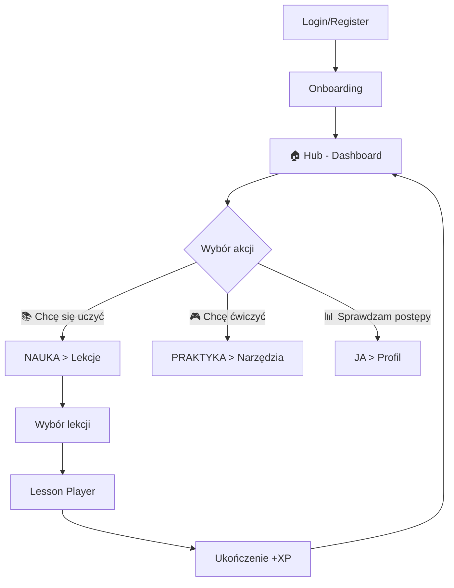
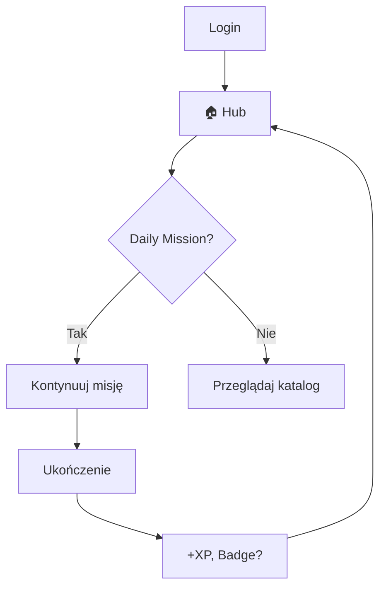

# 🚀 BrainVenture V3 - Specyfikacja Aplikacji

**Wersja:** 3.0  
**Data:** 2026-01-11  
**Status:** Bootstrap MVP Ready  
**Architektura:** Next.js 16 + Supabase + PostgreSQL  
**Design System:** Glassmorphism / Cyberpunk (Dark Theme)

---

## 📋 Spis treści

### I. Podstawy Produktu
1. [Wizja i Cel](#wizja-i-cel)
2. [Architektura Nawigacji](#architektura-nawigacji)
3. [Struktura Główna Aplikacji](#struktura-główna-aplikacji)
4. [System Nawigacji](#system-nawigacji)
5. [User Flow](#user-flow)
6. [Design System](#design-system)
7. [Lesson Content Architecture](#lesson-content-architecture) - JSON/JSONB, Card Types, Media
8. [Multi-Tenant Data Model](#multi-tenant-data-model) - B2C/B2B, Roles, Organizations
9. [Responsive Behavior](#responsive-behavior)
10. [Nawigacja w Poszczególnych Modułach](#nawigacja-w-poszczególnych-modułach)
11. [Kluczowe Decyzje UX](#kluczowe-decyzje-ux)

### II. Technologie AI/ML
10. [Agentic AI Architecture](#agentic-ai-architecture) - 8 wyspecjalizowanych agentów
11. [Machine Learning Strategy](#machine-learning-strategy) - 10 modeli ML

### III. Przyszłe Usprawnienia
12. [Future Enhancements - EdTech 2026](#future-enhancements---edtech-2026-features) - 10 kluczowych enhancement'ów

### IV. Strategia Biznesowa
13. [Strategic Business Elements](#strategic-business-elements) - Monetization, Security, Accessibility, Integrations
14. [Priority Matrix](#strategic-priority-matrix) - Priorytety implementacji

### V. Implementacja
15. [Next Steps](#next-steps---implementacja) - Roadmap implementacji
16. [Related Documents](#related-documents)

### VI. Burza Mózgów
17. [RPG Character Card - Advanced Ideas](#rpg-character-card---advanced-ideas) - Pomysły na rozbudowę karty postaci
18. [Lesson Card Types - Advanced Ideas](#lesson-card-types---advanced-ideas) - Pomysły na nowe typy kart w lekcjach


---

## 🎯 Wizja i Cel

### Główny Cel V3
Przekształcenie monolitycznej aplikacji Streamlit w **nowoczesną platformę EdTech** opartą o:
- **Microlearning** - krótkie, intensywne sesje (5-15 min)
- **Mobile-First PWA** - pełna funkcjonalność na telefonie
- **Card-Based Learning** - interaktywne karty zamiast długich tekstów
- **Gamifikacja** - XP, odznaki, poziomy, leaderboardy
- **AI Personalization** - adaptacyjne ścieżki nauki

### Odbiorcy
- **Profesjonaliści biznesowi** (menadżerowie, konsultanci, trenerzy)
- **Studenci MBA** / executive education
- **Zespoły korporacyjne** (L&D, HR)

---

## 🗺️ Architektura Nawigacji

### Model 4-Hub (Rekomendowany)

Zamiast klasycznego menu z 8+ opcjami → **4 główne huby**:

```
┌─────────────────────────────────────────────────────┐
│                                                     │
│   🏠 HUB        📚 NAUKA      🎮 PRAKTYKA    📊 JA  │
│   (Dashboard)   (Learning)    (Tools)        (Me)   │
│                                                     │
└─────────────────────────────────────────────────────┘
```

#### 🏠 **HUB (Dashboard / War Room)**
**Funkcja:** Centralny punkt dowodzenia  
**Zawartość:**
- Aktywne misje / cele
- Statystyki postępów (XP, poziom, streak)
- Rekomendacje AI ("Co dzisiaj?")
- Quick access do ostatnich aktywności
- Leaderboard (jeśli tryb rywalizacji)

**Przykład z V3:**
```tsx
// Już zaimplementowane w v3/frontend/src/app/page.tsx
- Operator Stats (XP, Level, Rank)
- Active Missions
- Competence Radar
- Leaderboard
```

---

#### 📚 **NAUKA (Learning Hub)**
**Funkcja:** Wszystko związane z edukacją  
**Zawartość:**

```
NAUKA
├── 🎓 Lekcje (Lessons)
│   ├── Katalog tematyczny
│   ├── Ścieżki nauki (Learning Paths)
│   ├── Zapisane / W trakcie / Ukończone
│   └── Polecane dla Ciebie
│
├── 🧠 Engramy (Neural Implants / Micro-skills)
│   ├── Kategorie (Leadership, Communication, Strategy...)
│   ├── Zainstalowane / Dostępne
│   ├── Status: Stable 🟢 / Fading 🟡 / Critical 🔴
│   └── Standalone + Wyodrębnione z Lekcji
│
└── 📖 Biblioteka Zasobów
    ├── Case Studies
    ├── Frameworks (Canvas, Models)
    ├── Checklists & Templates
    ├── E-books & Masterclasses
    └── Unlocked / Public
```

**Nawigacja wewnętrzna:**
- **Tabs:** Lekcje | Engramy | Zasoby
- **Filtry:** Kategoria, Trudność, Czas trwania, Status
- **Widoki:** Grid (desktop) | List (mobile)

---

### 📖 **Główne Koncepty: Lekcja, Engram, Zasób**

#### **Definicje i Charakterystyka**

| Aspekt | 📚 Lekcja | 🧠 Engram | 📖 Zasób |
|--------|-----------|-----------|----------|
| **Definicja** | Pełna jednostka edukacyjna | Destylat wiedzy - "Neural Implant" | Materiał dodatkowy (template, case study) |
| **Czas** | 20-45 min | 3-10 min | Nie dotyczy |
| **Format** | 6-12 kart interaktywnych | 3-4 slajdy + quiz | Plik/link zewnętrzny |
| **Cel** | Kompleksowa nauka tematu | Pojedyncza umiejętność/koncepcja | Praktyczne narzędzie |
| **XP** | 100-150 | 50 (install) + 25 (refresh) | 10 |
| **Specjalne** | Wyodrębnia engramy | **Decay system** (wymaga odświeżania) | **Unlock conditions** |
| **Miejsce** | 📚 NAUKA → Lekcje | 📚 NAUKA → Engramy | 📚 NAUKA → Zasoby |
| **DB** | `lessons` (JSONB cards) | `engrams` + `user_engrams` | `resources` |

#### **Hierarchia i Zależności (Top-Down)**

```
📚 LEKCJA (20-45 min)
    ↓ wyodrębnia
🧠 ENGRAMY (3-10 min każdy)
    ↓ unlockuje
📖 ZASOBY (templates, case studies)
```

**Konkretny przykład:**

```
📚 Lekcja: "Zarządzanie Czasem" (45 min, 8 kart) → +150 XP
    ↓
🧠 Wyodrębnia 3 engramy:
    • Engram #1: "Macierz Eisenhowera" (5 min) → +50 XP
    • Engram #2: "Zasada Pareto 80/20" (4 min) → +50 XP
    • Engram #3: "Deep Work Protocol" (7 min) → +50 XP
    ↓
📖 Unlockuje zasoby:
    • "Weekly Planner Template.xlsx" → +10 XP
    • Case Study: "Time Management w Heinz"
```

#### **Cross-Unlocking System**

**Mechanika:** Ukończenie Lekcji/Engramu/Zasobu może unlockować elementy w innych kategoriach.

```
Lekcja "SPIN Selling" (ukończona)
    ↓ unlockuje
• Engram: "Objection Handling"
• Zasób: "SPIN Questions Template.xlsx"
• Zasób: "Case Study: Heinz Market Share"
```

```
Engram "Pitch 60s" (zainstalowany standalone)
    ↓ sugeruje
• Lekcja: "Advanced Presentation Skills"
```

**Typy Zasobów według dostępności:**
- **Public:** Zawsze dostępne dla wszystkich
- **Unlockable:** Wymagają ukończenia konkretnej Lekcji/Engramu
- **Premium:** (Future) Wymagają subskrypcji/zakupu

---

### 🧠 **System Engramów - Szczegółowa Specyfikacja**

**Koncepcja:** Engramy to "Neural Implants" - destylaty wiedzy w formie micro-lessons (3-10 min), zaprojektowane dla szybkiej absorpcji i długoterminowej retencji poprzez Spaced Repetition System.

#### **1. Hierarchia Treści**

**Pochodzenie Engramów:**
- **Z Lekcji:** Automatycznie wyodrębnione kluczowe koncepty (każda lekcja → 2-5 engramów)
- **Standalone:** Niezależne micro-lessons (np. "Pitch 60s", "Szybkie Decyzje")

#### **2. Struktura Engramu**

**Format:** 3-4 slajdy interaktywne
1. **Problem** - Identyfikacja wyzwania
2. **Mechanizm** - Jak to działa (reguła/framework)
3. **Zastosowanie** - Praktyczny przykład
4. **Weryfikacja** - Quiz (3 pytania z puli 6-10)

#### **3. Decay System (Ebbinghaus + Adaptive)**

**Algorytm degradacji "Signal Strength":**

```
Day 1:  100% → 80%  (rapid initial decay)
Day 3:  80%  → 60%  (moderate)
Day 7:  60%  → 40%  (slower)
Day 14: 40%  → 20%  (minimal)
```

**Adaptive Modifier:**
- Jeśli user często odświeża (>3 razy) → decay spada o 20%
- Formula: `strength = base_decay * (1 + refresh_bonus)`

**UI Indicators:**
- **100-80%:** 🟢 **Stable** (Green, brak animacji)
- **79-40%:** 🟡 **Fading** (Yellow, subtle pulse)
- **<40%:** 🔴 **Critical** (Red, glitch animation effect)

**Notyfikacje:** Pasywne (tylko wizualne wskaźniki w UI)

#### **4. Refresh Mechanics**

**Quiz Pool System:**
- Każdy Engram ma **6-10 pytań** w puli
- Przy każdym odświeżeniu: **losowe 3 pytania**
- **Future:** Adaptive questioning (więcej pytań z obszarów, gdzie user się myli)

**XP Rewards:**
- Instalacja Engramu: **+50 XP**
- Odświeżenie (refresh): **+25 XP**

#### **5. Cross-Unlocking System**

**(patrz: sekcja "Główne Koncepty" powyżej dla szczegółów cross-unlocking)**

**Typy Zasobów:**
- **Public:** Zawsze dostępne
- **Unlockable:** Wymagają ukończenia Lekcji/Engramu
- **Premium:** (Future) Wymagają subskrypcji

#### **6. Data Model (Supabase)**

**Tabela: `engrams`**
```sql
CREATE TABLE engrams (
    id UUID PRIMARY KEY,
    title TEXT NOT NULL,
    category TEXT,
    slides JSONB NOT NULL,  -- 3-4 slajdy
    quiz_pool JSONB NOT NULL,  -- 6-10 pytań
    source_lesson_id UUID,  -- NULL jeśli standalone
    xp_reward INTEGER DEFAULT 50,
    estimated_minutes INTEGER,
    created_at TIMESTAMP DEFAULT NOW()
);
```

**Tabela: `user_engrams`**
```sql
CREATE TABLE user_engrams (
    id UUID PRIMARY KEY,
    user_id UUID REFERENCES auth.users(id),
    engram_id UUID REFERENCES engrams(id),
    installed_at TIMESTAMP DEFAULT NOW(),
    last_refreshed_at TIMESTAMP,
    strength INTEGER DEFAULT 100,  -- 0-100
    times_refreshed INTEGER DEFAULT 0,
    is_public BOOLEAN DEFAULT FALSE,  -- Privacy setting
    status TEXT DEFAULT 'active',  -- 'active' | 'archived'
    UNIQUE(user_id, engram_id)
);
```

**Tabela: `resources`**
```sql
CREATE TABLE resources (
    id UUID PRIMARY KEY,
    title TEXT NOT NULL,
    type TEXT,  -- 'article', 'template', 'video', 'ebook', 'case_study'
    url TEXT,
    unlock_condition JSONB,  -- {lesson_id: X} lub {engram_id: Y} lub {public: true}
    category TEXT,
    file_size TEXT,
    created_at TIMESTAMP DEFAULT NOW()
);
```

#### **7. User Journey - Przykład**

**Tydzień 1:**
1. User ukończył Lekcję "Zarządzanie Czasem" → **+150 XP**
2. System oferuje: "Zainstaluj 3 Engramy z tej lekcji?"
3. User instaluje 3 Engramy (quiz każdy) → **+150 XP**
4. Unlockuje Zasób: "Weekly Planner.xlsx" → **+10 XP**

**Tydzień 2:**
1. Engram "Macierz Eisenhowera" → Strength: 60% 🟡 (Fading)
2. User odświeża quiz → Strength: 100% 🟢 → **+25 XP**
3. Przeglądał Katalog, zainstalował standalone "Pitch 60s" → **+50 XP**

**Tydzień 3:**
1. Engram "Zasada Pareto" → Strength: 35% 🔴 (Critical, glitch effect)
2. User odświeżył → Strength: 100% 🟢
3. Ukończył Lekcję "SPIN Selling" → Unlockował Case Study + Engram

#### **8. Gamifikacja**

**Badges/Achievements:**
- 🧠 **"Neural Network"** - Zainstaluj 10 Engramów
- 🔄 **"Maintainer"** - Odśwież 20 Engramów
- 📚 **"Scholar"** - Ukończ 5 Lekcji z jednej kategorii
- 💎 **"Collector"** - Pobierz 15 Zasobów

**Dashboard "Moja Wiedza" (w zakładce JA):**
```
┌─────────────────────────────────────────┐
│  🎓 Ukończone Lekcje: 12/50             │
│  🧠 Zainstalowane Engramy: 8            │
│     ├─ 🟢 Stable: 5                     │
│     ├─ 🟡 Fading: 2                     │
│     └─ 🔴 Critical: 1 ⚠️                │
│  📚 Pobrane Zasoby: 23                  │
└─────────────────────────────────────────┘
```

#### **9. Privacy & Social**

**Ustawienia (w Profil → Ustawienia):**
- Toggle: "Make my Engrams public" (domyślnie: OFF)
- Jeśli ON → Public profile pokazuje: "[User] ma X zainstalowanych Engramów w kategorii [Y]"

**Future Features:**
- Polecanie Engramów znajomym
- Team Engrams (corporate learning)
- Engram Marketplace (user-generated content)

**Przykład z V3:**
```tsx
// Implementacja w:
- v3/frontend/src/app/learning/engrams/page.tsx (Katalog)
- v3/frontend/src/app/learning/engrams/[id]/page.tsx (Player)
- v3/frontend/src/app/learning/resources/page.tsx (Biblioteka)
```

---

### 🎮 **RPG-Inspired Gamification Mechanics**

**Koncepcja:** Wykorzystanie mechanik RPG do wizualizacji postępów użytkownika i zwiększenia engagementu poprzez systemowe nagrody, kombinacje umiejętności i progresję postaci.

#### **1. Character Stats System (MVP - Phase 1)**

**Radar Chart Visualization**

Każdy zainstalowany engram dodaje punkty do odpowiedniej kategorii statystyk:

```
Character Stats (0-100 scale):
├── Leadership: ████████░░ 80%
├── Sales:      ██████░░░░ 60%
├── Strategy:   ████████░░ 80%
├── Mindset:    ███████░░░ 70%
└── Technical:  ████░░░░░░ 40%
```

**Point Distribution:**
- **Basic Engram (3-5 min):** +10 points
- **Advanced Engram (7-10 min):** +20 points
- **Refresh Engram:** +5 points (maintain stats)

**Level Up System:**
- Each category has 5 levels (Novice → Master)
- **Level 1:** 0-20 points (Novice)
- **Level 2:** 21-40 points (Apprentice)
- **Level 3:** 41-60 points (Practitioner)
- **Level 4:** 61-80 points (Expert)
- **Level 5:** 81-100 points (Master)

**UI Implementation:**
- Radar chart on Profile → "Postępy" tab
- Animated transitions when stats increase
- Color-coded categories (matching engram badges)
- Tooltips showing breakdown: "Leadership: 80/100 (Expert)"

---

#### **2. Skill Tree / Tech Tree (Phase 2)**

**Dependency-Based Unlocking**

```
            [Advanced Leadership]
                   / \
    [Team Building]   [Conflict Resolution]
           |                  |
    [Active Listening] ──→ [Negotiation 101]
           |                  |
    [Communication Basics] ←─── [Sales Fundamentals]
```

**Prerequisites:**
- Some advanced engrams require completing basic engrams first
- Visual tree shows locked/unlocked paths
- Hover shows "Unlock by completing: [X, Y, Z]"

**Example Dependencies:**
```json
{
  "engram_id": "advanced-negotiation",
  "requires": ["active-listening", "batna-basics", "sales-101"],
  "unlock_level": "Leadership Level 3"
}
```

**UI Features:**
- Interactive node-based graph (similar to Cyberpunk 2077)
- Pan and zoom on skill tree
- Glowing paths show completed routes
- Locked nodes have lock icon + requirements tooltip

---

#### **3. Class System (Character Evolution)**

**Dynamic Class Assignment**

Based on engram combinations, user automatically receives a "Class" title:

**Class Types:**
```
🏆 Sales Strategist
   Requirements: 5+ Sales Engrams + 3+ Mindset Engrams
   Bonus: +50% XP from Sales lessons

🧠 Learning Architect
   Requirements: 5+ Leadership + 3+ Technical Engrams
   Bonus: Early access to advanced content

🎯 Versatile Professional
   Requirements: 2+ engrams in ALL categories
   Bonus: +25% XP from all sources

🚀 Specialist
   Requirements: 10+ engrams in ONE category
   Bonus: +100 XP per engram refresh in specialty
```

**Evolution Path:**
- User starts as "Novice" (no class)
- First class unlock at 5 total engrams
- Can have multiple classes simultaneously
- Class badges shown on profile

**UI Display:**
```
┌─────────────────────────────┐
│  Your Classes:              │
├─────────────────────────────┤
│  🏆 Sales Strategist        │
│     Active Bonus: +50% XP   │
│                             │
│  🎯 Versatile Professional  │
│     Unlocked: Jan 10, 2026  │
└─────────────────────────────┘
```

---

#### **4. Synergy Bonuses (Combo System)**

**Engram Combinations Unlock Special Bonuses**

**Example Combos:**
```
🔥 "Negotiation Master"
   Engrams: Active Listening + Storytelling + OODA Loop
   Bonus: +50% XP from Sales lessons

💎 "Strategic Thinker"  
   Engrams: Pareto 80/20 + Eisenhower Matrix + BATNA
   Bonus: Unlock exclusive case study library

⚡ "Speed Learner"
   Engrams: 5 engrams refreshed within 7 days
   Bonus: +100 XP one-time reward
```

**Detection Algorithm:**
```typescript
function detectCombos(userEngrams: Engram[]): Combo[] {
  const combos = [
    {
      name: "Negotiation Master",
      required: ["active-listening", "storytelling", "ooda-loop"],
      bonus: {type: "xp_multiplier", value: 1.5, category: "Sales"}
    },
    // ... more combos
  ]
  
  return combos.filter(combo => 
    combo.required.every(id => userEngrams.some(e => e.id === id))
  )
}
```

**UI Notification:**
```
┌───────────────────────────────┐
│  🔥 COMBO UNLOCKED!           │
├───────────────────────────────┤
│  "Negotiation Master"         │
│                               │
│  You've mastered:             │
│  • Active Listening           │
│  • Storytelling               │
│  • OODA Loop                  │
│                               │
│  Bonus: +50% XP from Sales    │
└───────────────────────────────┘
```

---

#### **5. Engram Load out (Active Slots)**

**Limited Active Slots**

- User can have **unlimited installed** engrams
- Only **5-7 active slots** at once
- **Active engrams** provide stat bonuses
- **Inactive engrams** stored in "Mental Archive"

**Loadout Presets:**
```
📋 "Presentation Build"
   Active: Storytelling, Negotiation, Active Listening, Pitch 60s, BATNA
   Quick switch before client meeting!

📋 "Strategy Build"
   Active: OODA Loop, Pareto 80/20, Eisenhower Matrix, Deep Work, Systems Thinking
   Planning session mode!

📋 "Daily Build"
   Active: Mix of refreshing engrams
```

**UI Features:**
- Drag-and-drop engrams to active slots
- Save/load preset builds
- Visual indicator showing active vs. archived
- Quick switch button before entering lessons

---

#### **6. Neural Matrix Visualization (Advanced)**

**3D Brain Model Concept**

Instead of traditional skill tree → **Interactive 3D brain visualization**:

**Features:**
- Each engram = **glowing node** in brain
- Connections between related engrams (synapses)
- Color-coded by category
- **Density** shows mastery (more engrams = denser neural network)
- Hover on node → shows engram details
- **Animation:** Installing engram = pulse wave from center

**Technical Stack (Future):**
- Three.js or React Three Fiber
- WebGL for performance
- Mobile: 2D simplified version

**Visual Concept:**
```
     Leadership (Purple Cluster)
        ⚡   ⚡   ⚡
         \ | /
          🧠  ← Brain Center
         / | \
        ⚡   ⚡   ⚡
     Sales (Green Cluster)
```

---

#### **7. Memory Decay with Streak Bonuses**

**Enhanced Decay System:**

**Standard Decay:**
```
Day 1:  100% → 80%
Day 7:  80%  → 60%
Day 14: 60%  → 40%
Day 30: 40%  → 20%
```

**Streak Bonus:**
- Refresh engram same day every week = **Streak +1**
- **Streak Multiplier:** 
  - Week 1-4: +5% XP per refresh
  - Week 5-9: +10% XP per refresh
  - Week 10+: +15% XP per refresh + engram becomes **"Mastered"**

**Mastered Status:**
- After 10 consecutive refreshes (weekly)
- Strength locked at **100%** (permanent)
- Badge: 🏆 "Mastered"
- Bonus: +50 XP one-time reward

**UI Indicator:**
```
🧠 OODA Loop
   Status: 🟢 Stable (95%)
   Streak: 🔥 Week 7 (+10% XP)
   Next Refresh: 3 days
```

---

#### **8. Achievement System**

**RPG-Style Badges:**
```
🧠 "Neural Network"
   Unlock: Install 10 Engrams
   Reward: +100 XP

🔄 "Maintainer"
   Unlock: Refresh 20 Engrams
   Reward: +200 XP

🏆 "Class Specialist"
   Unlock: Achieve Level 5 in any category
   Reward: Exclusive class title

💎 "Collector"
   Unlock: Unlock all combos
   Reward: Special profile badge

⚡ "Speed Demon"
   Unlock: Complete 5 engrams in 1 day
   Reward: +150 XP
```

---

#### **9. Data Model Extensions**

**New Tables:**

```sql
-- User stats tracking
CREATE TABLE user_stats (
    id UUID PRIMARY KEY,
    user_id UUID REFERENCES auth.users(id),
    category TEXT NOT NULL, -- 'Leadership', 'Sales', etc.
    points INTEGER DEFAULT 0, -- 0-100
    level INTEGER DEFAULT 1, -- 1-5
    updated_at TIMESTAMP DEFAULT NOW(),
    UNIQUE(user_id, category)
);

-- Class assignments
CREATE TABLE user_classes (
    id UUID PRIMARY KEY,
    user_id UUID REFERENCES auth.users(id),
    class_name TEXT NOT NULL,
    unlocked_at TIMESTAMP DEFAULT NOW(),
    is_active BOOLEAN DEFAULT TRUE,
    UNIQUE(user_id, class_name)
);

-- Synergy combos
CREATE TABLE user_combos (
    id UUID PRIMARY KEY,
    user_id UUID REFERENCES auth.users(id),
    combo_name TEXT NOT NULL,
    unlocked_at TIMESTAMP DEFAULT NOW(),
    bonus_active BOOLEAN DEFAULT TRUE,
    UNIQUE(user_id, combo_name)
);

-- Engram loadouts
CREATE TABLE user_loadouts (
    id UUID PRIMARY KEY,
    user_id UUID REFERENCES auth.users(id),
    name TEXT NOT NULL,
    engram_ids JSONB NOT NULL, -- Array of engram IDs
    is_active BOOLEAN DEFAULT FALSE,
    created_at TIMESTAMP DEFAULT NOW()
);
```

---

#### **10. Implementation Priority**

**Phase 1 (MVP - Week 1-2):**
- ✅ Character Stats (Radar Chart)
- ✅ Basic point distribution per engram
- ✅ Stats display on Profile page

**Phase 2 (Month 1-2):**
- ⏳ Synergy Combos detection
- ⏳ Class system (automatic assignment)
- ⏳ Achievement badges

**Phase 3 (Month 2-3):**
- ⏳ Skill Tree visualization
- ⏳ Loadout system
- ⏳ Streak bonuses

**Phase 4 (Month 3+):**
- ⏳ Neural Matrix 3D visualization
- ⏳ Advanced prerequisites
- ⏳ Mastered status system

---


#### 🎮 **PRAKTYKA (Practice Hub)**
**Funkcja:** Narzędzia i gry do zastosowania wiedzy  
**Zawartość:**

```
PRAKTYKA
├── 🎯 Narzędzia Sprzedażowe
│   ├── AI Sales Assistant
│   ├── Symulacje rozmów
│   └── Canvas Generators
│
├── 🎲 Business Games
│   ├── Gry strategiczne
│   ├── Symulacje decyzyjne
│   └── Case Study Challenges
│
├── 💡 Inspiracje
│   ├── Daily Challenges
│   ├── Quote of the Day
│   └── Success Stories
│
└── 📋 Moje Projekty
    ├── Zapisane Canvas'y
    ├── Action Plans
    └── Notes & Ideas
```

**Nawigacja wewnętrzna:**
- **Tabs:** Narzędzia | Gry | Inspiracje | Projekty
- **Quick Actions:** "Nowy Canvas", "Rozpocznij Grę"
- **Ostatnie:** Historia użycia narzędzi

---

#### 📊 **JA (Personal Hub)**
**Funkcja:** Profil, postępy, ustawienia  
**Zawartość:**

```
JA
├── 👤 Profil
│   ├── Avatar & Bio
│   ├── Poziom & Odznaki
│   ├── Certyfikaty
│   └── Statystyki życiowe
│
├── 📈 Moje Postępy
│   ├── Wykres XP
│   ├── Ukończone lekcje
│   ├── Kompetencje (Radar)
│   └── Streak & Consistency
│
├── 🎯 Cele & Misje
│   ├── Aktywne cele
│   ├── Zrealizowane
│   └── Ustaw nowy cel
│
└── ⚙️ Ustawienia
    ├── Preferencje nauki
    ├── Notyfikacje
    ├── Konto & Bezpieczeństwo
    └── Integracje
```

**Nawigacja wewnętrzna:**
- **Tabs:** Profil | Postępy | Cele | Ustawienia
- **Akcje:** Edytuj profil, Eksportuj dane

---

## 🏗️ Struktura Główna Aplikacji

### Layout Anatomy

```
┌─────────────────────────────────────────────────────────────┐
│  TOP BAR (sticky)                                           │
│  [Logo] [Search]              [Notif] [XP] [Avatar]        │
├─────────────────────────────────────────────────────────────┤
│                                                             │
│  SIDEBAR (fixed L, desktop)    │   MAIN CONTENT            │
│                                 │                           │
│  🏠 Hub                         │   ┌─────────────────┐    │
│  📚 Nauka                       │   │                 │    │
│  🎮 Praktyka                    │   │   Page Content  │    │
│  📊 Ja                          │   │                 │    │
│                                 │   │                 │    │
│  ─────────────────              │   └─────────────────┘    │
│  🤖 AI Assistant                │                           │
│                                 │                           │
│                                 │                           │
└─────────────────────────────────┴───────────────────────────┘
│  MOBILE BOTTOM NAV (mobile only)                           │
│  [Hub] [Nauka] [Praktyka] [Ja]                            │
└─────────────────────────────────────────────────────────────┘
```

### Routing Structure (Next.js)

```
/app
├── page.tsx                    → 🏠 Hub (Dashboard)
├── layout.tsx                  → Global layout + sidebar
│
├── learning/
│   ├── page.tsx                → 📚 Learning Hub (overview)
│   ├── lessons/
│   │   ├── page.tsx            → Lista lekcji
│   │   └── [id]/page.tsx       → Lesson Player
│   ├── implants/
│   │   └── page.tsx            → Neural Implants (✅ EXISTS)
│   └── resources/
│       └── page.tsx            → Biblioteka zasobów
│
├── practice/
│   ├── page.tsx                → 🎮 Practice Hub
│   ├── tools/
│   │   ├── page.tsx            → Lista narzędzi
│   │   └── [tool]/page.tsx     → Konkretne narzędzie
│   ├── games/
│   │   └── page.tsx            → Business Games
│   └── projects/
│       └── page.tsx            → Moje projekty
│
├── profile/
│   ├── page.tsx                → 📊 Personal Hub
│   ├── stats/page.tsx          → Szczegółowe statystyki
│   ├── goals/page.tsx          → Zarządzanie celami
│   └── settings/page.tsx       → Ustawienia
│
└── api/                        → API routes (proxy do FastAPI)
```

---

## 🧭 System Nawigacji

### Primary Navigation (Główna)

**Desktop:**
- **Sidebar (fixed left, 240px)**
  - Zawsze widoczny
  - 4 główne ikony + labels
  - Aktywny element: highlighted (neon glow)
  - Collapse na życzenie → mini-icons only

**Mobile:**
- **Bottom Navigation Bar (fixed)**
  - 4 ikony (bez labelek lub z mini-labels)
  - Active indicator (neon underline)
  - Haptic feedback on tap

### Secondary Navigation (W modułach)

**Format:** Horizontal Tabs (desktop) / Swipeable Tabs (mobile)

Przykład dla **NAUKA**:
```
┌─────────────────────────────────────────────┐
│  Lekcje  |  Implants  |  Zasoby            │ ← Tabs
├─────────────────────────────────────────────┤
│                                             │
│  [Content for selected tab]                 │
│                                             │
└─────────────────────────────────────────────┘
```

### Breadcrumbs (Desktop only)

Dla głębszych poziomów:
```
🏠 Hub > 📚 Nauka > Lekcje > Milwaukee Canvas
```

---

## 👤 User Flow

### Typowy Flow - Nowy Użytkownik



### Flow - Daily Active User



### Flow - Lesson Experience

```
Start Lesson
    ↓
Desktop: Sidebar (cards list) + Content (current card)
Mobile:  Swipe cards (1 na raz)
    ↓
Progress tracking (Card X/N, ~min, +XP)
    ↓
Interactive elements (quiz, practice, case study)
    ↓
Completion → Summary + XP reward
    ↓
Next: Recommendations / Powrót do katalogu
```

---

## 🎨 Design System

### Glassmorphism Principles

**Warstwa wizualna:**
```css
background: rgba(20, 20, 35, 0.4);
backdrop-filter: blur(20px);
border: 1px solid rgba(255, 255, 255, 0.08);
border-radius: 24px;
box-shadow: 0 8px 32px rgba(0, 0, 0, 0.3);
```

**Kolory (Cyberpunk Palette):**
- **Background:** `linear-gradient(135deg, #0f0c29, #302b63, #24243e)`
- **Neon Accents:**
  - Purple: `#b000ff`
  - Blue: `#00d4ff`
  - Gold: `#ffd700`
  - Red: `#ff0055`
  - Green: `#00ff88`
  - Orange: `#f59e0b`

**Typography:**
- **Font Family:** Outfit (Google Fonts)
- **Sizes:**
  - H1: 32px / 700
  - H2: 24px / 700
  - H3: 18px / 600
  - Body: 15px / 400
  - Small: 13px / 400

**Spacing System:**
- Base unit: 4px
- Scale: 4, 8, 12, 16, 20, 24, 32, 40, 48, 64

### Components Library

**Kluczowe komponenty do zbudowania:**

1. **Card (Base)**
   - Glassmorphic container
   - Variants: default, hover, active, disabled

2. **Navigation**
   - Sidebar (desktop)
   - Bottom Nav (mobile)
   - Tabs (secondary nav)
   - Breadcrumbs

3. **Stats Display**
   - XP bar
   - Level badge
   - Competence radar
   - Progress rings

4. **Interactive**
   - Buttons (primary, secondary, ghost)
   - Input fields (glass style)
   - Modals / Dialogs
   - Toast notifications

5. **Learning**
   - Lesson Card (grid/list view)
   - Card Player (desktop/mobile toggle)
   - Quiz components
   - Progress tracker

---

## 📚 Lesson Content Architecture

### **Content Format: JSON/JSONB**

**Storage Strategy:**
- ✅ **JSONB** in PostgreSQL (`lessons.cards` column)
- ✅ **Structured schema** (TypeScript interfaces)
- ✅ **Flexible** (easy to add new card types)
- ✅ **Single query perfor**mance
- ✅ **Indexed** for fast search

### **Lesson Data Model**

```typescript
interface Lesson {
  // Metadata
  id: string
  title: string
  description: string
  category: string
  difficulty: 'beginner' | 'intermediate' | 'advanced'
  estimated_minutes: number
  xp_reward: number
  
  // Multi-tenant targeting
  target_roles: string[] // ['manager', 'salesperson', 'investor']
  is_public: boolean // true = B2C, false = B2B custom
  organization_id?: string // For company-specific content
  
  // Content (JSONB!)
  cards: LessonCard[]
  
  // Timestamps
  created_at: string
  updated_at: string
}
```

### **Card Types (Extensible)**

**MVP Card Types (Week 1-4):**
```typescript
type CardType = 
  | 'intro'      // Welcome screen
  | 'concept'    // Learning content
  | 'quiz'       // Knowledge check
  | 'practice'   // Exercises
  | 'summary'    // Recap
```

**Future Card Types (Month 2+):**
```typescript
type CardType = 
  | ... // MVP types
  | 'video'              // YouTube/Vimeo embeds
  | 'podcast'            // Audio content
  | 'flashcard'          // Spaced repetition
  | 'case_study'         // Real-world examples
  | 'interactive_chart'  // Data visualization
  | 'reflection'         // Journal prompts
  | 'simulation'         // Interactive scenarios (advanced)
```

### **Card Schema (Flexible)**

```typescript
interface LessonCard {
  id: number
  type: string  // Not enum - allows ANY string for future types
  title: string
  content?: string  // Optional - not all cards need text
  
  // Universal metadata
  estimated_seconds?: number
  xp_points?: number
  icon?: string
  
  // Type-specific data (JSONB flexibility)
  data?: Record<string, any>  // Magic happens here!
}
```

**Example Cards:**

```json
// Concept card
{
  "id": 1,
  "type": "concept",
  "title": "BATNA Fundamentals",
  "content": "BATNA stands for Best Alternative To Negotiated Agreement...",
  "examples": ["Example 1...", "Example 2..."],
  "estimated_seconds": 180,
  "xp_points": 20
}

// Video card (future)
{
  "id": 2,
  "type": "video",
  "title": "Expert Interview",
  "data": {
    "video_url": "https://youtube.com/watch?v=...",
    "duration": 180,
    "transcript": "Full text transcript...",
    "provider": "youtube"
  }
}

// Flashcard (future)
{
  "id": 3,
  "type": "flashcard",
  "title": "Key Terms",
  "data": {
    "cards": [
      {"front": "BATNA", "back": "Best Alternative To Negotiated Agreement"},
      {"front": "ZOPA", "back": "Zone Of Possible Agreement"}
    ]
  }
}
```

### **Media Handling**

**MVP Approach:**
- External URLs (YouTube, Vimeo) - FREE
- Images via CDN or external hosting

**Future:**
- Supabase Storage for private content
- CDN for performance (Cloudflare, Bunny)
- Subtitle/transcript support

### **Content Creation Workflow**

**MVP (Manual JSON):**
```typescript
// Create lesson via SQL or Supabase Dashboard
const lesson = {
  title: "Negotiation Basics",
  cards: [
    {id: 1, type: "intro", title: "...", content: "..."},
    {id: 2, type: "concept", title: "...", content: "..."}
  ]
}
await supabase.from('lessons').insert(lesson)
```

**Month 4+ (Admin UI):**
- Visual lesson builder
- Card templates
- Drag-and-drop ordering
- Preview mode

**Month 7+ (AI-Assisted):**
- Generate lesson from outline
- Auto-create quizzes
- Suggest examples

---

## 🏢 Multi-Tenant Data Model

### **Architecture Overview**

**Support for:**
- ✅ **B2C:** Individual learners (managers, salespeople, investors)
- ✅ **B2B:** Team subscriptions (organizations)
- ✅ **Enterprise:** Custom content per company

### **Database Schema**

```sql
-- Organizations (companies)
CREATE TABLE organizations (
    id UUID PRIMARY KEY,
    name TEXT NOT NULL, -- "Milwaukee Tools", "Heinz"
    tier TEXT DEFAULT 'team', -- 'free', 'team', 'enterprise'
    created_at TIMESTAMP WITH TIME ZONE DEFAULT NOW()
);

-- User profiles with org + role support
CREATE TABLE profiles (
    id UUID PRIMARY KEY REFERENCES auth.users(id),
    email TEXT,
    full_name TEXT,
    avatar_url TEXT,
    
    -- Multi-tenant support
    organization_id UUID REFERENCES organizations(id), -- NULL for B2C users
    role TEXT DEFAULT 'manager', -- 'manager', 'salesperson', 'investor', 'admin'
    
    -- Gamification
    xp INTEGER DEFAULT 0,
    level INTEGER DEFAULT 1,
    
    -- User preferences (future)
    theme_preference TEXT DEFAULT 'dark',
    
    created_at TIMESTAMP WITH TIME ZONE DEFAULT NOW(),
    updated_at TIMESTAMP WITH TIME ZONE DEFAULT NOW()
);

-- Lessons with multi-tenant targeting
CREATE TABLE lessons (
    id UUID DEFAULT gen_random_uuid() PRIMARY KEY,
    title TEXT NOT NULL,
    description TEXT,
    category TEXT,
    difficulty TEXT,
    estimated_minutes INTEGER,
    xp_reward INTEGER DEFAULT 100,
    
    -- Targeting
    target_roles TEXT[] DEFAULT ARRAY['manager'],
    is_public BOOLEAN DEFAULT true,
    
    -- Content
    cards JSONB NOT NULL,
    
    created_at TIMESTAMP WITH TIME ZONE DEFAULT NOW(),
    updated_at TIMESTAMP WITH TIME ZONE DEFAULT NOW()
);

-- Content access control (for enterprise custom content)
CREATE TABLE content_access (
    id UUID PRIMARY KEY,
    lesson_id UUID REFERENCES lessons(id) ON DELETE CASCADE,
    organization_id UUID REFERENCES organizations(id) ON DELETE CASCADE,
    accessible_roles TEXT[], -- Which roles in org can access
    
    UNIQUE(lesson_id, organization_id)
);

-- User progress
CREATE TABLE user_progress (
    id UUID DEFAULT gen_random_uuid() PRIMARY KEY,
    user_id UUID REFERENCES auth.users(id) ON DELETE CASCADE,
    lesson_id UUID REFERENCES lessons(id) ON DELETE CASCADE,
    started_at TIMESTAMP WITH TIME ZONE DEFAULT NOW(),
    completed_at TIMESTAMP WITH TIME ZONE,
    current_card_index INTEGER DEFAULT 0,
    cards_completed INTEGER DEFAULT 0,
    total_cards INTEGER,
    UNIQUE(user_id, lesson_id)
);

-- Admin activity logs (for auditing)
CREATE TABLE admin_activity_logs (
    id UUID PRIMARY KEY,
    admin_id UUID REFERENCES profiles(id),
    action TEXT, -- 'user_banned', 'lesson_created', etc
    target_type TEXT, -- 'user', 'lesson', 'organization'
    target_id UUID,
    metadata JSONB,
    created_at TIMESTAMP WITH TIME ZONE DEFAULT NOW()
);
```

### **Content Filtering Strategy**

**Generic Content (Public):**
```sql
-- All public lessons for managers
SELECT * FROM lessons 
WHERE is_public = true 
  AND 'manager' = ANY(target_roles);
```

**Company-Specific Content:**
```sql
-- Milwaukee-only content + public content
SELECT DISTINCT l.* FROM lessons l
LEFT JOIN content_access ca ON l.id = ca.lesson_id
WHERE 
  -- Public content for role
  (l.is_public = true AND :user_role = ANY(l.target_roles))
  OR
  -- Company-specific content  
  (ca.organization_id = :user_org_id AND :user_role = ANY(ca.accessible_roles));
```

### **Rollout Strategy**

**Month 1-3 (MVP):**
- Only `role` field used (`organization_id = NULL` for all users)
- All content public (`is_public = true`)
- Simple role-based filtering

**Month 4-6 (B2B Pilot):**
- Organizations table activated
- Team subscriptions
- Still public content only

**Month 7-12 (Enterprise):**
- Custom content per organization
- `content_access` table used
- Premium pricing for exclusive content

### **User Types & Examples**

**B2C Individual:**
```
User: Jan Kowalski
- organization_id: NULL
- role: 'manager'
- Access: All public manager content
```

**B2B Team Member:**
```
User: Anna Nowak
- organization_id: milwaukee-uuid
- role: 'salesperson'
- Access: All public sales content
```

**B2B with Custom Content:**
```
User: Piotr Wiśniewski
- organization_id: milwaukee-uuid
- role: 'manager'
- Access: Public + Milwaukee-exclusive content
```

---

## 📱 Responsive Behavior

### Breakpoints

```scss
$mobile: 0-767px      → Bottom nav, single column
$tablet: 768-1023px   → Sidebar collapsible, 2 columns
$desktop: 1024px+     → Full sidebar, 3+ columns
```

### Layout Changes

| Element | Mobile | Tablet | Desktop |
|---------|--------|--------|---------|
| **Sidebar** | Hidden (→ Bottom Nav) | Collapsible | Fixed visible |
| **Content Grid** | 1 column | 2 columns | 3-4 columns |
| **Lesson Player** | Swipe cards | Swipe cards | Sidebar + Content |
| **Top Bar** | Compact (icons) | Full | Full |
| **Charts** | Vertical stack | Side-by-side | Grid |

### Mobile-Specific Features

- **Swipe gestures:** Navigate między kartami lekcji
- **Pull to refresh:** Aktualizacja dashboardu
- **Bottom sheet:** Quick actions (zamiast modali)
- **Haptic feedback:** Potwierdzenia akcji
- **Offline mode:** PWA z cache lekcji

---

## 🔄 Nawigacja w Poszczególnych Modułach

### 📚 NAUKA - Detailed Navigation

```
NAUKA Hub
│
├─ Tab: Lekcje
│  ├─ Filters: [Kategoria] [Trudność] [Czas] [Status]
│  ├─ Views: Grid / List toggle
│  ├─ Sort: Najnowsze / Popularne / Rekomendowane
│  └─ Action: Click → /learning/lessons/[id]
│
├─ Tab: Implants
│  ├─ Categories: Leadership, Communication, Strategy...
│  ├─ Status filter: Pobrane / Do pobrania
│  └─ Action: Click → Modal (download/activate)
│
└─ Tab: Zasoby
   ├─ Types: Case Studies / Frameworks / Templates
   ├─ Search bar
   └─ Action: Click → Preview / Download
```

**Lesson Player:**
```
/learning/lessons/[id]
│
Desktop View:
┌────────────┬──────────────────────┐
│  Sidebar   │   Content            │
│  (cards)   │   (current card)     │
│            │                      │
│  1. Intro  │   Card Title         │
│  2. Concept│   Card Content       │
│  3. Quiz ✓ │   [Interactive]      │
│  ...       │                      │
│            │   [← Prev] [Next →]  │
└────────────┴──────────────────────┘

Mobile View:
┌──────────────────────────┐
│  Card 3/22    ~15min    │ ← Progress
├──────────────────────────┤
│                          │
│   [Current Card]         │
│   Full screen            │
│   Swipe left/right       │
│                          │
├──────────────────────────┤
│    [←]        [→]       │ ← Nav controls
└──────────────────────────┘
```

---

### 🎮 PRAKTYKA - Detailed Navigation

```
PRAKTYKA Hub
│
├─ Tab: Narzędzia
│  ├─ Categories: Sprzedaż, Strategia, Analiza
│  ├─ Recently used
│  └─ Action: Click → /practice/tools/[tool]
│
├─ Tab: Gry
│  ├─ Types: Strategiczne / Symulacje / Wyzwania
│  ├─ Solo vs Multiplayer toggle
│  └─ Action: Start game → Modal lub /practice/games/[id]
│
├─ Tab: Inspiracje
│  ├─ Daily challenge (sticky top)
│  ├─ Quote of the day
│  └─ Success stories feed
│
└─ Tab: Projekty
   ├─ My saved Canvas
   ├─ Action plans
   └─ Action: Edit / Continue / New
```

---

### 📊 JA - Detailed Navigation

```
JA Hub
│
├─ Tab: Profil
│  ├─ Header: Avatar, Name, Level, XP bar
│  ├─ Badges grid
│  ├─ Certyfikaty
│  └─ Action: Edit profile → Modal
│
├─ Tab: Postępy
│  ├─ XP Chart (timeline)
│  ├─ Competence Radar
│  ├─ Completed lessons list
│  └─ Streak calendar
│
├─ Tab: Cele
│  ├─ Active goals (progress bars)
│  ├─ Completed goals (collapsed)
│  └─ Action: + Nowy cel → Modal/Form
│
└─ Tab: Ustawienia
   ├─ Sections: Profil, Nauka, Notyfikacje, Konto
   └─ Forms inline (expand/collapse)
```

---

## 🎯 Kluczowe Decyzje UX

### 1. **Nawigacja 4-Hub zamiast 8+ menu items**
**Dlaczego:**
- ✅ Prostsze mental model dla użytkownika
- ✅ Łatwiejsze na mobile (4 ikony vs 8+)
- ✅ Lepsze grupowanie funkcji
- ✅ Mniej cognitive load

### 2. **Card-Based Learning zamiast długich tekstów/tabów**
**Dlaczego:**
- ✅ Mobile-first (swipe natural gesture)
- ✅ Microlearning compatibility (bite-sized)
- ✅ Clear progress ("Card 5/20" lepsze niż "Scroll 60%")
- ✅ Gamification (każda karta = mini-achievement)

### 3. **Desktop Sidebar + Mobile Bottom Nav**
**Dlaczego:**
- ✅ Industry standard (Spotify, LinkedIn, YouTube)
- ✅ Thumb-friendly na mobile (bottom reachable)
- ✅ Persistent access do głównych hubów
- ✅ Responsive bez kompromisów

### 4. **Tabs dla nawigacji drugiego poziomu**
**Dlaczego:**
- ✅ Shallow hierarchy (max 3 levels)
- ✅ Fast switching (1 click/tap)
- ✅ Clear context (wiesz gdzie jesteś)
- ✅ Swipeable na mobile (natural)

---

## 🤖 Agentic AI Architecture

### **Vision: Multi-Agent Learning Team**

Zamiast pojedynczego AI chatbota → **8 wyspecjalizowanych agentów** współpracujących autonomicznie.

**Key Difference:**
```
Traditional AI: User asks → AI responds → End
Agentic AI:     Agents observe → Collaborate → Act proaktywnie
```

---

### **8 Specialized AI Agents**

#### **1. 🧑‍🏫 Learning Coach Agent**
**Role:** Personal AI mentor & adaptive guide
- Analizuje styl nauki użytkownika
- Identyfikuje knowledge gaps w czasie rzeczywistym
- Dostosowuje pace i difficulty dynamicznie
- Autonomicznie zmienia approach gdy user struggles

**Example:**
```
User fails quiz 3x →
Coach detects pattern →
Collaborates with Curator (easier explanations) →
Practice Partner (drills) →
Peer Matcher (find mentor) →
Presents coordinated recovery plan
```

#### **2. 📚 Content Curator Agent**
**Role:** Dynamic content discovery & personalization
- Skanuje external sources (research, news, videos)
- Generuje custom examples z user's industry
- Tworzy analogie zrozumiałe dla konkretnego usera
- Proaktywnie dodaje aktualne case studies

#### **3. 📝 Assessment Generator Agent**
**Role:** Dynamic quiz & exercise creation
- Generuje pytania dopasowane do poziomu użytkownika
- Tworzy realistic scenarios z user context
- Analizuje błędy → generuje targeted drills

#### **4. 👥 Peer Matching Agent**
**Role:** Intelligent social learning orchestrator
- Matchuje użytkowników o complementary skills
- Identyfikuje optimal study groups
- Sugeruje kto może pomóc komu
- Moderuje peer review quality

#### **5. 🎯 Career Advisor Agent**
**Role:** Long-term career path planner
- Mapuje current skills → target role requirements
- Prognozuje industry trends
- Monitoruje job market → adjustuje recommendations
- Tworzy multi-year learning roadmaps

#### **6. 🎭 Practice Partner Agent**
**Role:** Realistic scenario simulator
- Simuluje difficult conversations (boss, client, team)
- Roleplays z realistic objections
- Adapts difficulty based on performance
- Daje instant behavioral feedback

#### **7. 🔬 Research Assistant Agent**
**Role:** Real-time knowledge augmentation
- Searches latest research, trends, news
- Fact-checks user assumptions
- Dostarcza data za argumentami
- Kompiluje industry benchmarks

#### **8. ⏰ Accountability Agent**
**Role:** Behavioral change catalyst
- Monitoruje engagement patterns
- Wysyła personalized nudges (nie spam!)
- Celebrates milestones meaningfully
- Interweniuje when streak breaks

---

### **Agent Orchestration**

**Orchestrator (Meta-Agent):** Coordinates multiple agents for complex tasks

**Example Workflow:**
```
User: "Help me prepare for VP interview in 4 weeks"

Orchestrator delegates:
├─ Career Advisor: Identify skills gap for VP role
├─ Learning Coach: Create 4-week intensive plan
├─ Content Curator: Find VP-specific case studies
├─ Assessment Generator: Create mock interview questions
├─ Practice Partner: Schedule simulated interviews (weekly)
└─ Accountability: Daily check-ins + milestone tracking
```

**Inter-Agent Communication:**
```python
coach_agent.send_message(
    to=curator_agent,
    action="request_analogies",
    payload={"topic": "BATNA", "user_industry": "healthcare"}
)
```

---

### **Technical Implementation**

**Framework:** LangGraph / AutoGen / CrewAI

**Architecture:**
```
FastAPI Backend
    ↓
Agent Orchestrator Service
    ↓
[8 Specialized Agents]
Each with:
- LLM (GPT-4, Claude, Gemini)
- Vector DB (context)
- Tools (search, calculate)
- Memory (conversation history)
```

**Roadmap:**
- **Q2 2026:** 2 agents (Coach + Curator) MVP
- **Q3 2026:** 4 agents (+ Assessment + Accountability)
- **Q4 2026:** Full 8-agent system
- **2027:** Self-improving ecosystem

**Expected Impact:**
- Personalization: +300%
- Proactivity: +500%
- Engagement: +150%

**Full Details:** [v3_agentic_ai_architecture.md](file:///C:/Users/pksia/.gemini/antigravity/brain/fe142d18-e4ee-4a60-8e5d-403186925aeb/v3_agentic_ai_architecture.md)

---

## 🧠 Machine Learning Strategy

### **ML vs. AI Agents - Complementary Roles**

**AI Agents (LLM-based):**
- Language understanding, reasoning, content generation
- Expensive, no pattern learning from data

**Machine Learning (Statistical):**
- Pattern recognition, prediction, optimization
- Requires labeled data, learns from historical behavior

**Combined Power:**
```
ML discovers patterns → Agents use patterns to personalize
ML predicts user needs → Agents proaktywnie act
ML optimizes content → Agents deliver optimally
```

---

### **10 Key ML Models**

#### **1. 🎯 Personalized Learning Path Optimizer**
**Algorithm:** Collaborative Filtering + Deep Learning
**Predicts:** Which learning path will user complete successfully
**Impact:** +40% path completion rate

#### **2. 📊 Content Difficulty Predictor**
**Algorithm:** XGBoost
**Predicts:** Probability user will struggle with lesson
**Impact:** +40% completion (auto-adjusts difficulty)

**Thresholds:**
- < 0.3: Too easy → suggest advanced
- 0.3-0.7: Optimal zone ✅
- > 0.7: Too hard → suggest prep

#### **3. 📈 Engagement Forecaster**
**Algorithm:** LSTM (Time Series)
**Predicts:** Daily engagement for next 7 days
**Impact:** +60% retention (early intervention)

**Integration:**
```
if predicted_engagement < threshold:
    trigger_agent_intervention(urgency="high")
```

#### **4. 🚨 Churn Prevention Model**
**Algorithm:** Random Forest
**Predicts:** Probability user will churn within 14 days
**Impact:** -40% churn rate

**Risk Triggers:**
- High (>0.7): Immediate agent action
- Medium (0.4-0.7): Scheduled check-in
- Low (<0.4): Monitor

#### **5. ⏰ Optimal Learning Time Detector**
**Algorithm:** k-Means Clustering
**Finds:** When user learns best (hour, day of week)
**Impact:** +120% notification CTR

**Example Output:**
```
"You're 2.5x more effective at 7am than 9pm.
 Schedule tomorrow's session?"
```

#### **6. 🎁 Content Recommendation Engine**
**Algorithm:** Hybrid (Collaborative + Content-Based + Sequential)
**Recommends:** Next lesson based on 3 signals
**Impact:** +80% CTR on recommendations

**Signals:**
- Collaborative: Users like you took...
- Content: Topics you've shown interest...
- Sequential: Natural next step...

#### **7. ✅ Skill Level Assessor (Auto-Grading)**
**Algorithm:** BERT (fine-tuned NLP)
**Grades:** Open-ended answers (1-5 scale)
**Impact:** 90% grading automated

**Use Cases:**
- Case study responses
- Reflection prompts
- Practice exercises

#### **8. 🏷️ Content Auto-Tagger**
**Algorithm:** Multi-Label Classification
**Tags:** New lessons automatically
**Impact:** 95% accurate, consistent taxonomy

#### **9. 🎨 Learning Style Classifier**
**Algorithm:** k-Means → Classification
**Classifies:** Visual, Auditory, Reading, Kinesthetic, Mixed
**Impact:** +35% format engagement

**Adaptive Delivery:**
```
if user.style == 'visual':
    prioritize(format='video, diagrams')
elif user.style == 'kinesthetic':
    prioritize(format='interactive, simulations')
```

#### **10. 🔮 Performance Predictor (Real-time)**
**Algorithm:** Neural Network
**Predicts:** Will user complete? Quiz score? Mid-lesson!
**Impact:** +35% quiz pass rate (intervention before failure)

**Proactive Intervention:**
```
# During lesson (real-time)
if predictor.needs_help > 0.7:
    coach_agent.intervene(strategy='offer_hint')
```

---

### **Data Infrastructure**

**Required:**
- Data Warehouse: PostgreSQL + TimescaleDB
- Vector DB: Pinecone (embeddings)
- Feature Store: Automated feature computation
- Model Serving: FastAPI + TorchServe

**Feature Engineering:**
```python
# Nightly computation
features = {
    'avg_session_time_7d': ...,
    'completion_rate': ...,
    'skill_growth_rate': ...,
    'learning_velocity': ...
}
```

---

### **ML + Agents Integration**

**Example Workflows:**

**Workflow 1: Churn Prevention**
```
1. ML Churn Model: "User X has 78% churn risk"
2. Orchestrator deploys intervention:
   - Accountability→ empathetic message
   - Coach→ easier content
   - Peer Matcher→ study buddy
3. ML monitors outcome
4. ML learns from result (retrain)
```

**Workflow 2: Personalized Learning**
```
1. ML Learning Style: "Visual learner (85%)"
2. ML Optimal Time: "Best at 7am"
3. ML Recommender: "Strategy lesson (0.92 relevance)"
4. Curator Agent: Finds video-rich content
5. Accountability: Schedules for 7am
6. Coach: Prepares visual aids
```

---

### **ML Roadmap**

**Phase 1 (Q2 2026):** Foundation
- Data warehouse + Feature pipeline
- Model 1: Content Recommender
- Model 2: Difficulty Predictor

**Phase 2 (Q3 2026):** Intelligence
- Models 3-5: Engagement, Churn, Optimal Time
- ML → Agent integration
- A/B testing framework

**Phase 3 (Q4 2026):** Advanced
- Models 6-8: Skill Assessor, Tagger, Style Classifier
- Real-time inference API

**Phase 4 (Q1 2027):** Optimization
- Models 9-10: Performance Predictor, Path Optimizer
- Automated retraining
- MLOps best practices

**Expected ROI:**
- Engagement: +85%
- Completion: +65%
- Retention: +90%
- Operational Efficiency: +200%

**Full Details:** [v3_machine_learning_strategy.md](file:///C:/Users/pksia/.gemini/antigravity/brain/fe142d18-e4ee-4a60-8e5d-403186925aeb/v3_machine_learning_strategy.md)

---

## 🚀 Future Enhancements - EdTech 2026 Features

**Źródło:** Trendy EdTech 2026 (Microlearning, Adaptive Learning, AI Personalization, Gamification, Corporate Training Evolution)

### Przegląd Kluczowych Trendów

1. **Microlearning & Nanolearning** - Bite-sized content (2-5 min) z 80% wzrostem retencji
2. **Adaptive Learning** - AI-driven personalization z dynamic difficulty
3. **AI Personalization** - 24/7 tutors, predictive analytics, proactive interventions
4. **Advanced Gamification** - Story-driven experiences, AR/VR immersion
5. **Corporate Training Evolution** - Skills-based models, LXP platforms, ROI measurement

---

### 🧠 **Enhancement #1: AI-Powered Adaptive Learning Engine**

**Problem:** Wszyscy użytkownicy przechodzą te same lekcje w tej samej kolejności

**Rozwiązanie:**
- **Onboarding Assessment:** 5-min quiz kompetencji przy pierwszym logowaniu
- **Dynamic Difficulty:** AI dostosowuje poziom trudności kart w czasie rzeczywistym
- **Smart Recommendations:** "Na podstawie Twoich wyników, polecamy..."
- **Predictive Analytics:** "Masz 85% szans na trudności z kartą #12 - przygotowaliśmy dodatkowe materiały"

**UI Impact:**
```
📚 NAUKA > Ścieżki Nauki (nowy tab)
- Spersonalizowane learning paths
- AI Confidence score
- Estimated completion time
- Skip/Advanced options dla zaawansowanych
```

**Expected ROI:** +45% completion rate

---

### ⚡ **Enhancement #2: Nanolearning Modules (2-5 min)**

**Problem:** Menedżerowie mają max 5 minut między meetingami

**Rozwiązanie:**
- **Quick Wins:** Ultra-short modules (1 concept = 1 card = 2-3 min)
- **Daily Micro-Challenge:** AI-curated 3 nano-lessons based on calendar gaps
- **New Card Types:**
  - 💡 **Insight:** Jeden kluczowy insight w 90 sekund
  - 🎯 **Hack:** Praktyczna sztuczka do natychmiastowego użycia
  - 📊 **Data Point:** Jedna statystyka + interpretacja

**UI Impact:**
```
🏠 HUB > Daily Micro-Challenge
- 3 nano-lessons (~5 min total)
- Context-aware (meeting gaps)
- Instant +XP rewards
```

**Expected ROI:** +80% retention, +120% mobile usage

---

### 🤖 **Enhancement #3: AI Tutor - "BrainBot"**

**Problem:** Użytkownik utknął na quizie/ćwiczeniu bez możliwości pytania

**Rozwiązanie:**
- **Integrated Chat:** Dostępny w każdej lekcji
- **Context-Aware:** Rozumie aktualną kartę i postępy użytkownika
- **Instant Feedback:** Real-time odpowiedzi
- **Socratic Method:** Prowadzi do rozwiązania zamiast podawać odpowiedź

**Features:**
- "Nie rozumiem różnicy między X a Y"
- "Pokaż mi przykład z mojej branży"
- "Jak to zastosować w praktyce?"

**UI Impact:**
```
[Lesson Card] → [🤖 BrainBot] button
- Floating chat widget
- Context from current card
- Quick suggestions
```

**Expected ROI:** -60% drop-off rate

---

### 🎮 **Enhancement #4: Advanced Gamification - Story Mode**

**Problem:** Obecna gamifikacja to tylko XP i progress bar

**Rozwiązanie:**

**A. Story-Driven Learning:**
- "The Executive's Journey" narrative
- Characters: Mentor (AI), Rival, Team
- Choices Matter: Decyzje wpływają na story
- Multiple Endings: Based on performance

**B. Achievement System 2.0:**
- Badge unlocks trigger story chapters
- "7-Day Streak" → Unlocks "Discipline Path"
- "Perfect Quiz" → Unlocks "Expert Mode"

**C. AR/VR Simulations (Phase 4):**
- VR Pitch Practice
- AR Canvas Builder
- VR Networking scenarios

**UI Impact:**
```
🏠 HUB > Your Story
- Chapter progress
- Character development
- Story-driven missions
```

**Expected ROI:** +70% engagement

---

### 📈 **Enhancement #5: Learning Analytics Dashboard**

**Problem:** Brak widoczności ROI z nauki (user + organizacja)

**Rozwiązanie:**

**A. Personal Analytics:**
- Skills Growth chart (last 30 days)
- Learning Velocity metrics
- Best/Worst learning times
- AI-powered recommendations

**B. Manager Dashboard:**
- Team completion rates
- Popular vs struggling topics
- ROI metrics (time invested vs business impact)
- Recommended actions

**UI Impact:**
```
📊 JA > Analytics (nowy tab)
- Personal impact dashboard
- Retention by time of day
- Skill progression timeline

Admin Panel (dla L&D):
- Team overview
- Completion trends
- Business outcomes correlation
```

**Expected ROI:** +35% manager buy-in, +90% long-term retention

---

### 👥 **Enhancement #6: Collaborative Learning**

**Problem:** Nauka w izolacji vs. peer learning

**Rozwiązanie:**

**A. Study Groups:**
- Create/join groups
- Shared progress tracking
- Group challenges
- Peer Q&A

**B. Peer Review System:**
- Submit practice answers
- Get reviewed by 2 peers
- Review 2 others
- Learn from variety

**C. Live Cohorts:**
- Scheduled group starts
- Weekly live sessions
- Expert Q&A
- Networking

**UI Impact:**
```
🎮 PRAKTYKA > Collaborative (nowy tab)
- Your Learning Squad
- Group challenges
- Squad chat
- Peer reviews queue
```

**Expected ROI:** +50% completion (cohorts), +65% engagement

---

### 🗺️ **Enhancement #7: Skills Mapping & Career Pathways**

**Problem:** Users nie wiedzą jakich skills potrzebują dla awansu

**Rozwiązanie:**

**A. Role-Based Skill Maps:**
- Current vs Target role
- Gap analysis
- Recommended learning path
- ETA to goal

**B. Industry Benchmarking:**
- Your skills vs industry average
- Percentile rankings
- Focus recommendations

**UI Impact:**
```
📊 JA > Career Path (nowy tab)
- Current → Target journey
- Skills gap visualization
- Recommended roadmap
- Benchmark comparison
```

**Expected ROI:** +150% corporate adoption

---

### 📱 **Enhancement #8: Mobile-First PWA Enhancements**

**Problem:** Desktop bias, mobile jako afterthought

**Rozwiązanie:**

**A. Offline-First:**
- Download lesson packs
- Auto-sync progress
- Works in airplane mode

**B. Voice-Enabled:**
- Voice commands
- "Resume last lesson"
- Hands-free learning

**C. Commute Mode:**
- Audio-only lessons
- Podcast-style delivery
- Smart pause (traffic detection)

**UI Impact:**
```
📱 Mobile-specific features:
- Download manager
- Voice activation button
- Commute mode toggle
```

**Expected ROI:** +120% mobile usage

---

### 🎓 **Enhancement #9: Certification & Credentials**

**Problem:** Ukończenie lekcji bez oficjalnego uznania

**Rozwiązanie:**

**A. Verifiable Certificates:**
- Blockchain-verified
- QR code validation
- Lifetime validity

**B. LinkedIn Integration:**
- One-click share
- Profile visibility boost
- Recruiter discovery

**UI Impact:**
```
📊 JA > Certyfikaty (nowy tab)
- Earned certificates gallery
- Share buttons
- Verification links
```

---

### 🔄 **Enhancement #10: Continuous Learning Loop**

**Problem:** One-and-done learning vs. spaced repetition

**Rozwiązanie:**

**A. Spaced Repetition System:**
- Auto-schedule reviews
- 5 key concepts recap
- Quick quizzes

**B. Smart Nudges:**
- Calendar gap detection
- "Got 5 min? Review BATNA"
- Performance-based reminders

**UI Impact:**
```
Notifications:
- Review reminders
- Gap-based suggestions
- Trending topics
```

**Expected ROI:** +95% retention (with reviews) vs 45% (without)

---

## 🛠️ Implementation Roadmap - Enhanced

### **Phase 1: Foundation (Q1 2026)** - Core V3
- [x] 4-Hub Navigation
- [x] Glassmorphism UI
- [x] Card-Based Learning
- [x] Basic Gamification (XP, Badges)
- [ ] **NEW:** AI Assessment Quiz (onboarding)
- [ ] **NEW:** Nanolearning cards (2-5 min)
- [ ] **NEW:** Basic analytics dashboard

### **Phase 2: Intelligence (Q2 2026)** - AI Features
- [ ] Adaptive Learning Engine
- [ ] AI Tutor (BrainBot) integration
- [ ] Predictive analytics
- [ ] Skills mapping
- [ ] Smart recommendations

### **Phase 3: Social (Q3 2026)** - Collaborative Features
- [ ] Study Groups
- [ ] Peer Review System
- [ ] Live Cohorts
- [ ] Collaborative challenges
- [ ] Manager Dashboard

### **Phase 4: Advanced (Q4 2026)** - Next-Gen Features
- [ ] Story Mode gamification
- [ ] AR/VR simulations (pilot)
- [ ] Voice-enabled learning
- [ ] Blockchain certificates
- [ ] Advanced analytics & ROI tracking

### **Phase 5: Scale (2027)** - Platform Maturity
- [ ] Multi-language support
- [ ] White-label for enterprises
- [ ] API ecosystem
- [ ] Mobile native apps
- [ ] Advanced integrations (Slack, Teams, LMS)

---

## 💰 Expected Business Impact

| Feature | Completion Rate | Engagement | Retention | Adoption |
|---------|----------------|------------|-----------|----------|
| **Adaptive Learning** | +45% | +30% | +40% | +25% |
| **Nanolearning** | +25% | +40% | +80% | +30% |
| **AI Tutor** | +60% | +50% | +35% | +20% |
| **Story Mode** | +30% | +70% | +45% | +15% |
| **Analytics Dashboard** | +15% | +20% | +90% | +35% |
| **Collaborative** | +50% | +65% | +55% | +40% |
| **Skills Mapping** | +20% | +25% | +30% | +150% |
| **Mobile PWA** | +35% | +120% | +40% | +50% |

**Overall Expected Impact:**
- User Engagement: **+85%**
- Completion Rate: **+65%**
- Knowledge Retention: **+90%**
- Corporate Adoption: **+150%**

---

## 🎯 Priority Matrix

### **Must Have (MVP+)** - Phases 1-2
1. AI Assessment Quiz
2. Nanolearning modules
3. Basic analytics
4. Smart recommendations

### **Should Have** - Phase 3
1. AI Tutor (BrainBot)
2. Study Groups
3. Skills mapping
4. Manager Dashboard

### **Nice to Have** - Phase 4
1. Story Mode
2. Peer Review
3. Certifications
4. Live Cohorts

### **Future Vision** - Phase 5
1. AR/VR
2. Voice learning
3. Blockchain certs
4. Advanced integrations

---

## 💼 Strategic Business Elements

### **Vision Completion - Beyond Technology**

Mamy kompletną wizję technologiczną (stack, features, AI/ML), ale aby platforma odniosła sukces biznesowy, musimy uwzględnić dodatkowe elementy strategiczne.

---

### **🚨 CRITICAL - Implementation Blockers**

#### **1. 🔒 Data Privacy & Security**

**Status:** BLOCKER dla enterprise sales

**Required:**
- **GDPR Compliance:** Cookie consent, data export, right to deletion, privacy policy
- **Data Encryption:** AES-256-GCM at rest, TLS 1.3+ in transit
- **Security Certifications:**
  - Year 2: SOC 2 Type I ($50k investment)
  - Year 3: SOC 2 Type II + ISO 27001
- **User Controls:** Privacy dashboard, data download, account deletion

**Implementation:**
```
Settings > Privacy & Data
- Download My Data
- Delete My Account
- Granular consent controls
```

**Business Impact:** Unlocks Fortune 500 sales (security = table stakes)

---

#### **2. 🌍 Accessibility (WCAG 2.1 AA)**

**Status:** Legal requirement in EU/US

**Required:**
- **Screen reader support** (ARIA labels)
- **Keyboard navigation** (all features accessible)
- **Color contrast** (4.5:1 minimum)
- **Neurodiversity support:** Dyslexia fonts, distraction-free mode
- **Video captions** + transcripts

**Implementation:**
```tsx
<button 
  aria-label="Start lesson: Milwaukee Canvas"
  aria-describedby="lesson-description"
>
  Begin
</button>
```

**Business Impact:** +15% TAM, legal compliance, inclusive brand

**Priority:** HIGH (Q2 2026)

---

#### **3. 💰 Monetization Strategy**

**B2C Pricing Tiers:**

| Tier | Price | Features |
|------|-------|----------|
| **Free** | $0/mo | 3 lessons/mo, ads, basic stats |
| **Pro** | $19/mo | Unlimited lessons, AI Coach (basic), certificates |
| **Premium** | $49/mo | Full AI team (8 agents), live cohorts, advanced analytics |

**B2B Pricing:**
- **Team:** $99/user/year (min 10) - Manager dashboard, SSO
- **Enterprise:** Custom - White-label, API, on-premise, SLA

**Additional Revenue:**
- Content Marketplace (70/30 split with creators)
- Certification fees ($49-$199)
- API credits (usage-based)
- Custom training services ($5k-$50k per program)

**Unit Economics (Pro Tier):**
- Revenue: $190/year
- CAC: $50
- LTV: $633 (30% annual churn)
- **LTV/CAC = 12.6x** ✅
- **Gross Margin: 92%** ✅

**Priority:** CRITICAL (defines go-to-market)

---

### **📈 HIGH Priority - Year 1**

#### **4. 🔗 Integration Ecosystem**

**Public API:**
```yaml
REST API Endpoints:
- /api/v1/users/{id}/progress
- /api/v1/lessons/{id}/enroll
- /api/v1/analytics/team-performance
```

**Native Integrations:**
- **Slack:** `/brainventure daily` (micro-lesson)
- **Microsoft Teams:** Embedded lesson player
- **SCORM/xAPI:** LMS compatibility
- **Zapier:** 1000+ app connections

**Business Impact:** +50% enterprise adoption

**Investment:** $100k (Year 1)

---

#### **5. 📊 Enterprise Analytics**

**Manager Dashboard:**
```
admin.brainventure.com

Team Performance:
- Enrollment Rate: 78% (↑12%)
- Completion Rate: 64%
- Time to Mastery: 3.2 weeks
- ROI Calculator (show business impact)
```

**Metrics:**
- Learning hours invested
- Skills gained per employee
- Certification completion
- Correlation: Training → Performance

**Business Impact:** +25% B2B close rate, proves ROI

**Investment:** $60k

---

#### **6. 👥 Community Features**

**Discussion Forums:**
```
📚 NAUKA > Community

💬 Hot Topics:
"How to negotiate with difficult clients?" (234 replies)

Start Discussion | Ask Experts
```

**Viral Growth:**
- **Referral Program:** Referrer gets 1 month free, referee 20% off
- **Social Sharing:** LinkedIn achievement posts
- **User-Generated Content:** Share notes, learning paths

**Business Impact:** +30% viral growth (k-factor > 1.0), reduced CAC

**Investment:** $40k

---

### **⏳ MEDIUM Priority - Year 2**

#### **7. 🎨 Content Creation Tools**

**Creator Studio:**
- Visual card builder (drag-drop)
- AI Co-Pilot (suggests structure)
- Quiz generator
- Preview mode

**Content Marketplace:**
- Creators earn per enrollment ($5-$20)
- Revenue share: 70% creator, 30% platform

**Business Impact:** 10x content scaling, niche topics covered

**Investment:** $20k

---

#### **8. 🌐 Localization**

**Phase 1 Languages:**
1. Polish (home market)
2. German (largest EU economy)
3. Spanish (500M speakers)
4. French (Africa business)
5. Portuguese (Brazil)

**Cultural Adaptation:**
- Regional case studies
- Currency localization
- Date/time formats

**Business Impact:** 5x TAM expansion (global vs English-only)

**Investment:** $150k

---

#### **9. 🌱 AI Ethics & Sustainability**

**AI Ethics Charter:**
- Transparency (users know AI decisions)
- Fairness (bias audits quarterly)
- Privacy (data minimization)
- Human Agency (AI suggests, humans decide)

**Bias Detection:**
```python
# Regular audits
audit_recommendation_model(
    protected_attributes=['gender', 'age', 'location']
)
```

**Carbon Neutral by 2027:**
- ML training emissions measured
- Carbon credits purchased
- Green hosting (renewable energy)

**Business Impact:** Regulatory compliance (EU AI Act), brand differentiation

**Investment:** $40k

---

### **🔜 LOW Priority - Year 3+**

#### **10. 📜 Regulatory Compliance**

**Industry Certifications:**
- **Business:** PMI PDUs, SHRM credits
- **Healthcare:** CME credits
- **Finance:** CFA approved

**Audit Trails:**
```python
# Immutable log for compliance
compliance_log = {
    'user_id': user.id,
    'lesson_completed': lesson.id,
    'timestamp': now(),
    'quiz_score': score
}
```

**Business Impact:** Vertical market expansion (healthcare, finance)

**Investment:** $80k

---

## 🎯 Strategic Priority Matrix

| Element | Revenue Impact | Cost | Strategic Value | Timeline |
|---------|---------------|------|-----------------|----------|
| **Security (SOC 2)** | 🚫 Blocker | $50k | CRITICAL | Q2-Q3 2026 |
| **Accessibility** | +15% TAM | $30k | CRITICAL | Q2 2026 |
| **Monetization** | Direct revenue | $0 | CRITICAL | Now |
| **Integrations** | +50% enterprise | $100k | HIGH | Q2-Q3 2026 |
| **Analytics** | +25% close rate | $60k | HIGH | Q3 2026 |
| **Community** | +30% growth | $40k | HIGH | Q3-Q4 2026 |
| **Creators** | 10x content | $20k | MEDIUM | 2027 |
| **Localization** | 5x TAM | $150k | MEDIUM | 2027 |
| **AI Ethics** | Brand | $40k | MEDIUM | 2026-27 |
| **Compliance** | Niche premium | $80k | LOW | 2027+ |

**Total Investment:** ~$570k over 3 years  
**Expected ROI:** 10x+ (unlocks $50M+ market opportunity)

---

## 📝 Next Steps - Implementacja

### Faza 1: Core Navigation (Tydzień 1-2)
- [ ] Zbudować Layout z Sidebar (desktop) + Bottom Nav (mobile)
- [ ] Routing dla 4 głównych hubów
- [ ] Top bar z search, notifications, profile
- [ ] Breadcrumbs component

### Faza 2: Hub Implementations (Tydzień 3-5)
- [ ] 🏠 Hub - rozszerzyć istniejący dashboard
- [ ] 📚 Nauka - Lessons catalog + Implants grid
- [ ] 🎮 Praktyka - Tools grid + Games
- [ ] 📊 Ja - Profile + Stats pages

### Faza 3: Lesson Player Integration (Tydzień 6-7)
- [ ] Przenieść lesson players z HTML do React
- [ ] API integration (FastAPI endpoints)
- [ ] Progress tracking (save state)
- [ ] XP rewards on completion

### Faza 4: Polish & Features (Tydzień 8-10)
- [ ] Search functionality
- [ ] Notifications system
- [ ] AI recommendations
- [ ] Mobile PWA setup
- [ ] Offline mode

---

## 🔗 Related Documents

- [preview_glass_ultimate.html](file:///C:/Users/pksia/.gemini/antigravity/brain/fe142d18-e4ee-4a60-8e5d-403186925aeb/preview_glass_ultimate.html) - Dashboard mockup
- [lesson_milwaukee_canvas.html](file:///C:/Users/pksia/.gemini/antigravity/brain/fe142d18-e4ee-4a60-8e5d-403186925aeb/lesson_milwaukee_canvas.html) - Lesson player example
- [v3/frontend/src/app/page.tsx](file:///c:/Users/pksia/Dropbox/BVA/v3/frontend/src/app/page.tsx) - Current dashboard
- [v3/frontend/src/app/implants/page.tsx](file:///c:/Users/pksia/Dropbox/BVA/v3/frontend/src/app/implants/page.tsx) - Neural Implants

---

## 💡 RPG Character Card - Advanced Ideas

> **Status:** 🧠 **BRAINSTORM** - Pomysły do rozważenia, nie część formalnej specyfikacji MVP  
> **Cel:** Rozbudowa elementów RPG w karcie postaci - inspiracje z gier RPG dla większego engagement

---

### **📊 Stan Obecny (Zaimplementowany/Zaplanowany)**

**Co już mamy:**
- ✅ Character Stats (Radar Chart) - 6 kategorii: Leadership, Communication, Strategy, Negotiation, Sales, Analytics
- ✅ XP + Level System (0-100 scale per category, 5 levels: Novice → Master)
- ✅ Badge/Achievement System (grid z odznakami)
- ✅ Class System (Sales Strategist, Learning Architect, Versatile Professional, Specialist)
- ✅ Synergy Combos (kombinacje engramów = bonusy XP)
- ✅ Loadout System (5-7 aktywnych slotów engramów)
- ✅ Streak Bonuses + Mastered Status (10-week streak = permanent 100% strength)
- ✅ Goals/Objectives (progress bars, deadlines)
- ✅ Radar Chart visualization (Chart.js)

**Źródła:** 
- [v3_app_specification.md](#🎮-rpg-inspired-gamification-mechanics) (linie 360-750)
- [v3_ja_mockup.html](v3_mockups/v3_ja_mockup.html)

---

### **💡 1. Character Attributes (Core Stats)**

**Koncepcja:** Klasyczne atrybuty RPG wpływające na mechaniki gry (build diversity)

**6 Podstawowych Atrybutów:**

```
┌──────────────────── ATRYBUTY PODSTAWOWE ────────────────────┐
│                                                              │
│  💪 Siła Woli (Willpower): ████████░░ 80/100                │
│     ↳ Wpływ: Streak bonuses +20%, decay slowdown -15%       │
│     ↳ Level up: +2 za każde 10 punktów                      │
│                                                              │
│  🧠 Intelekt (Intelligence): ██████░░░░ 60/100              │
│     ↳ Wpływ: XP z lekcji +30%, quiz attempts +1             │
│     ↳ Level up: +3 XP za każde 10 punktów                   │
│                                                              │
│  ⚡ Energia (Stamina): ███████░░░ 70/100                    │
│     ↳ Wpływ: Daily action limit +5, refresh fatigue -20%    │
│     ↳ Regeneracja: +10 pkt/dzień aktywności                 │
│                                                              │
│  🎯 Focus: ████████░░ 80/100                                │
│     ↳ Wpływ: Card completion speed +15%, distraction -25%   │
│     ↳ Bonus: Unlock "Deep Work Mode" at 80+                 │
│                                                              │
│  🤝 Charyzma: ████░░░░░░ 40/100                             │
│     ↳ Wpływ: Peer matching quality, leaderboard visibility   │
│     ↳ Social: Team engrams unlock at 60+                    │
│                                                              │
│  🍀 Szczęście (Luck): █████░░░░░ 50/100                     │
│     ↳ Wpływ: Rare resources +10% chance, bonus XP rolls     │
│     ↳ Events: Random positive events frequency +5%          │
└──────────────────────────────────────────────────────────────┘
```

**Mechanika przydzielania punktów:**
- **Start:** Każdy atrybut = 20 punktów
- **Level up bonus:** Co 5 leveli → +5 punktów do rozdania
- **Soft cap:** Po 80 punktach = diminishing returns (połowa efektu)
- **Respec:** Możliwość przepisania 1x miesięcznie (lub za premium)
- **UI:** Modal z sliderami + podgląd bonusów live

**Przykład buildu:**
```
"Speed Learner Build"
- Intelligence: 90 (max XP)
- Focus: 85 (fast completion)
- Luck: 60 (item drops)
- Rest: 20-30 (minimal)

"Persistent Grinder Build"
- Willpower: 95 (streak god)
- Stamina: 80 (daily limit)
- Intelligence: 50 (balanced)
```

**DB Schema Addition:**
```sql
CREATE TABLE user_attributes (
    id UUID PRIMARY KEY,
    user_id UUID REFERENCES auth.users(id),
    willpower INTEGER DEFAULT 20,
    intelligence INTEGER DEFAULT 20,
    stamina INTEGER DEFAULT 20,
    focus INTEGER DEFAULT 20,
    charisma INTEGER DEFAULT 20,
    luck INTEGER DEFAULT 20,
    respec_available_at TIMESTAMP,
    updated_at TIMESTAMP DEFAULT NOW(),
    UNIQUE(user_id)
);
```

---

### **💡 2. Quest/Mission Log System**

**Koncepcja:** Strukturyzowany system questów zamiast luźnych "celów"

**4 Typy Questów:**

```
┌─────────────────── QUEST LOG ───────────────────┐
│                                                  │
│  📖 MAIN QUEST: "Path to Mastery" [4/7]         │
│     ├─ [✓] Osiągnij Level 5                     │
│     ├─ [✓] Ukończ 10 lekcji                     │
│     ├─ [✓] Zainstaluj 5 engramów                │
│     ├─ [→] Zdobądź klasę "Specialist" 🟡        │
│     ├─ [ ] Osiągnij 100% w jednej kategorii     │
│     ├─ [ ] Unlock all Leadership nodes          │
│     └─ [ ] Complete 50 lessons lifetime         │
│     Nagroda: 🏆 +500 XP, Tytuł "Master Learner" │
│     Postęp: ████████░░░░░░ 57%                  │
│                                                  │
│  ⭐ DAILY QUESTS (Reset: 6h 23m)                │
│     ├─ [✓] Zaloguj się dzisiaj +20 XP           │
│     ├─ [→] Ukończ 1 lekcję (0/1) +50 XP 🔴      │
│     ├─ [ ] Odśwież 2 engramy +30 XP             │
│     └─ [ ] Osiągnij 100 XP dzisiaj +25 XP       │
│                                                  │
│  🌟 WEEKLY QUEST (Reset: Nd 00:00)              │
│     └─ [→] Zainstaluj 5 engramów (2/5)          │
│     Nagroda: +200 XP, 🎁 Mystery Box (Rare)     │
│                                                  │
│  🔥 LIMITED CHALLENGE: "January Rush"           │
│     └─ Ukończ 15 lekcji przed 31.01             │
│     Czas: ⏰ 17 dni pozostało                   │
│     Progress: [████░░░░░░] 8/15 (53%)           │
│     Nagroda: 💎 +500 XP, Badge "Speedster"      │
│                                                  │
│  🔒 HIDDEN QUESTS (Discovered: 2/10)            │
│     ├─ [✓] "First Steps" - Complete 1st lesson │
│     ├─ [→] "Night Owl" - Learn after 11 PM     │
│     └─ [ ] ??? (Undiscovered)                   │
└──────────────────────────────────────────────────┘
```

**Quest Features:**
- **Auto-tracking:** Progress aktualizuje się automatycznie
- **Notifications:** Subtle banner przy unlock/completion
- **Chaining:** Completing main quest → unlocks next chapter
- **Randomization:** Daily quests losowane z puli 20+
- **Hidden quests:** Odkrywane przez exploration

**UI Patterns:**
- Tab w "📊 JA → Misje"
- Floating mini-widget na Dashboard (next daily quest)
- Completion animation (konfetti + sound effect)

---

### **💡 3. Inventory/Equipment System**

**Koncepcja:** "Mental Equipment" - unlockowane przedmioty dające bonusy

**6 Slotów ekwipunku:**

```
┌─────────────────── EKWIPUNEK MENTALNY ──────────────────┐
│                                                          │
│  🧠 HEAD SLOT: [Philosopher's Cap] 🟣 EPIC              │
│     • +15% XP from Philosophy lessons                   │
│     • Decay -10% in Mindset category                    │
│     Źródło: Unlocked via "Stoic Path" combo             │
│     Durability: ∞ (permanent)                           │
│                                                          │
│  📚 MAIN HAND: [SPIN Framework Scroll] 🔵 RARE          │
│     • +20% XP from Sales lessons                        │
│     • Quiz: 1 extra attempt per lesson                  │
│     Źródło: Complete "SPIN Selling" lesson              │
│     Durability: 30 uses remaining                       │
│                                                          │
│  💼 OFF HAND: [MBA Toolkit] 🟢 UNCOMMON                 │
│     • Access to 5 premium templates                     │
│     • Case study library unlock                         │
│     Źródło: Install 10 Strategy engrams                 │
│                                                          │
│  ⚡ TRINKET 1: [Focus Crystal] ⚪ COMMON                │
│     • Card completion time -5%                          │
│     Źródło: Achieve 7-day streak                        │
│                                                          │
│  🔮 TRINKET 2: [Memory Stone] 🟣 EPIC                   │
│     • All engrams: Decay -20% (massive!)                │
│     Źródło: Refresh 50 engrams (lifetime achievement)   │
│                                                          │
│  🎖️ BADGE SLOT: [Innovator's Crest] 🟠 LEGENDARY       │
│     • +25% XP from ALL sources                          │
│     • Peer visibility +50%                              │
│     • Unlock "VIP Lounge" community feature             │
│     Źródło: Secret achievement: "First to Master"       │
│     ⚠️ UNIQUE (only 1 exists per server)                │
└──────────────────────────────────────────────────────────┘
```

**Rarity System:**
- ⚪ **Common:** +5-10% bonuses, easy unlock
- 🟢 **Uncommon:** +10-15% bonuses, moderate grind
- 🔵 **Rare:** +20% bonuses + special effects, quest rewards
- 🟣 **Epic:** +25% bonuses + unique abilities, hard achievements
- 🟠 **Legendary:** Game-changing, limited quantity (server-wide)
- 💎 **Mythic:** (Future) Prestige-only, cosmetic glow effects

**Durability System:**
- Some items have limited uses (consumables)
- "Repair" via mini-quests or currency
- Permanent items = infinite durability

**Unlock Methods:**
- Quest completion rewards
- Achievement milestones
- Combo unlocks
- Time-limited events
- Rare drops from quizzes (5% RNG)
- DegenCoin shop (future monetization)

**UI:**
- Character sheet modal (drag-and-drop slots)
- Inventory grid (WoW/Diablo style)
- Item tooltip: hover → full stats + lore text
- Visual: equipped items show on avatar (cosmetic)

---

### **💡 4. Title/Prestige System**

**Koncepcja:** Zbieralne tytuły wyświetlane na profilu + mechanical bonuses

**Title Collection UI:**

```
┌────────── TWOJE TYTUŁY (5/45 unlocked) ──────────┐
│                                                   │
│  [EQUIPPED]  🏆 "The Strategist"                 │
│              Unlocked: Jan 5, 2026               │
│              Req: Achieve 100 Strategy points    │
│              Bonus: +10% XP from Strategy        │
│              Visibility: Shows on profile badge  │
│                                                   │
│  🎯 "Combo Master"                                │
│     Unlocked: Dec 28, 2025                       │
│     Req: Unlock 10 synergy combos                │
│     Bonus: +5% rare item drop chance             │
│     [Equip] button                               │
│                                                   │
│  ⚡ "Speed Demon"                                 │
│     Unlocked: Jan 2, 2026                        │
│     Req: Complete 10 lessons in 1 week           │
│     Bonus: Fast learner badge visibility         │
│                                                   │
│  🔥 "Phoenix"                                     │
│     Unlocked: Jan 10, 2026                       │
│     Req: Recover 20 Critical (🔴) engrams        │
│     Bonus: Decay -5% globally (permanent!)       │
│                                                   │
│  🌟 "Early Adopter"                               │
│     Unlocked: Nov 15, 2025 (Beta)                │
│     Req: Join during beta period                 │
│     Bonus: Exclusive cosmetic avatar border      │
│                                                   │
│  🔒 "Knowledge Architect" (LOCKED)               │
│     Req: Install 50 engrams                      │
│     Progress: [████████░░] 34/50 (68%)           │
│     Bonus: ???                                   │
│                                                   │
│  🔒 "The Untouchable" (LEGENDARY)                │
│     Req: 100-day streak without break            │
│     Progress: [████░░░░░░] 42/100 (42%)          │
│     Bonus: +50% XP, Prestige Level +1            │
│                                                   │
│  🔒 "Guild Master" (LOCKED)                      │
│     Req: Lead team of 10+ members (B2B feature)  │
│     Bonus: Team-wide +10% XP buff                │
└───────────────────────────────────────────────────┘
```

**Mechanika:**
- **Active title:** Tylko 1 equipped = bonus aktywny
- **Collection bonus:** Unlock 10/25/45 titles = meta-achievements
- **Display:** Title shows on:
  - Profile header (under name)
  - Leaderboard entries
  - Comments/peer interactions
- **Cosmetic variants:** Some titles change avatar border color

**Title Categories:**
- 🏆 **Achievement-based:** Milestones (Level 50, 100 lessons, etc.)
- ⚡ **Challenge-based:** Speed runs, streaks, perfection
- 🎯 **Class-based:** Tied to character classes
- 🌟 **Event-based:** Limited-time events (seasonal)
- 🔒 **Secret-based:** Hidden requirements (community mysteries)

---

### **💡 5. Skill Tree (Visual + Interactive)**

**Koncepcja:** Rozbudowane drzewo umiejętności z dependency locks

**Example Tree Structure (Leadership Branch):**

```
                    [🏆 Leadership Master]
                    Level 5 | 500 XP req
                         /           \
          [Team Building]           [Conflict Management]
          L4 | 200 XP               L4 | 200 XP
              /    \                    /      \
    [Delegation] [Motivation]  [Negotiation] [Mediation]
    L3 | 100    L3 | 100       L3 | 100     L3 | 100
         |           |               |            |
    [Planning]  [Coaching]    [Active Listen] [Empathy]
    L2 | 50     L2 | 50       L2 | 50        L2 | 50
         \           /               \          /
          [Communication Fundamentals] ← Starting Node
                    L1 | 20 XP
```

**Visual States:**
- 🟢 **Completed:** Green glow, checkmark
- 🔵 **Available:** Blue pulse, clickable
- 🔒 **Locked:** Gray, shows requirements on hover
- ⭐ **Current:** Yellow border (user's active learning path)

**Interaction:**
- **Click node:** Shows engram details + "Start Learning" CTA
- **Hover:** Tooltip with prerequisites + rewards
- **Pan/Zoom:** Mouse drag to navigate, scroll to zoom
- **Multiple paths:** User can choose different routes to same mastery

**Implementation Stack:**
- **Library:** React Flow / vis.js / D3.js
- **Mobile:** Simplified tree view (collapsible lists)
- **Animation:** Completion = pulse wave through connections

**Gamification:**
- **Path completion:** Unlock entire branch = special badge
- **Speed bonus:** Complete branch in <30 days = +200 XP
- **Exploration:** Discover all nodes = achievement

---

### **💡 6. Prestige/Paragon System**

**Koncepcja:** Endgame progression - reset z cumulative bonuses

**Prestige Mechanics:**

```
┌──────────────── PRESTIGE STATUS ────────────────┐
│                                                  │
│  ⭐⭐ PRESTIGE LEVEL: 2 (Elite Learner)         │
│                                                  │
│  🎁 LIFETIME BONUSES (Cumulative):              │
│  • XP multiplier: +20% (+10% per prestige)      │
│  • Starting level: 10 (skip early grind)        │
│  • Exclusive cosmetics: Gold avatar border      │
│  • Prestige-only content: Advanced masterclass  │
│  • DegenCoins: +1000 per prestige               │
│  • Rare item: Random Epic drop on reset         │
│                                                  │
│  📊 CURRENT PROGRESS:                            │
│  • Level: 32/50 (64% to Prestige 3)             │
│  • XP: 8,450 / 15,000                           │
│  • Estimated time: ~3 weeks (at current pace)   │
│                                                  │
│  ⚠️ RESET BĘDZIE ZACHOWAŁ:                      │
│  ✓ Odznaki i tytuły                             │
│  ✓ Equipment (inventory)                        │
│  ✓ Skill tree unlock progress                   │
│  ✓ Attribute points (bonus +10 per prestige)    │
│  ✗ Engramy (musisz reinstall) ← Główny grind   │
│  ✗ Lessons completion (fresh slate)             │
│                                                  │
│  [Preview Prestige 3 Rewards] [Reset Now]       │
└──────────────────────────────────────────────────┘
```

**Prestige Levels:**
1. **Prestige 1:** Level 50 → Reset → +10% XP, Gold border
2. **Prestige 2:** Level 50 (2nd) → +20% XP, Diamond border, +1000 coins
3. **Prestige 3:** Level 50 (3rd) → +30% XP, Platinum border, Mythic item
4. **Prestige 5:** "Legendary Scholar" title, server-wide announcement
5. **Prestige 10:** Hall of Fame entry, unique cosmetic effects

**Why Prestige?**
- Endgame motivation for completionists
- Re-experience content with bonuses (faster progression)
- Exclusive rewards incentivize multiple playthroughs
- Community status (prestige badge on leaderboard)

---

### **💡 7. Random Events & Loot Drops**

**Koncepcja:** RNG elements for surprise & delight

**A) Lesson Completion Loot:**

```
┌────────────────────────────────┐
│  🎁 LESSON COMPLETE!           │
├────────────────────────────────┤
│  Base Rewards:                 │
│  • +150 XP                     │
│  • Progress saved              │
│                                │
│  🎲 BONUS ROLL... (d100: 87)   │
│  • 💎 Mystery Bonus: +75 XP!   │
│  • 🔮 [Focus Crystal] (Rare!)  │
│  • 💰 DegenCoin x5             │
│                                │
│  Luck bonus: +10% (from stat)  │
│  Total XP: 225                 │
└────────────────────────────────┘
```

**Loot Table (example):**
- 70% chance: +25-50 bonus XP
- 20% chance: Common item drop
- 8% chance: Uncommon/Rare item
- 2% chance: Epic item + jackpot XP (+200)

**B) Random Daily Events (5% chance/day):**

```
🌟 "Knowledge Surge Event"
   Duration: 2 hours
   Effect: XP doubled for all activities!
   Notification: Push alert + dashboard banner

🎯 "Wandering Mentor"
   NPC: "Alex the Strategist" appears
   Offers: Special quest (+300 XP reward)
   Expires: 24 hours

⚡ "Memory Preservation"
   Effect: All engram decay frozen for 24h
   Bonus: Perfect time to skip refreshes!

💰 "Treasure Chest Found"
   Loot: Random Epic item + 500 coins
   Condition: First 10 users to login today

🔥 "Double Streak Day"
   Effect: Today counts as 2 days for streaks
   Strategy: Extend streak faster!
```

**Implementation:**
- **Server-side RNG:** Prevents client manipulation
- **Notification system:** Push alerts for rare events
- **Activity log:** Track all drops in profile history
- **Pity timer:** Guaranteed rare drop after 50 lessons w/o one

---

### **💡 8. Hall of Fame / Legacy System**

**Koncepcja:** Permanent records of achievements beyond current progress

**Hall of Fame Display:**

```
┌───────────── TWOJA LEGENDA ─────────────┐
│                                          │
│  📊 LIFETIME STATISTICS:                 │
│  • Total XP earned: 45,230               │
│  • Lessons completed: 127                │
│  • Engrams installed: 89                 │
│  • Engrams mastered: 34 🏆               │
│  • Days active: 456                      │
│  • Longest streak: 42 days 🔥            │
│  • Combos unlocked: 23                   │
│  • Prestige level: 2 ⭐⭐                 │
│                                          │
│  🏅 HALL OF FAME ENTRIES:                │
│  • 🥇 #1 in Sales (Week 23, 2025)       │
│  • 🥈 #2 Overall (Month: August 2025)   │
│  • 🎖️ First to unlock "Phoenix" title   │
│  • 🌟 Beta tester (Top 100)             │
│                                          │
│  💫 LEGENDARY MOMENTS:                   │
│  • Jan 15, 2026: "Perfect Week"          │
│    Completed 10 lessons, 0 mistakes      │
│                                          │
│  • Feb 3, 2026: "Leadership Master"      │
│    Unlocked all Leadership tree nodes    │
│                                          │
│  • Mar 12, 2026: "Prestige Achieved"     │
│    First prestige - Level 50 reached     │
│                                          │
│  📜 COMMUNITY RECORDS:                   │
│  • Fastest lesson: 8m 23s (#12 all-time) │
│  • Highest weekly XP: 2,450 (#5 Jan '26) │
│                                          │
│  🔗 SHARE PROFILE: [Copy Link] [Tweet]  │
└──────────────────────────────────────────┘
```

**Features:**
- **Permanent tracking:** Never resets (survives prestige)
- **Leaderboard archives:** Historical rankings saved
- **Milestone timestamps:** Exact dates of achievements
- **Social sharing:** Generate image cards for Twitter/LinkedIn
- **Community records:** Server-wide comparisons
- **Anniversary notifications:** "1 year ago today you..."

**Special Moments Detection:**
- Perfect quiz scores
- Record-breaking speeds
- First-to-achieve (server-wide)
- Milestone combos (50th engram, 100th lesson)
- Social impact (most helpful peer reviews)

---

## 📊 Podsumowanie: Priority Matrix

**Quick Wins (Low effort, High impact):**
1. ⭐ **Quest Log** - strukturyzuje cele (refactor existing goals)
2. ⭐ **Titles** - prestige + cosmetics (DB extension, UI modal)
3. ⭐ **Loot Drops** - excitement factor (RNG on completion)

**Medium Investment:**
4. 🔶 **Attributes** - build diversity (new stats system)
5. 🔶 **Random Events** - engagement spikes (cron jobs + notifications)
6. 🔶 **Hall of Fame** - legacy tracking (lifetime stats table)

**Long-term Projects:**
7. 🔷 **Inventory** - complex but rewarding (full item system)
8. 🔷 **Skill Tree** - beautiful but heavy (React Flow integration)
9. 🔷 **Prestige** - endgame motivation (requires mature user base)

---

## 🎯 Następne Kroki

**Dyskusja wymagana:**
- Które z tych pomysłów najbardziej pasują do wizji BVA?
- Priorytet: engagement vs. complexity?
- MVP scope: które elementy dodać do formalnej specyfikacji?

**Potencjalne decyzje:**
1. **Phase 2 Addition:** Quest Log + Titles (łatwe, duży impact)
2. **Phase 3 Consideration:** Attributes + Loot system
3. **Future/Premium:** Skill Tree, Prestige, Inventory (zaawansowane)

---

## 📚 Lesson Card Types - Advanced Ideas

> **Status:** 🧠 **BRAINSTORM** - Pomysły na rozszerzenie typów kart w lekcjach  
> **Cel:** Zwiększenie interaktywności i engagement poprzez różnorodne formaty nauki

---

### **📊 Stan Obecny (Zaimplementowany/Zaplanowany)**

**MVP Card Types (Week 1-4):**
1. ✅ `intro` - Welcome screen
2. ✅ `concept` - Learning content
3. ✅ `quiz` - Knowledge check
4. ✅ `practice` - Exercises
5. ✅ `summary` - Recap

**Zaplanowane (Month 2+):**
6. 🔜 `video` - YouTube/Vimeo embeds
7. 🔜 `podcast` - Audio content
8. 🔜 `flashcard` - Spaced repetition
9. 🔜 `case_study` - Real-world examples
10. 🔜 `interactive_chart` - Data visualization
11. 🔜 `reflection` - Journal prompts
12. 🔜 `simulation` - Interactive scenarios

**Źródła:** 
- [v3_app_specification.md](#lesson-content-architecture) (linie 1036-1250)
- Elastyczna architektura JSONB pozwala na łatwe dodawanie nowych typów

---

### **💡 1. Story Card** - Narracyjne wprowadzenie

**Koncepcja:** Zbudowanie kontekstu przez storytelling przed główną lekcją

**JSON Schema:**
```typescript
{
  "type": "story",
  "title": "Jak Maria straciła największego klienta",
  "data": {
    "protagonist": "Maria - Sales Manager",
    "setting": "Negocjacje kontraktu na 2M PLN",
    "conflict": "Klient nagle zrywa rozmowy. Dlaczego?",
    "lesson_preview": "Nauczysz się BATNA framework",
    "mood": "suspense", // visual theme: suspense, inspiring, dramatic
    "image_url": "story-background.jpg",
    "audio_narration_url": "narration.mp3" // (optional, Phase 2)
  }
}
```

**UI Features:**
- Cinematic background image (full-screen or parallax)
- Text reveals progressively (typewriter effect)
- Optional audio narration (gTTS Polish voice)
- "Continue to lesson" button leads to first `concept` card
- Mobile: simplified layout, no animations

**Use Cases:**
- Lesson intros (set emotional context)
- Case study setups
- Problem-based learning scenarios

**Implementation:**
- Complexity: **LOW** (tylko tekst + obraz)
- Impact: **HIGH** (emotional hook, retention boost)
- Priority: **MVP+** (quick win)

---

### **💡 2. Interactive Scenario** - Wybory i konsekwencje

**Koncepcja:** Decision-making practice z branching paths (choose-your-own-adventure)

**JSON Schema:**
```typescript
{
  "type": "scenario",
  "title": "Trudna rozmowa z szefem",
  "data": {
    "situation": "Twój szef odrzucił projekt, w który włożyłeś 3 miesiące pracy.",
    "your_goal": "Zrozumieć powody i wynegocjować constructive feedback",
    "choices": [
      {
        "id": "a",
        "text": "Pytam spokojnie: 'Co mogę poprawić w następnej wersji?'",
        "outcome": {
          "result": "positive",
          "feedback": "✅ Świetnie! Pokażesz gotowość do nauki.",
          "xp_bonus": 50,
          "next_card_id": 12 // branch to success path
        }
      },
      {
        "id": "b",
        "text": "Reaguję emocjonalnie: 'Czy cokolwiek jest dla Ciebie dobre?'",
        "outcome": {
          "result": "negative",
          "feedback": "❌ Szef zamyka się. Rozmowa kończy się napięciem.",
          "xp_bonus": 10,
          "lesson": "Emocje blokują komunikację. Zobacz jak to zrobić lepiej...",
          "next_card_id": 13 // remedial path
        }
      },
      {
        "id": "c",
        "text": "Milczę i wychodzę z pokoju.",
        "outcome": {
          "result": "neutral",
          "feedback": "⚠️ Stracona okazja na feedback. Co dalej?",
          "xp_bonus": 20,
          "next_card_id": 14
        }
      }
    ],
    "timer": 30 // optional: seconds to decide (pressure!)
  }
}
```

**Features:**
- **Branching logic:** Różne next_card_id based on choice
- **Variable XP:** Reward quality of decision
- **Immediate feedback:** Why choice was good/bad
- **Optional timer:** Adds pressure (realistic scenarios)
- **Multiple outcomes:** 2-4 choices per scenario

**UI Implementation:**
- Card layout with 2-4 buttons (choices)
- Click → animation → outcome screen
- Outcome shows: emoji feedback + explanation + XP earned
- "Continue" → jumps to next_card_id

**Use Cases:**
- Communication skills (difficult conversations)
- Sales objection handling
- Leadership decision-making
- Negotiation tactics

**Gamification:**
- "Perfect Path" achievement (all optimal choices in lesson)
- "Explorer" badge (try all branches)
- Replay lesson to try different paths

**Implementation:**
- Complexity: **MEDIUM** (branching logic + UI states)
- Impact: **VERY HIGH** (engagement, realistic practice)
- Priority: **Month 2** (after MVP stable)

---

### **💡 3. Challenge Card** - Immediate application task

**Koncepcja:** Learn → Do cycle (apply knowledge immediately)

**JSON Schema:**
```typescript
{
  "type": "challenge",
  "title": "Stwórz swój BATNA w 2 minuty",
  "data": {
    "task": "Wyobraź sobie negocjacje zakupu samochodu. Zapisz swoją BATNA.",
    "time_limit_seconds": 120,
    "input_type": "textarea", // or "voice", "upload", "canvas"
    "placeholder": "Moja BATNA: Jeśli nie kupię tego auta, to...",
    "min_characters": 50,
    "validation": {
      "required_keywords": ["alternatywa", "opcja"], // soft check
      "ai_feedback": true // (Phase 2) GPT review
    },
    "examples": [
      "✅ Dobry przykład: 'Kupię inny model u dealera XYZ za 10% taniej'",
      "❌ Zły przykład: 'Nie kupię nic' (to nie jest BATNA)"
    ],
    "save_to_portfolio": true // user's "Moje Projekty"
  }
}
```

**UI Features:**
- **Timer countdown** (visual + sound at 10s remaining)
- **Text area** with character counter
- **Example toggle** (show/hide good vs bad examples)
- **Submit button** (validates min_characters)
- **AI feedback** (Phase 2): "Twoja BATNA jest konkretna! +bonus XP"
- **Save confirmation** → auto-saved to user's portfolio

**Input Types:**
- `textarea` - written response (default)
- `voice` - audio recording (Phase 2)
- `upload` - file/photo (Phase 3)
- `canvas` - drawing/diagram (Phase 3)

**Validation Levels:**
1. **Basic:** min_characters check
2. **Keyword:** soft check for required terms
3. **AI:** (Phase 2) GPT evaluates quality + gives feedback

**Use Cases:**
- Personal BATNA/SWOT creation
- Pitch writing
- Goal setting
- Reflection prompts

**Portfolio Integration:**
- All challenge responses saved to "📋 Moje Projekty"
- User can review/edit later
- Export as PDF
- Share with mentor (B2B feature)

**Implementation:**
- Complexity: **MEDIUM** (timer, validation, save logic)
- Impact: **HIGH** (application = retention)
- Priority: **Month 2**

---

### **💡 4. Poll/Survey Card** - Crowdsourced learning

**Koncepcja:** Social learning through community wisdom + peer comparison

**JSON Schema:**
```typescript
{
  "type": "poll",
  "title": "Jak postąpiłbyś w tej sytuacji?",
  "data": {
    "question": "Klient prosi o 30% rabat. Ty masz margines tylko 15%. Co robisz?",
    "options": [
      {
        "id": "a",
        "text": "Odmawiam stanowczo",
        "votes": 234 // real-time counter from DB
      },
      {
        "id": "b",
        "text": "Negocjuję volume deal (większa ilość = wyższy rabat)",
        "votes": 892
      },
      {
        "id": "c",
        "text": "Proponuję dodatkowe usługi zamiast rabatu",
        "votes": 567
      },
      {
        "id": "d",
        "text": "Proszę o czas na konsultację z zarządem",
        "votes": 345
      }
    ],
    "expert_answer": "b", // revealed after user votes
    "expert_explanation": "Negocjacja volume deal to win-win: klient dostaje lepszą cenę przez większy zakup, ty zwiększasz całkowitą sprzedaż i utrzymujesz marżę.",
    "show_results_immediately": true, // or false (reveal later)
    "allow_multiple_votes": false // one vote per user
  }
}
```

**UI Flow:**
1. **User sees question + options** (no votes visible yet)
2. **User votes** → button click
3. **Results reveal:**
   - Animated bars showing % distribution
   - "You voted: B (56% agree with you!)"
   - Highlight expert answer in green
4. **Expert commentary** appears below
5. **+XP reward** (small, e.g., +10 XP for participation)

**Features:**
- **Real-time voting** (Supabase real-time subscriptions)
- **Percentage bars** (visual comparison)
- **Expert validation** (learning moment)
- **Social proof** ("Most users chose B")
- **Anonymous** (privacy)

**DB Schema:**
```sql
CREATE TABLE poll_votes (
    id UUID PRIMARY KEY,
    user_id UUID REFERENCES auth.users(id),
    card_id TEXT NOT NULL,
    option_id TEXT NOT NULL,
    voted_at TIMESTAMP DEFAULT NOW(),
    UNIQUE(user_id, card_id) -- one vote per card
);
```

**Analytics Value:**
- Admin sees: "80% users struggle with negotiation scenario X"
- Improve content based on data
- A/B test different expert explanations

**Gamification:**
- "Wisdom of Crowd" badge (vote in 20 polls)
- "Contrarian" badge (vote against majority 5 times, but correct)

**Implementation:**
- Complexity: **LOW-MEDIUM** (DB + real-time)
- Impact: **HIGH** (social engagement)
- Priority: **Month 2**

---

### **💡 5. Drag-and-Drop Exercise**

**Koncepcja:** Kinesthetic learning (sorting, matching, sequencing)

**Variant A: Sequencing**
```typescript
{
  "type": "drag_drop",
  "variant": "sequence",
  "title": "Uporządkuj etapy negocjacji",
  "data": {
    "instruction": "Przeciągnij kroki w poprawnej kolejności (od góry)",
    "items": [
      {"id": "1", "text": "Przygotowanie i research"},
      {"id": "2", "text": "Ustalenie własnej BATNA"},
      {"id": "3", "text": "Opening offer"},
      {"id": "4", "text": "Dyskusja interesów (interests, not positions)"},
      {"id": "5", "text": "Zamknięcie i follow-up"}
    ],
    "correct_order": ["1", "2", "3", "4", "5"],
    "shuffle": true, // randomize initial order
    "partial_credit": true, // +XP for each correct position
    "hint_after_attempts": 2, // show hint after 2 wrong tries
    "hint": "Zawsze zacznij od research i BATNA!"
  }
}
```

**Variant B: Matching**
```typescript
{
  "type": "drag_drop",
  "variant": "matching",
  "data": {
    "instruction": "Dopasuj terminy do definicji",
    "left_column": [
      {"id": "a", "text": "BATNA"},
      {"id": "b", "text": "ZOPA"},
      {"id": "c", "text": "Anchor"}
    ],
    "right_column": [
      {"id": "1", "text": "Pierwsza oferta w negocjacjach (wyznacza punkt odniesienia)"},
      {"id": "2", "text": "Najlepsza alternatywa dla wynegocjowanej umowy"},
      {"id": "3", "text": "Strefa możliwego porozumienia (Zone of Possible Agreement)"}
    ],
    "correct_pairs": [
      {"left": "a", "right": "2"},
      {"left": "b", "right": "3"},
      {"left": "c", "right": "1"}
    ]
  }
}
```

**UI Implementation:**
- **React DnD** or **@dnd-kit** library
- Touch-friendly (mobile drag support)
- **Visual feedback:** 
  - Dragging: item lifts + shadow
  - Valid drop zone: green highlight
  - Correct placement: checkmark animation
  - Wrong placement: shake + red flash
- **Submit button** → validate all positions
- **Partial credit:** 
  - 5 items, 3 correct = 60% XP
  - Perfect order = 100% XP + bonus

**Use Cases:**
- Process sequencing (sales funnel, project stages)
- Term matching (vocabulary, frameworks)
- Priority sorting (Eisenhower Matrix)
- Timeline ordering (historical events, project milestones)

**Accessibility:**
- Keyboard navigation (Tab + Space/Enter)
- Screen reader support
- Alternative: multiple choice fallback for assistive tech

**Implementation:**
- Complexity: **MEDIUM** (drag-drop library + validation)
- Impact: **HIGH** (interactive, fun)
- Priority: **Month 3**

---

### **💡 6. Audio Response Card**

**Koncepcja:** Pitch practice / presentation rehearsal (voice recording)

**JSON Schema:**
```typescript
{
  "type": "audio_response",
  "title": "Nagraj swój 60-sekundowy elevator pitch",
  "data": {
    "prompt": "Wyobraź sobie, że jesteś w windzie z CEO Twojej wymarzonej firmy. Przedstaw swój pomysł biznesowy w 60 sekund.",
    "time_limit_seconds": 60,
    "recording_type": "browser_audio", // WebRTC getUserMedia
    "playback": true, // user can listen to themselves
    "retry_allowed": true, // re-record until happy
    "ai_analysis": {
      "enabled": false, // Phase 1: disabled, Phase 2: GPT Whisper
      "metrics": ["pace", "filler_words", "clarity", "confidence", "word_count"]
    },
    "tips": [
      "🎯 Mów wyraźnie i z przekonaniem",
      "⚡ Unikaj 'eee', 'no', 'właśnie'",
      "🎬 Zakończ call-to-action",
      "⏱️ Trzymaj się 60 sekund!"
    ],
    "save_to_portfolio": true
  }
}
```

**UI Flow:**
1. **Preparation screen:**
   - Show prompt + tips
   - "Test microphone" button
   - Countdown: 3... 2... 1... Record!
2. **Recording:**
   - Big red button (recording indicator)
   - Timer countdown (60s)
   - Waveform visualization (live audio)
   - "Stop" button (manual end)
3. **Playback:**
   - Audio player controls
   - "Re-record" or "Submit" buttons
4. **Feedback:** (Phase 2)
   - AI analysis results
   - Transcript (Whisper API)
   - Metrics: pace, filler words count, total words

**Features:**
- **Browser recording:** WebRTC (no upload needed for preview)
- **Waveform:** Visual feedback during recording
- **Multiple attempts:** Re-record until satisfied
- **Portfolio save:** All recordings saved with timestamps
- **Progress tracking:** "You've improved! 30% fewer filler words than last week"

**AI Analysis (Phase 2):**
```typescript
// Whisper API transcription
const transcript = await openai.audio.transcriptions.create({
  file: audioBlob,
  model: "whisper-1"
})

// GPT analysis
const analysis = await openai.chat.completions.create({
  model: "gpt-4",
  messages: [{
    role: "system",
    content: "Analyze this elevator pitch transcript. Rate: clarity, confidence, structure, call-to-action. Count filler words."
  }, {
    role: "user",
    content: transcript.text
  }]
})
```

**Gamification:**
- "Pitch Perfect" badge (5 pitches recorded)
- "Filler-Free" badge (pitch with <3 filler words)
- Leaderboard: best pitch scores (opt-in)

**Use Cases:**
- Elevator pitches
- Sales call practice
- Presentation rehearsal
- Interview prep
- Public speaking training

**Implementation:**
- Complexity: **HIGH** (audio handling, browser APIs, AI integration)
- Impact: **VERY HIGH** (unique feature, practice-focused)
- Priority: **Month 4** (after core stable)

---

### **💡 7. Image Annotation Card**

**Koncepcja:** Visual learning (click hotspots, identify elements)

**JSON Schema:**
```typescript
{
  "type": "image_annotation",
  "title": "Zidentyfikuj pozytywne sygnały body language",
  "data": {
    "image_url": "negotiation-scene.jpg",
    "task": "Kliknij 3 obszary pokazujące pozytywne sygnały rozmówcy",
    "hotspots": [
      {
        "x": 45, "y": 30, // percentage coordinates
        "radius": 10, // clickable radius (px)
        "correct": true,
        "label": "Otwarty gest rąk",
        "feedback": "✅ Świetnie! Otwarte dłonie = gotowość do współpracy"
      },
      {
        "x": 70, "y": 50,
        "radius": 8,
        "correct": false,
        "label": "Skrzyżowane ramiona",
        "feedback": "❌ To sygnał defensywny, nie pozytywny"
      },
      {
        "x": 55, "y": 25,
        "radius": 12,
        "correct": true,
        "label": "Bezpośredni kontakt wzrokowy",
        "feedback": "✅ Tak! Pokazuje zaangażowanie"
      },
      {
        "x": 60, "y": 70,
        "radius": 10,
        "correct": true,
        "label": "Pochylenie w stronę rozmówcy",
        "feedback": "✅ Doskonale! Sygnalizuje zainteresowanie"
      }
    ],
    "min_correct": 3, // pass threshold
    "max_attempts": 5 // limit clicks
  }
}
```

**UI Implementation:**
- **Image container:** Responsive, maintains aspect ratio
- **Click handler:** 
  - Click → check proximity to hotspots (within radius)
  - Correct: green circle + checkmark + feedback tooltip
  - Wrong: red X + shake animation + feedback
- **Progress indicator:** "2/3 correct spots found"
- **Hint system:** After 3 wrong clicks → show semi-transparent circles

**Use Cases:**
- Body language identification
- Chart/graph interpretation ("Click the outlier")
- Process diagrams ("Click steps in order")
- Product features ("Identify key components")
- Safety training ("Spot hazards")

**Alternative: Labeling Mode**
```typescript
{
  "variant": "labeling",
  "data": {
    "image_url": "business-model-canvas.jpg",
    "task": "Przeciągnij etykiety do właściwych pól",
    "labels": [
      {"id": "1", "text": "Value Proposition"},
      {"id": "2", "text": "Customer Segments"},
      {"id": "3", "text": "Revenue Streams"}
    ],
    "drop_zones": [
      {"x": 50, "y": 30, "correct_label": "1"},
      {"x": 75, "y": 30, "correct_label": "2"},
      {"x": 75, "y": 70, "correct_label": "3"}
    ]
  }
}
```

**Implementation:**
- Complexity: **MEDIUM** (click detection, coordinate mapping)
- Impact: **MEDIUM-HIGH** (visual learners)
- Priority: **Month 4**

---

### **💡 8. Comparison Card**

**Koncepcja:** Side-by-side analysis (Good vs Bad patterns)

**JSON Schema:**
```typescript
{
  "type": "comparison",
  "title": "Dobry vs. Zły feedback - czym się różnią?",
  "data": {
    "left": {
      "label": "❌ Zły feedback",
      "example": "'Twoja prezentacja była okropna. Popraw to.'",
      "issues": [
        "❌ Brak konkretów (co było złe?)",
        "❌ Negatywny ton (demotywuje)",
        "❌ Brak sugestii (jak poprawić?)"
      ],
      "highlight_color": "red"
    },
    "right": {
      "label": "✅ Dobry feedback",
      "example": "'Slajd 3 miał za dużo tekstu - trudno było śledzić. Spróbuj użyć bullet pointów zamiast akapitów.'",
      "strengths": [
        "✅ Konkretny przykład (slajd 3)",
        "✅ Konstruktywny ton (pomaga, nie atakuje)",
        "✅ Actionable sugestia (bullet points)"
      ],
      "highlight_color": "green"
    },
    "key_takeaway": "💡 Dobry feedback jest: konkretny, konstruktywny i actionable (SBI framework: Situation - Behavior - Impact).",
    "interactive_elements": [
      {
        "type": "hover_highlight",
        "text": "Slajd 3",
        "tooltip": "Konkretny przykład - łatwo zidentyfikować problem"
      }
    ]
  }
}
```

**UI Layout:**
```
┌─────────────────────────────────────────────┐
│         Dobry vs. Zły feedback              │
├──────────────────┬──────────────────────────┤
│  ❌ Zły feedback │  ✅ Dobry feedback       │
│                  │                          │
│  "Okropna..."    │  "Slajd 3 miał..."      │
│                  │                          │
│  Issues:         │  Strengths:              │
│  • Brak...       │  • Konkretny...          │
│  • Negatywny...  │  • Konstruktywny...      │
│  • Brak...       │  • Actionable...         │
└──────────────────┴──────────────────────────┘
         💡 Key Takeaway (bottom)
```

**Interactive Features:**
- **Hover highlights:** Mouse over keywords → tooltip explanation
- **Animated reveal:** Left appears first → pause → right appears (contrast)
- **Toggle view:** Mobile can switch between left/right (tabs)
- **Color coding:** Red border (bad) vs Green border (good)

**Use Cases:**
- Good vs Bad examples (communication, code, design)
- Before/After transformations
- Myth vs Fact comparisons
- Old way vs New way (process improvements)

**Variants:**
- **Multi-comparison:** 3-4 columns (Novice → Expert progression)
- **Slider comparison:** Before/after image slider

**Implementation:**
- Complexity: **LOW** (just layout + styling)
- Impact: **MEDIUM-HIGH** (clarity, memorable)
- Priority: **Month 2** (easy win)

---

### **💡 9. Progress Tracker Card**

**Koncepcja:** Mid-lesson checkpoint (motivation + recap)

**JSON Schema:**
```typescript
{
  "type": "progress",
  "title": "Jesteś w połowie drogi! 🎯",
  "data": {
    "cards_completed": 8,
    "cards_total": 15,
    "xp_earned_so_far": 180,
    "estimated_time_remaining": "7 minut",
    "achievements_unlocked": [
      "🎯 5 kart bez pomyłek!",
      "⚡ Tempo: +20% szybciej niż średnia"
    ],
    "motivational_message": "Świetna robota! Jeszcze chwila i opanujesz całość.",
    "quick_recap": {
      "enabled": true,
      "question": "Szybki test: Co to jest BATNA?",
      "options": [
        "a) Best Alternative To Negotiated Agreement",
        "b) Best Actual Terms Negotiated Annually",
        "c) Business Alliance Trade Network Agreement"
      ],
      "correct": "a",
      "xp_reward": 20
    },
    "visual_style": "celebration" // confetti animation
  }
}
```

**UI Components:**
1. **Header:** "🎯 Checkpoint!" with icon
2. **Progress ring:** Circular progress (53% complete)
3. **Stats grid:**
   - Cards: 8/15
   - XP: 180 earned
   - Time left: ~7 min
4. **Achievements:** Badge cards (unlocked during lesson)
5. **Motivational quote:** Rotating messages
6. **Quick recap quiz:** Optional 1-question check
7. **Continue button:** Proceed to next card

**When to show:**
- **Automatic triggers:**
  - 50% completion (mid-point)
  - After difficult section (5+ cards)
  - Every 10 minutes (time-based)
- **Manual:** User can request "Show Progress" anytime

**Psychology:**
- **Goal gradient effect:** Showing progress motivates completion
- **Sunk cost:** "You're already 53% done!"
- **Achievement unlock:** Dopamine hit from badges
- **Recap quiz:** Reinforces retention (testing effect)

**Implementation:**
- Complexity: **LOW** (calculated from lesson state)
- Impact: **HIGH** (retention, motivation)
- Priority: **MVP+** (quick win)

---

### **💡 10. Creative Canvas Card**

**Koncepcja:** Visual brainstorming / interactive diagramming

**JSON Schema:**
```typescript
{
  "type": "canvas",
  "title": "Stwórz mind mapę swojego projektu",
  "data": {
    "canvas_type": "mind_map", // or "business_canvas", "swot", "eisenhower"
    "template": {
      "center_node": "Mój Projekt Sprzedażowy",
      "branches": ["Cele", "Zasoby", "Ryzyko", "Timeline", "KPIs"]
    },
    "tools": ["text", "shapes", "connectors", "colors", "icons"],
    "dimensions": {"width": 800, "height": 600},
    "save_to_portfolio": true,
    "export_formats": ["png", "pdf", "json"],
    "collaborative": false // Phase 3: multi-user editing
  }
}
```

**Canvas Types:**

**1. Mind Map:**
- Central idea → branches → sub-branches
- Tools: text nodes, connectors, colors

**2. Business Model Canvas:**
- 9 pre-defined boxes (Value Prop, Customer Segments, etc.)
- User fills each box with text/sticky notes

**3. SWOT Analysis:**
- 2x2 grid: Strengths, Weaknesses, Opportunities, Threats
- Drag-and-drop items into quadrants

**4. Eisenhower Matrix:**
- 2x2 grid: Urgent/Not Urgent × Important/Not Important
- Add tasks to appropriate quadrant

**UI Implementation:**
- **Library options:**
  - **Excalidraw** (open-source, whiteboard-like)
  - **React Flow** (node-based diagrams)
  - **Fabric.js** (canvas manipulation)
  - **TldDraw** (modern, lightweight)
- **Features:**
  - Toolbar: shapes, text, connectors, colors
  - Zoom/pan controls
  - Undo/redo
  - Auto-save every 30s
  - Export: PNG, PDF, JSON

**Portfolio Integration:**
- All canvases auto-saved to "📋 Moje Projekty"
- Version history (snapshots)
- Share link (public/private)
- Print-friendly PDF export

**Use Cases:**
- Strategic planning (SWOT, Business Canvas)
- Task prioritization (Eisenhower)
- Brainstorming (Mind Map)
- Process mapping (Flowcharts)
- Goal setting (OKRs)

**Gamification:**
- "Strategist" badge (create 5 canvases)
- Template library expands with progress
- Community templates (Phase 3)

**Implementation:**
- Complexity: **HIGH** (canvas library integration, save/export)
- Impact: **HIGH** (unique feature, practical)
- Priority: **Month 5** (advanced feature)

---

### **💡 11. Leaderboard Card**

**Koncepcja:** Social proof snapshot w lekcji (competitive motivation)

**JSON Schema:**
```typescript
{
  "type": "leaderboard",
  "title": "⚡ Top Learners - Ta Lekcja",
  "data": {
    "scope": "this_lesson", // or "weekly", "monthly", "all_time"
    "metric": "completion_time", // or "xp_earned", "perfect_score", "speed_run"
    "top_count": 10,
    "show_user_rank": true,
    "privacy": "opt_in", // users can hide from leaderboards
    "challenge_cta": "Możesz poprawić swój czas! Spróbuj 'Speed Run Mode'",
    "rewards": {
      "top_3": "+50 bonus XP",
      "top_10": "+25 bonus XP"
    }
  }
}
```

**UI Layout:**
```
┌────────────────────────────────────────┐
│  ⚡ Najszybsi w tej lekcji             │
├────────────────────────────────────────┤
│  🥇 #1  Anna K.      12m 34s  ⭐      │
│  🥈 #2  Marcin P.    13m 02s  ⭐      │
│  🥉 #3  Kasia W.     13m 45s  ⭐      │
│  4️⃣  #4  Piotr L.     14m 10s         │
│  5️⃣  #5  YOU!         14m 23s  🎯     │
│  ...                                   │
│  🔟 #10 Tomasz K.    16m 50s          │
├────────────────────────────────────────┤
│  💡 Twój ranking: #5/127               │
│  Top 4% users! Świetnie! 🎉            │
│                                        │
│  [🔄 Try Speed Run] [⚙️ Privacy]      │
└────────────────────────────────────────┘
```

**Metrics (choose one per leaderboard):**
- **Completion time:** Fastest learners
- **XP earned:** Highest scores (quiz performance)
- **Perfect score:** 100% accuracy on all quizzes
- **Streak:** Consecutive days completing lessons
- **Helpfulness:** Most peer reviews given

**Privacy Controls:**
- **Opt-in by default:** User must enable leaderboard
- **Anonymous mode:** Show as "User #1234" instead of name
- **Friends-only:** Compare with connections only
- **Hide option:** Completely invisible on leaderboards

**Gamification:**
- **Crown icons:** 🥇🥈🥉 for top 3
- **Bonus XP:** Rewards for top 10
- **Badges:** "Speed Demon", "Perfectionist", "Consistent Learner"
- **Challenge mode:** "Beat the #1 time!"

**DB Schema:**
```sql
CREATE TABLE lesson_completions (
    id UUID PRIMARY KEY,
    user_id UUID REFERENCES auth.users(id),
    lesson_id UUID REFERENCES lessons(id),
    completion_time_seconds INTEGER,
    xp_earned INTEGER,
    perfect_score BOOLEAN,
    completed_at TIMESTAMP DEFAULT NOW()
);

CREATE INDEX idx_leaderboard 
ON lesson_completions(lesson_id, completion_time_seconds);
```

**Implementation:**
- Complexity: **LOW-MEDIUM** (DB queries + UI)
- Impact: **MEDIUM-HIGH** (competitive users)
- Priority: **Month 3**

---

### **💡 12. External Resource Card**

**Koncepcja:** Curated links to deeper learning (monetization opportunity)

**JSON Schema:**
```typescript
{
  "type": "external_resource",
  "title": "📚 Chcesz zgłębić temat?",
  "data": {
    "intro": "Polecane zasoby do dalszej nauki:",
    "resources": [
      {
        "type": "article",
        "title": "Harvard Business Review: The Art of BATNA",
        "url": "https://hbr.org/article/batna-negotiation",
        "author": "Fisher & Ury",
        "reading_time": "8 min",
        "difficulty": "intermediate",
        "icon": "📄",
        "badge": "FREE"
      },
      {
        "type": "video",
        "title": "TED Talk: Never Split the Difference",
        "url": "https://youtube.com/watch?v=xyz",
        "speaker": "Chris Voss",
        "duration": "18 min",
        "views": "5.2M",
        "icon": "🎥",
        "badge": "POPULAR"
      },
      {
        "type": "book",
        "title": "Getting to Yes - Fisher & Ury",
        "url": "https://amazon.com/dp/0143118757?tag=bva-affiliate",
        "price": "49 PLN",
        "rating": 4.7,
        "icon": "📚",
        "badge": "BESTSELLER",
        "affiliate": true // monetization!
      },
      {
        "type": "podcast",
        "title": "The Negotiation Podcast - Ep 12",
        "url": "https://spotify.com/episode/xyz",
        "duration": "45 min",
        "icon": "🎙️"
      },
      {
        "type": "tool",
        "title": "BATNA Worksheet (PDF)",
        "url": "/resources/batna-worksheet.pdf",
        "icon": "📋",
        "unlocked": true, // from completing lesson
        "badge": "UNLOCKED"
      },
      {
        "type": "course",
        "title": "Advanced Negotiation Masterclass",
        "url": "/courses/negotiation-advanced",
        "instructor": "Prof. Maria Kowalska",
        "duration": "4h",
        "price": "299 PLN",
        "icon": "🎓",
        "badge": "PREMIUM",
        "internal": true // BVA product
      }
    ],
    "optional": true, // doesn't block lesson progress
    "save_for_later": true // bookmark feature
  }
}
```

**UI Layout:**
```
┌─────────────────────────────────────────┐
│  📚 Chcesz zgłębić temat?              │
├─────────────────────────────────────────┤
│  Polecane zasoby do dalszej nauki:     │
│                                         │
│  📄 Harvard Business Review: BATNA     │
│     Fisher & Ury • 8 min • FREE        │
│     [Read →]  [Save]                   │
│                                         │
│  🎥 TED: Never Split the Difference    │
│     Chris Voss • 18 min • 5.2M views   │
│     [Watch →]  [Save]                  │
│                                         │
│  📚 Getting to Yes (Book)              │
│     ⭐ 4.7/5 • 49 PLN • BESTSELLER    │
│     [Buy on Amazon →]  [Save]          │
│                                         │
│  📋 BATNA Worksheet (PDF) 🔓          │
│     Unlocked! Download ready           │
│     [Download →]                       │
│                                         │
│  [Skip for now]  [Browse all →]        │
└─────────────────────────────────────────┘
```

**Features:**
- **Badge system:** FREE, POPULAR, BESTSELLER, PREMIUM, UNLOCKED
- **Ratings:** Star ratings for books/courses
- **Save for later:** Bookmark to "Moja Biblioteka"
- **Track clicks:** Analytics (which resources most popular)
- **Difficulty filter:** Beginner, Intermediate, Advanced
- **Type filter:** Article, Video, Book, Podcast, Tool, Course

**Monetization Strategies:**
1. **Affiliate links:** Amazon, Audible (5-10% commission)
2. **Internal upsells:** Premium BVA courses
3. **Sponsored content:** Partner resources (paid placement)
4. **Premium resources:** Gated content (subscription)

**Analytics Value:**
- Track: which resources clicked most
- A/B test: positioning, descriptions
- Recommend: personalized based on user's progress

**Implementation:**
- Complexity: **LOW** (just links + tracking)
- Impact: **MEDIUM-HIGH** (value add + revenue)
- Priority: **MVP+** (easy monetization)

---

## 📊 **Priority Matrix - Card Types**

| Card Type | Engagement | Complexity | Dev Time | Priority | Phase |
|-----------|-----------|------------|----------|----------|-------|
| **Story** | ⭐⭐⭐⭐⭐ | Low | 1 week | **HIGH** | MVP+ |
| **Progress** | ⭐⭐⭐⭐ | Low | 3 days | **HIGH** | MVP+ |
| **External Resource** | ⭐⭐⭐ | Low | 1 week | **HIGH** | MVP+ |
| **Comparison** | ⭐⭐⭐ | Low | 1 week | MEDIUM | Month 2 |
| **Poll** | ⭐⭐⭐⭐ | Low-Med | 2 weeks | MEDIUM | Month 2 |
| **Scenario** | ⭐⭐⭐⭐⭐ | Medium | 3 weeks | **HIGH** | Month 2 |
| **Challenge** | ⭐⭐⭐⭐ | Medium | 2 weeks | **HIGH** | Month 2 |
| **Drag-Drop** | ⭐⭐⭐⭐ | Medium | 2 weeks | MEDIUM | Month 3 |
| **Leaderboard** | ⭐⭐⭐⭐ | Med | 2 weeks | MEDIUM | Month 3 |
| **Image Annotation** | ⭐⭐⭐ | Medium | 2 weeks | LOW | Month 4 |
| **Audio Response** | ⭐⭐⭐⭐⭐ | High | 4 weeks | MEDIUM | Month 4 |
| **Canvas** | ⭐⭐⭐⭐ | High | 4 weeks | LOW | Month 5 |

---

## 🎯 **Rekomendowane Quick Wins (MVP+)**

Jeśli chcesz rozszerzyć MVP o 3-4 typy kart **w pierwszym miesiącu**:

### **Tier 1: Natychmiast (Week 5-6)**
1. ✅ **Story Card** - emocjonalny hook, łatwe (tylko tekst + obraz)
2. ✅ **Progress Card** - motywacja, proste (kalkulowane z state)
3. ✅ **External Resource Card** - wartość dodana + monetization ready

**Dlaczego:** Niski effort, wysoki impact, różnorodność (storytelling + tracking + resources)

### **Tier 2: Miesiąc 2 (Week 7-10)**
4. ⭐ **Scenario Card** - branching decisions (WOW factor)
5. ⭐ **Challenge Card** - apply learning (portfolio building)
6. ⭐ **Comparison Card** - good vs bad (crystal clear learning)

**Dlaczego:** Medium complexity, bardzo wysokie engagement, praktyczne

### **Tier 3: Miesiąc 3-4 (Advanced)**
7. 🔶 **Poll Card** - social proof
8. 🔶 **Drag-Drop** - kinesthetic learning
9. 🔶 **Leaderboard** - gamification
10. 🔶 **Audio Response** - unique differentiator

---

## 💡 **Content Creator Workflow**

Jak będzie wyglądało tworzenie lekcji z nowymi typami kart:

**Obecnie (MVP):**
```json
{
  "cards": [
    {"type": "intro", "title": "..."},
    {"type": "concept", "title": "..."},
    {"type": "quiz", "data": {...}}
  ]
}
```

**Z nowymi typami (Phase 2):**
```json
{
  "cards": [
    {"type": "story", "title": "Maria's Mistake", "data": {...}},
    {"type": "concept", "title": "BATNA Framework"},
    {"type": "comparison", "data": {"left": {...}, "right": {...}}},
    {"type": "scenario", "data": {"choices": [...]}},
    {"type": "progress", "data": {"cards_completed": 8}},
    {"type": "challenge", "data": {"task": "Create your BATNA"}},
    {"type": "quiz", "data": {...}},
    {"type": "external_resource", "data": {"resources": [...]}}
  ]
}
```

**Admin UI (Month 4+):**
- Visual lesson builder
- Card type picker (dropdown)
- Template library per type
- Drag-and-drop ordering
- Live preview
- AI suggestions ("Add scenario card here?")

---

## 🚀 **Następne Kroki**

**Dyskusja wymagana:**
- Które typy kart najbardziej pasują do BVA content?
- Priorytet: interaktywność vs. prostota?
- Budget: ile czasu dev na Phase 1 vs Phase 2?

**Sugestie implementacji:**
1. **MVP+ (Week 5-6):** Story + Progress + External Resource
2. **Month 2:** Scenario + Challenge + Comparison
3. **Month 3-4:** Poll + Drag-Drop + Audio Response
4. **Month 5+:** Canvas + Image Annotation + Leaderboard

**Template library:**
- Każdy card type → 3-5 gotowych szablonów
- Copy-paste friendly JSON examples
- Best practices guide

---

## 🎯 Practice Tab - Applied Learning Hub

> **Status:** 💡 **CONCEPT** - Zakładka "Praktyka" w Profile  
> **Cel:** Transform passive learning into active application through projects, challenges, and real-world practice

---

### **📊 Vision: Theory → Practice Pipeline**

**Problem:** Users complete lessons but don't apply knowledge in real scenarios.

**Solution:** Dedicated "Praktyka" tab = workspace for hands-on application.

**Core Philosophy:** 
- **Learn** (Lessons/Engrams) → **Apply** (Practice Tab) → **Master** (Real World)
- Every engram unlocks practice opportunities
- Portfolio of work demonstrates skill progression

---

### **🗂️ Tab Structure (4 Sub-Sections)**

```
Profile → Praktyka
├── 📋 Projekty (Portfolio)
├── 🎯 Wyzwania (Challenges)
├── 📚 Case Studies
└── 🔥 Skill Drills
```

---

## **1. 📋 Projekty (Portfolio)**

### **Concept:**
Personal workspace for applied learning artifacts - SWOT analyses, business plans, pitches, frameworks filled out for real scenarios.

### **Data Model:**
```typescript
interface UserProject {
  id: UUID
  user_id: UUID
  title: string
  type: 'swot' | 'batna' | 'business_canvas' | 'pitch' | 'plan' | 'custom'
  created_from_engram_id?: UUID // which engram inspired this
  content: JSONB // flexible structure per type
  status: 'draft' | 'in_progress' | 'completed' | 'archived'
  created_at: timestamp
  last_edited_at: timestamp
  attachments: string[] // file URLs
  peer_reviewed: boolean
  feedback_score?: number // 1-5 from peers
  tags: string[]
}
```

### **UI Features:**

**Grid/List View:**
```
┌─────────────────────────────────────────────┐
│  📋 Twoje Projekty (12 total)              │
├─────────────────────────────────────────────┤
│  [Grid] [List]  [Filter ▼] [Sort ▼]       │
│                                             │
│  ┌─────────────┐  ┌─────────────┐         │
│  │ SWOT        │  │ BATNA       │         │
│  │ Q1 Strategy │  │ Client XYZ  │         │
│  │ ────────────│  │ ────────────│         │
│  │ In Progress │  │ ✅ Complete │         │
│  │ 2 days ago  │  │ Jan 10      │         │
│  │             │  │ ⭐⭐⭐⭐⭐ │         │
│  └─────────────┘  └─────────────┘         │
│                                             │
│  [+ New Project]                           │
└─────────────────────────────────────────────┘
```

**Project Detail View:**
- **Header:** Title, type badge, status
- **Content area:** Form fields based on type (e.g., SWOT = 4 quadrants)
- **Toolbar:** Save, Export PDF, Share, Request Review
- **Metadata:** Created from [Engram Name], Last edited, Tags
- **Attachments:** Upload images/PDFs
- **Feedback section:** Peer reviews (if requested)

**Project Templates:**

1. **SWOT Analysis**
   ```
   Strengths:     │  Opportunities:
   [textarea]     │  [textarea]
   ────────────────┼──────────────────
   Weaknesses:    │  Threats:
   [textarea]     │  [textarea]
   ```

2. **BATNA Worksheet**
   ```
   Scenario: [text]
   My BATNA: [textarea]
   Their BATNA: [textarea]
   ZOPA: [range slider]
   Target outcome: [text]
   ```

3. **Business Model Canvas**
   - 9 boxes pre-structured
   - Drag-and-drop sticky notes
   - Export as image

4. **Elevator Pitch**
   ```
   Problem: [150 chars]
   Solution: [150 chars]
   Unique Value: [150 chars]
   Call to Action: [150 chars]
   
   [🎤 Record Audio] [⏱️ 60s timer]
   ```

**Gamification:**
- "Portfolio Builder" badge (5 projects completed)
- "Peer Mentor" badge (10 reviews given)
- XP rewards: +100 XP per completed project

---

## **2. 🎯 Wyzwania (Challenges)**

### **Concept:**
Daily/weekly prompts for immediate skill practice with XP rewards and streaks.

### **Data Model:**
```typescript
interface Challenge {
  id: UUID
  type: 'daily' | 'weekly' | 'special'
  title: string
  description: string
  task_prompt: string
  input_type: 'text' | 'audio' | 'video' | 'file' | 'canvas'
  time_limit_seconds?: number
  xp_reward: number
  badge_unlock?: string
  difficulty: 'easy' | 'medium' | 'hard'
  related_engrams: UUID[] // which engrams this tests
  active_from: timestamp
  active_until: timestamp
}

interface UserChallengeResponse {
  id: UUID
  user_id: UUID
  challenge_id: UUID
  response_content: JSONB
  submitted_at: timestamp
  ai_feedback?: string // Phase 2
  xp_earned: number
  completed: boolean
}
```

### **Challenge Types:**

**Daily Challenges (50-100 XP):**
```
🎯 Today's Challenge
"Write a 3-minute elevator pitch for your current project"

⏱️ Time limit: 3 minutes
📝 Min length: 50 words
🎁 Reward: 50 XP + Daily Streak

[Start Challenge]
```

**Weekly Challenges (200-500 XP):**
```
🏆 Weekly Challenge
"Conduct a SWOT analysis for a real business situation"

Requirements:
✅ All 4 quadrants filled
✅ Minimum 3 items per quadrant
✅ Submit by Sunday 23:59

Reward: 200 XP + "Strategist" badge

[Accept Challenge]
```

**Special Events:**
```
⚡ Flash Challenge (2h remaining!)
"Negotiate with AI for the best deal"

Scenario: Buy a car, starting price 100k
Your budget: 85k max
3 rounds of negotiation

Top 10: +500 XP bonus
Everyone: +100 XP

[Join Now]
```

### **UI Flow:**

1. **Challenge Card** (on Praktyka tab):
   ```
   ┌─────────────────────────────────┐
   │ 🎯 DAILY CHALLENGE             │
   │ "3-minute pitch practice"      │
   │                                 │
   │ ⏱️ 3:00 timer                  │
   │ 🎁 50 XP                       │
   │ 🔥 Streak: 5 days              │
   │                                 │
   │ [Start Now]                    │
   └─────────────────────────────────┘
   ```

2. **Challenge Active Screen:**
   - Big countdown timer
   - Task instructions prominent
   - Input area (text/audio/canvas based on type)
   - [Submit] button (disabled until valid)

3. **Completion Screen:**
   ```
   ✅ Challenge Complete!
   
   +50 XP earned
   🔥 Streak: 6 days!
   
   Your response saved to Projects
   
   [View Feedback] [Next Challenge]
   ```

**Gamification:**
- **Streak system:** 7-day = +100 bonus, 30-day = badge
- **Leaderboard:** Weekly top performers
- **Badges:** "Daily Warrior", "Challenge Master"

---

## **3. 📚 Case Studies**

### **Concept:**
Real-world business scenarios to analyze and solve using learned frameworks.

### **Data Model:**
```typescript
interface CaseStudy {
  id: UUID
  title: string
  difficulty: 'beginner' | 'intermediate' | 'advanced'
  industry: string
  situation: string // markdown description
  characters: string[] // stakeholders
  data_points: JSONB // financial data, charts, etc.
  questions: Question[]
  expert_solution: string // revealed after submission
  frameworks_used: string[] // tags: SWOT, BATNA, BMC, etc.
  estimated_time_minutes: number
  xp_reward: number
}

interface Question {
  id: string
  type: 'short_answer' | 'multiple_choice' | 'ranking' | 'file_upload'
  prompt: string
  options?: string[] // for MC
  validation?: object
}
```

### **Example Case Study:**

**Title:** "TechStart's Crossroads" 🚀

**Situation:**
```markdown
TechStart (B2B SaaS, 50 employees) faces a critical decision:

**Facts:**
- Current MRR: 200k PLN
- Runway: 3 months
- Biggest client (40% revenue) just churned
- Product has PMF but growth stalled

**Options:**
A) Pivot to new market segment (high risk, 6mo timeline)
B) Aggressive fundraising (dilution, pressure)
C) Cost-cutting + focus on retention (safe, slow)

**CEO asks YOU:** Which path and why?
```

**Your Tasks:**
1. **SWOT Analysis** (upload or fill template)
2. **Rank options** (drag-and-drop 1-3 with justification)
3. **Recommendation** (300 words minimum)

**Frameworks to use:**
- SWOT
- Blue Ocean Strategy
- Business Model Canvas

**Time:** 45 minutes recommended

**Reward:** 300 XP + compare with expert solution

### **UI Flow:**

1. **Case Library:**
   ```
   ┌────────────────────────────────────┐
   │  📚 Case Studies (8 available)    │
   ├────────────────────────────────────┤
   │  [Filter: Industry ▼] [Diff ▼]   │
   │                                    │
   │  🚀 TechStart's Crossroads        │
   │     Startup • Intermediate        │
   │     45 min • 300 XP               │
   │     Frameworks: SWOT, BMC         │
   │     [Start Case]                  │
   │                                    │
   │  💼 Retail Chain Expansion        │
   │     Retail • Advanced             │
   │     ...                           │
   └────────────────────────────────────┘
   ```

2. **Case Workspace:**
   - Situation description (left panel, scrollable)
   - Work area (right panel):
     - Question 1: SWOT upload
     - Question 2: Ranking widget
     - Question 3: Essay box
   - [Save Draft] [Submit Final]

3. **Results Screen:**
   ```
   ✅ Case Study Complete!
   
   Your Analysis:
   - SWOT: ⭐⭐⭐⭐ (comprehensive)
   - Recommendation: Option B (Fundraising)
   
   Expert Solution:
   - Recommended: Option A (Pivot)
   - Rationale: [reveals expert thinking]
   
   Community Stats:
   - 45% chose A
   - 30% chose B (you)
   - 25% chose C
   
   +300 XP earned
   
   [Discuss in Forum] [Next Case]
   ```

**Gamification:**
- "Case Solver" badge (10 cases)
- "Strategic Thinker" badge (5 advanced cases)
- Leaderboard: fastest solvers

---

## **4. 🔥 Skill Drills**

### **Concept:**
Micro-practice sessions (2-5 minutes) for muscle memory building - like Duolingo for business skills.

### **Data Model:**
```typescript
interface SkillDrill {
  id: UUID
  skill_category: 'sales' | 'leadership' | 'negotiation' | 'communication'
  type: 'quick_decision' | 'terminology' | 'sequence' | 'best_practice'
  question: string
  options: string[]
  correct_answer: number
  explanation: string
  difficulty: number // 1-10, adaptive
  xp_reward: 10 // small but adds up
}
```

### **Drill Example:**

**Sales Drill:**
```
🔥 Objection Handling

Customer: "Your price is too high."

Best response?
A) "Let me show you our competitors' pricing..."
B) "I can offer you a 10% discount..."
C) "What are you comparing our price to?"
D) "This is our standard rate, take it or leave it."

[Select answer]

✅ Correct: C
Explanation: SPIN selling - always clarify before responding. 
"Too high" is vague. Compared to what? Their budget? 
Competitors? Last year's pricing?

+10 XP

[Next Drill]
```

### **UI Features:**

**Drill Dashboard:**
```
┌─────────────────────────────────────┐
│  🔥 Skill Drills                   │
├─────────────────────────────────────┤
│  Today's Progress: 5/10 drills     │
│  Streak: 🔥🔥🔥🔥🔥🔥🔥 7 days  │
│                                     │
│  By Category:                      │
│  Sales:        ████████░░ 80%      │
│  Leadership:   ██████░░░░ 60%      │
│  Negotiation:  ██████████ 100%     │
│                                     │
│  [Start Random Drill]              │
│  [Practice Sales] [Practice...]    │
└─────────────────────────────────────┘
```

**Drill Session:**
- Question appears
- 4 options (A-D)
- Select → Immediate feedback (green/red)
- Explanation shown
- +10 XP
- Auto-advance to next (or break)

**Adaptive Difficulty:**
```typescript
// Algorithm sketch
if (user accuracy > 90%) difficulty += 1
if (user accuracy < 50%) difficulty -= 1

// Serve drills at user's current difficulty level
```

**Notifications:**
- Push: "Time for your daily drill! 🔥"
- Email: Weekly drill summary + streak status

**Gamification:**
- **Streak tracking:** 7, 30, 100 day milestones
- **Mastery levels:** Bronze → Silver → Gold → Platinum per category
- **Leaderboard:** Drill champions (total drills completed)
- **Badges:** "Sales Sharpshooter", "100-Day Warrior"

---

## **5. 🤝 Peer Review System**

### **Concept:**
Community-driven feedback on projects - learn by reviewing others + get expert-level feedback on your work.

### **Data Model:**
```typescript
interface PeerReview {
  id: UUID
  project_id: UUID
  reviewer_id: UUID
  author_id: UUID
  rating: number // 1-5
  criteria_scores: {
    clarity: number
    depth: number
    actionability: number
    creativity: number
  }
  comment: string
  helpful_tips: string
  submitted_at: timestamp
  helpful_votes: number // other users can upvote reviews
}
```

### **How It Works:**

**Author Side:**
1. Complete a project (SWOT, pitch, etc.)
2. Click "Request Peer Review"
3. System assigns 2-3 reviewers (similar level)
4. Wait 24-48h for feedback
5. Receive aggregated scores + comments
6. Optional: Revise based on feedback

**Reviewer Side:**
1. Notification: "You've been assigned a review"
2. Read peer's project
3. Fill structured feedback form:
   ```
   Rate (1-5 stars):
   - Clarity of thinking    [★★★★☆]
   - Depth of analysis      [★★★☆☆]
   - Actionability          [★★★★★]
   - Creativity/Originality [★★★★☆]
   
   Overall Comment (required):
   [textarea - 100 chars min]
   
   Helpful Tips (optional):
   [textarea]
   
   [Submit Review] → +25 XP
   ```
4. Earn XP for helpful reviews

### **Quality Control:**

**Reviewer Selection:**
- Similar XP level (±500 XP)
- Completed ≥3 projects in same category
- Review helpfulness score > 3.5/5
- Not your friend (avoid bias)

**Review Quality:**
- Must provide comment (min length)
- Ratings can't all be 5 stars (prevents gaming)
- Other users vote "helpful" or "not helpful"
- Low-rated reviewers get less assignments

### **UI:**

**Request Review:**
```
┌─────────────────────────────────────┐
│  Request Peer Review               │
├─────────────────────────────────────┤
│  Your project: "Q1 SWOT Analysis"  │
│                                     │
│  Reviewers needed: 3               │
│  Estimated wait: 24-48 hours       │
│                                     │
│  What you get:                     │
│  ✓ Structured feedback             │
│  ✓ Rating scores (4 criteria)     │
│  ✓ Improvement suggestions         │
│  ✓ Community perspective           │
│                                     │
│  [Request Review] [Cancel]         │
└─────────────────────────────────────┘
```

**Review Results:**
```
┌─────────────────────────────────────┐
│  3 Reviews Received                │
├─────────────────────────────────────┤
│  Average Scores:                   │
│  Clarity:        ★★★★☆ (4.0)      │
│  Depth:          ★★★☆☆ (3.3)      │
│  Actionability:  ★★★★★ (4.7)      │
│  Creativity:     ★★★★☆ (4.0)      │
│                                     │
│  Top Comment:                      │
│  "Strong SWOT, but Threats section │
│   could be more specific. Consider │
│   quantifying risks..."            │
│   - Reviewer #2 (12 helpful votes) │
│                                     │
│  [View All Reviews] [Revise]      │
└─────────────────────────────────────┘
```

**Gamification:**
- "Helpful Reviewer" badge (20 reviews, avg 4★+)
- "Peer Mentor" badge (50 reviews given)
- XP: +25 per review, +10 bonus if voted "helpful"

---

## **6. 📊 Progress Tracking Dashboard**

### **Concept:**
Analytics view showing practice activity, streaks, and achievements.

###**Dashboard Widgets:**

**1. Activity Summary (30 days):**
```
┌─────────────────────────────────────┐
│  🎯 Your Practice (Last 30 Days)   │
├─────────────────────────────────────┤
│  📋 Projects completed:       5    │
│  🎯 Challenges done:        12/15  │
│  📚 Case studies solved:      3    │
│  🔥 Skill drills streak:    7 days │
│  🤝 Peer reviews given:       8    │
│                                     │
│  📈 Practice Hours:         12.5h  │
│  🏆 Badges earned:          3 new  │
│  ⭐ XP from practice:      +1,450  │
└─────────────────────────────────────┘
```

**2. Streak Calendar:**
```
┌─────────────────────────────────────┐
│  🔥 30-Day Streak                  │
├─────────────────────────────────────┤
│  Mo Tu We Th Fr Sa Su              │
│  ✅ ✅ ✅ ✅ ✅ ✅ ✅   Week 1    │
│  ✅ ✅ ❌ ✅ ✅ ✅ ✅   Week 2    │
│  ✅ ✅ ✅ ✅ ✅ ❌ ✅   Week 3    │
│  ✅ ✅ ✅ ✅ ✅ 🔲 🔲   Week 4    │
│                                     │
│  Current Streak: 🔥 7 days         │
│  Longest Streak: 🏆 12 days        │
└─────────────────────────────────────┘
```

**3. Skills Heatmap:**
```
┌─────────────────────────────────────┐
│  📊 Skill Practice Distribution    │
├─────────────────────────────────────┤
│  Sales         ████████████ 45%    │
│  Leadership    ████████░░░░ 30%    │
│  Strategy      ████░░░░░░░░ 15%    │
│  Mindset       ██░░░░░░░░░░  8%    │
│  Technical     ░░░░░░░░░░░░  2%    │
│                                     │
│  Recommendation:                   │
│  💡 Diversify! Try a Technical    │
│     challenge this week.           │
└─────────────────────────────────────┘
```

**4. Recent Activity Feed:**
```
┌─────────────────────────────────────┐
│  📝 Recent Activity                │
├─────────────────────────────────────┤
│  Today, 14:30                      │
│  🎯 Completed daily challenge      │
│     +50 XP                         │
│                                     │
│  Yesterday, 16:00                  │
│  📋 Finished "Q2 Planning" SWOT    │
│     +100 XP                        │
│                                     │
│  Jan 12, 10:00                     │
│  🤝 Gave helpful peer review       │
│     +35 XP (10 upvotes)            │
└─────────────────────────────────────┘
```

**5. Achievements Showcase:**
```
┌─────────────────────────────────────┐
│  🏆 Latest Badges                  │
├─────────────────────────────────────┤
│  🔥 Daily Warrior                  │
│  7-day practice streak achieved    │
│  Unlocked: Jan 13                  │
│                                     │
│  📚 Case Solver                    │
│  Completed 10 case studies         │
│  Unlocked: Jan 10                  │
│                                     │
│  [View All 23 Badges]              │
└─────────────────────────────────────┘
```

---

## **📐 Technical Implementation**

### **Database Tables:**

```sql
-- Projects
CREATE TABLE user_projects (
    id UUID PRIMARY KEY,
    user_id UUID REFERENCES auth.users(id),
    title TEXT NOT NULL,
    type TEXT NOT NULL,
    content JSONB,
    status TEXT DEFAULT 'draft',
    created_from_engram_id UUID REFERENCES engrams(id),
    created_at TIMESTAMP DEFAULT NOW(),
    last_edited_at TIMESTAMP DEFAULT NOW(),
    tags TEXT[],
    peer_reviewed BOOLEAN DEFAULT FALSE,
    feedback_score NUMERIC(2,1)
);

-- Challenges
CREATE TABLE challenges (
    id UUID PRIMARY KEY,
    type TEXT NOT NULL,
    title TEXT NOT NULL,
    description TEXT,
    task_prompt TEXT,
    input_type TEXT,
    time_limit_seconds INTEGER,
    xp_reward INTEGER,
    difficulty TEXT,
    active_from TIMESTAMP,
    active_until TIMESTAMP
);

CREATE TABLE user_challenge_responses (
    id UUID PRIMARY KEY,
    user_id UUID REFERENCES auth.users(id),
    challenge_id UUID REFERENCES challenges(id),
    response_content JSONB,
    submitted_at TIMESTAMP DEFAULT NOW(),
    xp_earned INTEGER,
    completed BOOLEAN DEFAULT TRUE
);

-- Case Studies
CREATE TABLE case_studies (
    id UUID PRIMARY KEY,
    title TEXT NOT NULL,
    difficulty TEXT,
    industry TEXT,
    situation TEXT,
    questions JSONB,
    expert_solution TEXT,
    xp_reward INTEGER
);

CREATE TABLE user_case_responses (
    id UUID PRIMARY KEY,
    user_id UUID REFERENCES auth.users(id),
    case_id UUID REFERENCES case_studies(id),
    answers JSONB,
    submitted_at TIMESTAMP DEFAULT NOW(),
    xp_earned INTEGER
);

-- Skill Drills
CREATE TABLE skill_drills (
    id UUID PRIMARY KEY,
    skill_category TEXT,
    type TEXT,
    question TEXT,
    options JSONB,
    correct_answer INTEGER,
    explanation TEXT,
    difficulty INTEGER,
    xp_reward INTEGER DEFAULT 10
);

CREATE TABLE user_drill_history (
    id UUID PRIMARY KEY,
    user_id UUID REFERENCES auth.users(id),
    drill_id UUID REFERENCES skill_drills(id),
    answered_correctly BOOLEAN,
    answered_at TIMESTAMP DEFAULT NOW()
);

-- Peer Reviews
CREATE TABLE peer_reviews (
    id UUID PRIMARY KEY,
    project_id UUID REFERENCES user_projects(id),
    reviewer_id UUID REFERENCES auth.users(id),
    author_id UUID REFERENCES auth.users(id),
    rating INTEGER CHECK (rating >= 1 AND rating <= 5),
    criteria_scores JSONB,
    comment TEXT NOT NULL,
    helpful_tips TEXT,
    submitted_at TIMESTAMP DEFAULT NOW(),
    helpful_votes INTEGER DEFAULT 0
);
```

### **API Endpoints:**

```typescript
// Projects
GET    /api/practice/projects
POST   /api/practice/projects
PUT    /api/practice/projects/:id
DELETE /api/practice/projects/:id
POST   /api/practice/projects/:id/request-review

// Challenges
GET    /api/practice/challenges/daily
GET    /api/practice/challenges/weekly
POST   /api/practice/challenges/:id/submit

// Case Studies
GET    /api/practice/cases
GET    /api/practice/cases/:id
POST   /api/practice/cases/:id/submit

// Skill Drills
GET    /api/practice/drills/random
POST   /api/practice/drills/:id/answer
GET    /api/practice/drills/stats

// Peer Reviews
GET    /api/practice/reviews/pending
POST   /api/practice/reviews/:projectId
POST   /api/practice/reviews/:id/vote-helpful
```

---

## **🎯 MVP vs Advanced Features**

### **MVP (Month 2):**
- ✅ Projects: Basic templates (SWOT, BATNA, Pitch)
- ✅ Daily challenges: Text-based only
- ✅ Case studies: 5 pre-written scenarios
- ✅ Skill drills: 50 questions pool, random selection
- ✅ Progress dashboard: Basic stats

### **Advanced (Month 3-4):**
- AI feedback on projects (GPT-4 review)
- Audio/video challenge responses
- Peer review system (full implementation)
- Adaptive skill drills (difficulty scaling)
- Leaderboards and social features
- Export portfolio as PDF resume

### **Phase 2 (Month 5+):**
- Live challenges (real-time competitions)
- Collaborative projects (team work)
- Mentor matching (1-on-1 feedback)
- Integration with LinkedIn (showcase projects)
- Mobile app (drills on-the-go)

---

## **📊 Success Metrics**

**Engagement:**
- % users who visit Practice tab (target: 60%)
- Avg projects per user (target: 3/month)
- Daily challenge completion rate (target: 40%)
- Drill streak retention (target: 30% reach 7 days)

**Learning Outcomes:**
- Project quality scores (peer review avg)
- Skill drill accuracy improvement over time
- Case study completion rate
- Application of frameworks in real projects

**Monetization:**
- Premium templates library
- 1-on-1 mentor reviews (paid)
- Advanced case study packs
- Certification based on portfolio

---

## **🚀 Next Steps**

**Immediate (Week 1-2):**
1. Create DB schema for practice tables
2. Design UI mockups for each sub-section
3. Build project templates (3-5 types)
4. Write 3 daily challenges + 1 weekly
5. Create 2 case studies

**Month 2:**
1. Implement Projects system
2. Launch Daily Challenges
3. Add Case Studies
4. Basic progress dashboard

**Month 3:**
1. Skill Drills system
2. Peer Review MVP
3. Advanced analytics

---

**Status:** ✅ **Complete Product Vision - Ready for Execution**  
**Ostatnia aktualizacja:** 2026-01-14 (Added: RPG Brainstorm + Lesson Card Types + Practice Tab)
