# 🚀 BrainVenture V3 - Specyfikacja Aplikacji

**Wersja:** 3.0  
**Data:** 2026-01-11  
**Status:** Design Specification  
**Architektura:** Next.js 15 + FastAPI + PostgreSQL  
**Design System:** Glassmorphism / Cyberpunk

---

## 📋 Spis treści

### I. Podstawy Produktu
1. [Wizja i Cel](#wizja-i-cel)
2. [Architektura Nawigacji](#architektura-nawigacji)
3. [Struktura Główna Aplikacji](#struktura-główna-aplikacji)
4. [System Nawigacji](#system-nawigacji)
5. [User Flow](#user-flow)
6. [Design System](#design-system)
7. [Responsive Behavior](#responsive-behavior)
8. [Nawigacja w Poszczególnych Modułach](#nawigacja-w-poszczególnych-modułach)
9. [Kluczowe Decyzje UX](#kluczowe-decyzje-ux)

### II. Technologie AI/ML
10. [Agentic AI Architecture](#agentic-ai-architecture) - 8 wyspecjalizowanych agentów
11. [Machine Learning Strategy](#machine-learning-strategy) - 10 modeli ML

### III. Przyszłe Usprawnienia
12. [Future Enhancements - EdTech 2026](#future-enhancements---edtech-2026-features) - 10 kluczowych enhancement'ów

### IV. Strategia Biznesowa
13. [Strategic Business Elements](#strategic-business-elements) - Monetization, Security, Accessibility, Integrations
14. [Priority Matrix](#strategic-priority-matrix) - Priorytety implementacji

### V. Implementacja
15. [Next Steps](#next-steps---implementacja) - Roadmap implementacji
16. [Related Documents](#related-documents)


---

## 🎯 Wizja i Cel

### Główny Cel V3
Przekształcenie monolitycznej aplikacji Streamlit w **nowoczesną platformę EdTech** opartą o:
- **Microlearning** - krótkie, intensywne sesje (5-15 min)
- **Mobile-First PWA** - pełna funkcjonalność na telefonie
- **Card-Based Learning** - interaktywne karty zamiast długich tekstów
- **Gamifikacja** - XP, odznaki, poziomy, leaderboardy
- **AI Personalization** - adaptacyjne ścieżki nauki

### Odbiorcy
- **Profesjonaliści biznesowi** (menadżerowie, konsultanci, trenerzy)
- **Studenci MBA** / executive education
- **Zespoły korporacyjne** (L&D, HR)

---

## 🗺️ Architektura Nawigacji

### Model 4-Hub (Rekomendowany)

Zamiast klasycznego menu z 8+ opcjami → **4 główne huby**:

```
┌─────────────────────────────────────────────────────┐
│                                                     │
│   🏠 HUB        📚 NAUKA      🎮 PRAKTYKA    📊 JA  │
│   (Dashboard)   (Learning)    (Tools)        (Me)   │
│                                                     │
└─────────────────────────────────────────────────────┘
```

#### 🏠 **HUB (Dashboard / War Room)**
**Funkcja:** Centralny punkt dowodzenia  
**Zawartość:**
- Aktywne misje / cele
- Statystyki postępów (XP, poziom, streak)
- Rekomendacje AI ("Co dzisiaj?")
- Quick access do ostatnich aktywności
- Leaderboard (jeśli tryb rywalizacji)

**Przykład z V3:**
```tsx
// Już zaimplementowane w v3/frontend/src/app/page.tsx
- Operator Stats (XP, Level, Rank)
- Active Missions
- Competence Radar
- Leaderboard
```

---

#### 📚 **NAUKA (Learning Hub)**
**Funkcja:** Wszystko związane z edukacją  
**Zawartość:**

```
NAUKA
├── 🎓 Lekcje (Lessons)
│   ├── Katalog tematyczny
│   ├── Ścieżki nauki (Learning Paths)
│   ├── Zapisane / W trakcie / Ukończone
│   └── Polecane dla Ciebie
│
├── 🧠 Neural Implants (Micro-skills)
│   ├── Kategorie (Leadership, Communication, Strategy...)
│   ├── Pobrane / Do pobrania
│   └── Aktywne "wszczepy"
│
└── 📖 Biblioteka Zasobów
    ├── Case Studies
    ├── Frameworks (Canvas, Models)
    └── Checklists & Templates
```

**Nawigacja wewnętrzna:**
- **Tabs:** Lekcje | Implants | Zasoby
- **Filtry:** Kategoria, Trudność, Czas trwania, Status
- **Widoki:** Grid (desktop) | List (mobile)

**Przykład z V3:**
```tsx
// Już częściowo zaimplementowane:
- v3/frontend/src/app/implants/page.tsx (Neural Implants)
- Lesson players w artifacts/*.html
```

---

#### 🎮 **PRAKTYKA (Practice Hub)**
**Funkcja:** Narzędzia i gry do zastosowania wiedzy  
**Zawartość:**

```
PRAKTYKA
├── 🎯 Narzędzia Sprzedażowe
│   ├── AI Sales Assistant
│   ├── Symulacje rozmów
│   └── Canvas Generators
│
├── 🎲 Business Games
│   ├── Gry strategiczne
│   ├── Symulacje decyzyjne
│   └── Case Study Challenges
│
├── 💡 Inspiracje
│   ├── Daily Challenges
│   ├── Quote of the Day
│   └── Success Stories
│
└── 📋 Moje Projekty
    ├── Zapisane Canvas'y
    ├── Action Plans
    └── Notes & Ideas
```

**Nawigacja wewnętrzna:**
- **Tabs:** Narzędzia | Gry | Inspiracje | Projekty
- **Quick Actions:** "Nowy Canvas", "Rozpocznij Grę"
- **Ostatnie:** Historia użycia narzędzi

---

#### 📊 **JA (Personal Hub)**
**Funkcja:** Profil, postępy, ustawienia  
**Zawartość:**

```
JA
├── 👤 Profil
│   ├── Avatar & Bio
│   ├── Poziom & Odznaki
│   ├── Certyfikaty
│   └── Statystyki życiowe
│
├── 📈 Moje Postępy
│   ├── Wykres XP
│   ├── Ukończone lekcje
│   ├── Kompetencje (Radar)
│   └── Streak & Consistency
│
├── 🎯 Cele & Misje
│   ├── Aktywne cele
│   ├── Zrealizowane
│   └── Ustaw nowy cel
│
└── ⚙️ Ustawienia
    ├── Preferencje nauki
    ├── Notyfikacje
    ├── Konto & Bezpieczeństwo
    └── Integracje
```

**Nawigacja wewnętrzna:**
- **Tabs:** Profil | Postępy | Cele | Ustawienia
- **Akcje:** Edytuj profil, Eksportuj dane

---

## 🏗️ Struktura Główna Aplikacji

### Layout Anatomy

```
┌─────────────────────────────────────────────────────────────┐
│  TOP BAR (sticky)                                           │
│  [Logo] [Search]              [Notif] [XP] [Avatar]        │
├─────────────────────────────────────────────────────────────┤
│                                                             │
│  SIDEBAR (fixed L, desktop)    │   MAIN CONTENT            │
│                                 │                           │
│  🏠 Hub                         │   ┌─────────────────┐    │
│  📚 Nauka                       │   │                 │    │
│  🎮 Praktyka                    │   │   Page Content  │    │
│  📊 Ja                          │   │                 │    │
│                                 │   │                 │    │
│  ─────────────────              │   └─────────────────┘    │
│  🤖 AI Assistant                │                           │
│                                 │                           │
│                                 │                           │
└─────────────────────────────────┴───────────────────────────┘
│  MOBILE BOTTOM NAV (mobile only)                           │
│  [Hub] [Nauka] [Praktyka] [Ja]                            │
└─────────────────────────────────────────────────────────────┘
```

### Routing Structure (Next.js)

```
/app
├── page.tsx                    → 🏠 Hub (Dashboard)
├── layout.tsx                  → Global layout + sidebar
│
├── learning/
│   ├── page.tsx                → 📚 Learning Hub (overview)
│   ├── lessons/
│   │   ├── page.tsx            → Lista lekcji
│   │   └── [id]/page.tsx       → Lesson Player
│   ├── implants/
│   │   └── page.tsx            → Neural Implants (✅ EXISTS)
│   └── resources/
│       └── page.tsx            → Biblioteka zasobów
│
├── practice/
│   ├── page.tsx                → 🎮 Practice Hub
│   ├── tools/
│   │   ├── page.tsx            → Lista narzędzi
│   │   └── [tool]/page.tsx     → Konkretne narzędzie
│   ├── games/
│   │   └── page.tsx            → Business Games
│   └── projects/
│       └── page.tsx            → Moje projekty
│
├── profile/
│   ├── page.tsx                → 📊 Personal Hub
│   ├── stats/page.tsx          → Szczegółowe statystyki
│   ├── goals/page.tsx          → Zarządzanie celami
│   └── settings/page.tsx       → Ustawienia
│
└── api/                        → API routes (proxy do FastAPI)
```

---

## 🧭 System Nawigacji

### Primary Navigation (Główna)

**Desktop:**
- **Sidebar (fixed left, 240px)**
  - Zawsze widoczny
  - 4 główne ikony + labels
  - Aktywny element: highlighted (neon glow)
  - Collapse na życzenie → mini-icons only

**Mobile:**
- **Bottom Navigation Bar (fixed)**
  - 4 ikony (bez labelek lub z mini-labels)
  - Active indicator (neon underline)
  - Haptic feedback on tap

### Secondary Navigation (W modułach)

**Format:** Horizontal Tabs (desktop) / Swipeable Tabs (mobile)

Przykład dla **NAUKA**:
```
┌─────────────────────────────────────────────┐
│  Lekcje  |  Implants  |  Zasoby            │ ← Tabs
├─────────────────────────────────────────────┤
│                                             │
│  [Content for selected tab]                 │
│                                             │
└─────────────────────────────────────────────┘
```

### Breadcrumbs (Desktop only)

Dla głębszych poziomów:
```
🏠 Hub > 📚 Nauka > Lekcje > Milwaukee Canvas
```

---

## 👤 User Flow

### Typowy Flow - Nowy Użytkownik

```mermaid
graph TD
    A[Login/Register] --> B[Onboarding]
    B --> C[🏠 Hub - Dashboard]
    C --> D{Wybór akcji}
    D -->|"📚 Chcę się uczyć"| E[NAUKA > Lekcje]
    D -->|"🎮 Chcę ćwiczyć"| F[PRAKTYKA > Narzędzia]
    D -->|"📊 Sprawdzam postępy"| G[JA > Profil]
    E --> H[Wybór lekcji]
    H --> I[Lesson Player]
    I --> J[Ukończenie +XP]
    J --> C
```



### Flow - Daily Active User

```mermaid
graph TD
    A[Login] --> B[🏠 Hub]
    B --> C{Daily Mission?}
    C -->|Tak| D[Kontynuuj misję]
    C -->|Nie| E[Przeglądaj katalog]
    D --> F[Ukończenie]
    F --> G[+XP, Badge?]
    G --> B
```



### Flow - Lesson Experience

```
Start Lesson
    ↓
Desktop: Sidebar (cards list) + Content (current card)
Mobile:  Swipe cards (1 na raz)
    ↓
Progress tracking (Card X/N, ~min, +XP)
    ↓
Interactive elements (quiz, practice, case study)
    ↓
Completion → Summary + XP reward
    ↓
Next: Recommendations / Powrót do katalogu
```

---

## 🎨 Design System

### Glassmorphism Principles

**Warstwa wizualna:**
```css
background: rgba(20, 20, 35, 0.4);
backdrop-filter: blur(20px);
border: 1px solid rgba(255, 255, 255, 0.08);
border-radius: 24px;
box-shadow: 0 8px 32px rgba(0, 0, 0, 0.3);
```

**Kolory (Cyberpunk Palette):**
- **Background:** `linear-gradient(135deg, #0f0c29, #302b63, #24243e)`
- **Neon Accents:**
  - Purple: `#b000ff`
  - Blue: `#00d4ff`
  - Gold: `#ffd700`
  - Red: `#ff0055`
  - Green: `#00ff88`
  - Orange: `#f59e0b`

**Typography:**
- **Font Family:** Outfit (Google Fonts)
- **Sizes:**
  - H1: 32px / 700
  - H2: 24px / 700
  - H3: 18px / 600
  - Body: 15px / 400
  - Small: 13px / 400

**Spacing System:**
- Base unit: 4px
- Scale: 4, 8, 12, 16, 20, 24, 32, 40, 48, 64

### Components Library

**Kluczowe komponenty do zbudowania:**

1. **Card (Base)**
   - Glassmorphic container
   - Variants: default, hover, active, disabled

2. **Navigation**
   - Sidebar (desktop)
   - Bottom Nav (mobile)
   - Tabs (secondary nav)
   - Breadcrumbs

3. **Stats Display**
   - XP bar
   - Level badge
   - Competence radar
   - Progress rings

4. **Interactive**
   - Buttons (primary, secondary, ghost)
   - Input fields (glass style)
   - Modals / Dialogs
   - Toast notifications

5. **Learning**
   - Lesson Card (grid/list view)
   - Card Player (desktop/mobile toggle)
   - Quiz components
   - Progress tracker

---

## 📱 Responsive Behavior

### Breakpoints

```scss
$mobile: 0-767px      → Bottom nav, single column
$tablet: 768-1023px   → Sidebar collapsible, 2 columns
$desktop: 1024px+     → Full sidebar, 3+ columns
```

### Layout Changes

| Element | Mobile | Tablet | Desktop |
|---------|--------|--------|---------|
| **Sidebar** | Hidden (→ Bottom Nav) | Collapsible | Fixed visible |
| **Content Grid** | 1 column | 2 columns | 3-4 columns |
| **Lesson Player** | Swipe cards | Swipe cards | Sidebar + Content |
| **Top Bar** | Compact (icons) | Full | Full |
| **Charts** | Vertical stack | Side-by-side | Grid |

### Mobile-Specific Features

- **Swipe gestures:** Navigate między kartami lekcji
- **Pull to refresh:** Aktualizacja dashboardu
- **Bottom sheet:** Quick actions (zamiast modali)
- **Haptic feedback:** Potwierdzenia akcji
- **Offline mode:** PWA z cache lekcji

---

## 🔄 Nawigacja w Poszczególnych Modułach

### 📚 NAUKA - Detailed Navigation

```
NAUKA Hub
│
├─ Tab: Lekcje
│  ├─ Filters: [Kategoria] [Trudność] [Czas] [Status]
│  ├─ Views: Grid / List toggle
│  ├─ Sort: Najnowsze / Popularne / Rekomendowane
│  └─ Action: Click → /learning/lessons/[id]
│
├─ Tab: Implants
│  ├─ Categories: Leadership, Communication, Strategy...
│  ├─ Status filter: Pobrane / Do pobrania
│  └─ Action: Click → Modal (download/activate)
│
└─ Tab: Zasoby
   ├─ Types: Case Studies / Frameworks / Templates
   ├─ Search bar
   └─ Action: Click → Preview / Download
```

**Lesson Player:**
```
/learning/lessons/[id]
│
Desktop View:
┌────────────┬──────────────────────┐
│  Sidebar   │   Content            │
│  (cards)   │   (current card)     │
│            │                      │
│  1. Intro  │   Card Title         │
│  2. Concept│   Card Content       │
│  3. Quiz ✓ │   [Interactive]      │
│  ...       │                      │
│            │   [← Prev] [Next →]  │
└────────────┴──────────────────────┘

Mobile View:
┌──────────────────────────┐
│  Card 3/22    ~15min    │ ← Progress
├──────────────────────────┤
│                          │
│   [Current Card]         │
│   Full screen            │
│   Swipe left/right       │
│                          │
├──────────────────────────┤
│    [←]        [→]       │ ← Nav controls
└──────────────────────────┘
```

---

### 🎮 PRAKTYKA - Detailed Navigation

```
PRAKTYKA Hub
│
├─ Tab: Narzędzia
│  ├─ Categories: Sprzedaż, Strategia, Analiza
│  ├─ Recently used
│  └─ Action: Click → /practice/tools/[tool]
│
├─ Tab: Gry
│  ├─ Types: Strategiczne / Symulacje / Wyzwania
│  ├─ Solo vs Multiplayer toggle
│  └─ Action: Start game → Modal lub /practice/games/[id]
│
├─ Tab: Inspiracje
│  ├─ Daily challenge (sticky top)
│  ├─ Quote of the day
│  └─ Success stories feed
│
└─ Tab: Projekty
   ├─ My saved Canvas
   ├─ Action plans
   └─ Action: Edit / Continue / New
```

---

### 📊 JA - Detailed Navigation

```
JA Hub
│
├─ Tab: Profil
│  ├─ Header: Avatar, Name, Level, XP bar
│  ├─ Badges grid
│  ├─ Certyfikaty
│  └─ Action: Edit profile → Modal
│
├─ Tab: Postępy
│  ├─ XP Chart (timeline)
│  ├─ Competence Radar
│  ├─ Completed lessons list
│  └─ Streak calendar
│
├─ Tab: Cele
│  ├─ Active goals (progress bars)
│  ├─ Completed goals (collapsed)
│  └─ Action: + Nowy cel → Modal/Form
│
└─ Tab: Ustawienia
   ├─ Sections: Profil, Nauka, Notyfikacje, Konto
   └─ Forms inline (expand/collapse)
```

---

## 🎯 Kluczowe Decyzje UX

### 1. **Nawigacja 4-Hub zamiast 8+ menu items**
**Dlaczego:**
- ✅ Prostsze mental model dla użytkownika
- ✅ Łatwiejsze na mobile (4 ikony vs 8+)
- ✅ Lepsze grupowanie funkcji
- ✅ Mniej cognitive load

### 2. **Card-Based Learning zamiast długich tekstów/tabów**
**Dlaczego:**
- ✅ Mobile-first (swipe natural gesture)
- ✅ Microlearning compatibility (bite-sized)
- ✅ Clear progress ("Card 5/20" lepsze niż "Scroll 60%")
- ✅ Gamification (każda karta = mini-achievement)

### 3. **Desktop Sidebar + Mobile Bottom Nav**
**Dlaczego:**
- ✅ Industry standard (Spotify, LinkedIn, YouTube)
- ✅ Thumb-friendly na mobile (bottom reachable)
- ✅ Persistent access do głównych hubów
- ✅ Responsive bez kompromisów

### 4. **Tabs dla nawigacji drugiego poziomu**
**Dlaczego:**
- ✅ Shallow hierarchy (max 3 levels)
- ✅ Fast switching (1 click/tap)
- ✅ Clear context (wiesz gdzie jesteś)
- ✅ Swipeable na mobile (natural)

---

## 🤖 Agentic AI Architecture

### **Vision: Multi-Agent Learning Team**

Zamiast pojedynczego AI chatbota → **8 wyspecjalizowanych agentów** współpracujących autonomicznie.

**Key Difference:**
```
Traditional AI: User asks → AI responds → End
Agentic AI:     Agents observe → Collaborate → Act proaktywnie
```

---

### **8 Specialized AI Agents**

#### **1. 🧑‍🏫 Learning Coach Agent**
**Role:** Personal AI mentor & adaptive guide
- Analizuje styl nauki użytkownika
- Identyfikuje knowledge gaps w czasie rzeczywistym
- Dostosowuje pace i difficulty dynamicznie
- Autonomicznie zmienia approach gdy user struggles

**Example:**
```
User fails quiz 3x →
Coach detects pattern →
Collaborates with Curator (easier explanations) →
Practice Partner (drills) →
Peer Matcher (find mentor) →
Presents coordinated recovery plan
```

#### **2. 📚 Content Curator Agent**
**Role:** Dynamic content discovery & personalization
- Skanuje external sources (research, news, videos)
- Generuje custom examples z user's industry
- Tworzy analogie zrozumiałe dla konkretnego usera
- Proaktywnie dodaje aktualne case studies

#### **3. 📝 Assessment Generator Agent**
**Role:** Dynamic quiz & exercise creation
- Generuje pytania dopasowane do poziomu użytkownika
- Tworzy realistic scenarios z user context
- Analizuje błędy → generuje targeted drills

#### **4. 👥 Peer Matching Agent**
**Role:** Intelligent social learning orchestrator
- Matchuje użytkowników o complementary skills
- Identyfikuje optimal study groups
- Sugeruje kto może pomóc komu
- Moderuje peer review quality

#### **5. 🎯 Career Advisor Agent**
**Role:** Long-term career path planner
- Mapuje current skills → target role requirements
- Prognozuje industry trends
- Monitoruje job market → adjustuje recommendations
- Tworzy multi-year learning roadmaps

#### **6. 🎭 Practice Partner Agent**
**Role:** Realistic scenario simulator
- Simuluje difficult conversations (boss, client, team)
- Roleplays z realistic objections
- Adapts difficulty based on performance
- Daje instant behavioral feedback

#### **7. 🔬 Research Assistant Agent**
**Role:** Real-time knowledge augmentation
- Searches latest research, trends, news
- Fact-checks user assumptions
- Dostarcza data za argumentami
- Kompiluje industry benchmarks

#### **8. ⏰ Accountability Agent**
**Role:** Behavioral change catalyst
- Monitoruje engagement patterns
- Wysyła personalized nudges (nie spam!)
- Celebrates milestones meaningfully
- Interweniuje when streak breaks

---

### **Agent Orchestration**

**Orchestrator (Meta-Agent):** Coordinates multiple agents for complex tasks

**Example Workflow:**
```
User: "Help me prepare for VP interview in 4 weeks"

Orchestrator delegates:
├─ Career Advisor: Identify skills gap for VP role
├─ Learning Coach: Create 4-week intensive plan
├─ Content Curator: Find VP-specific case studies
├─ Assessment Generator: Create mock interview questions
├─ Practice Partner: Schedule simulated interviews (weekly)
└─ Accountability: Daily check-ins + milestone tracking
```

**Inter-Agent Communication:**
```python
coach_agent.send_message(
    to=curator_agent,
    action="request_analogies",
    payload={"topic": "BATNA", "user_industry": "healthcare"}
)
```

---

### **Technical Implementation**

**Framework:** LangGraph / AutoGen / CrewAI

**Architecture:**
```
FastAPI Backend
    ↓
Agent Orchestrator Service
    ↓
[8 Specialized Agents]
Each with:
- LLM (GPT-4, Claude, Gemini)
- Vector DB (context)
- Tools (search, calculate)
- Memory (conversation history)
```

**Roadmap:**
- **Q2 2026:** 2 agents (Coach + Curator) MVP
- **Q3 2026:** 4 agents (+ Assessment + Accountability)
- **Q4 2026:** Full 8-agent system
- **2027:** Self-improving ecosystem

**Expected Impact:**
- Personalization: +300%
- Proactivity: +500%
- Engagement: +150%

**Full Details:** [v3_agentic_ai_architecture.md](file:///C:/Users/pksia/.gemini/antigravity/brain/fe142d18-e4ee-4a60-8e5d-403186925aeb/v3_agentic_ai_architecture.md)

---

## 🧠 Machine Learning Strategy

### **ML vs. AI Agents - Complementary Roles**

**AI Agents (LLM-based):**
- Language understanding, reasoning, content generation
- Expensive, no pattern learning from data

**Machine Learning (Statistical):**
- Pattern recognition, prediction, optimization
- Requires labeled data, learns from historical behavior

**Combined Power:**
```
ML discovers patterns → Agents use patterns to personalize
ML predicts user needs → Agents proaktywnie act
ML optimizes content → Agents deliver optimally
```

---

### **10 Key ML Models**

#### **1. 🎯 Personalized Learning Path Optimizer**
**Algorithm:** Collaborative Filtering + Deep Learning
**Predicts:** Which learning path will user complete successfully
**Impact:** +40% path completion rate

#### **2. 📊 Content Difficulty Predictor**
**Algorithm:** XGBoost
**Predicts:** Probability user will struggle with lesson
**Impact:** +40% completion (auto-adjusts difficulty)

**Thresholds:**
- < 0.3: Too easy → suggest advanced
- 0.3-0.7: Optimal zone ✅
- > 0.7: Too hard → suggest prep

#### **3. 📈 Engagement Forecaster**
**Algorithm:** LSTM (Time Series)
**Predicts:** Daily engagement for next 7 days
**Impact:** +60% retention (early intervention)

**Integration:**
```
if predicted_engagement < threshold:
    trigger_agent_intervention(urgency="high")
```

#### **4. 🚨 Churn Prevention Model**
**Algorithm:** Random Forest
**Predicts:** Probability user will churn within 14 days
**Impact:** -40% churn rate

**Risk Triggers:**
- High (>0.7): Immediate agent action
- Medium (0.4-0.7): Scheduled check-in
- Low (<0.4): Monitor

#### **5. ⏰ Optimal Learning Time Detector**
**Algorithm:** k-Means Clustering
**Finds:** When user learns best (hour, day of week)
**Impact:** +120% notification CTR

**Example Output:**
```
"You're 2.5x more effective at 7am than 9pm.
 Schedule tomorrow's session?"
```

#### **6. 🎁 Content Recommendation Engine**
**Algorithm:** Hybrid (Collaborative + Content-Based + Sequential)
**Recommends:** Next lesson based on 3 signals
**Impact:** +80% CTR on recommendations

**Signals:**
- Collaborative: Users like you took...
- Content: Topics you've shown interest...
- Sequential: Natural next step...

#### **7. ✅ Skill Level Assessor (Auto-Grading)**
**Algorithm:** BERT (fine-tuned NLP)
**Grades:** Open-ended answers (1-5 scale)
**Impact:** 90% grading automated

**Use Cases:**
- Case study responses
- Reflection prompts
- Practice exercises

#### **8. 🏷️ Content Auto-Tagger**
**Algorithm:** Multi-Label Classification
**Tags:** New lessons automatically
**Impact:** 95% accurate, consistent taxonomy

#### **9. 🎨 Learning Style Classifier**
**Algorithm:** k-Means → Classification
**Classifies:** Visual, Auditory, Reading, Kinesthetic, Mixed
**Impact:** +35% format engagement

**Adaptive Delivery:**
```
if user.style == 'visual':
    prioritize(format='video, diagrams')
elif user.style == 'kinesthetic':
    prioritize(format='interactive, simulations')
```

#### **10. 🔮 Performance Predictor (Real-time)**
**Algorithm:** Neural Network
**Predicts:** Will user complete? Quiz score? Mid-lesson!
**Impact:** +35% quiz pass rate (intervention before failure)

**Proactive Intervention:**
```
# During lesson (real-time)
if predictor.needs_help > 0.7:
    coach_agent.intervene(strategy='offer_hint')
```

---

### **Data Infrastructure**

**Required:**
- Data Warehouse: PostgreSQL + TimescaleDB
- Vector DB: Pinecone (embeddings)
- Feature Store: Automated feature computation
- Model Serving: FastAPI + TorchServe

**Feature Engineering:**
```python
# Nightly computation
features = {
    'avg_session_time_7d': ...,
    'completion_rate': ...,
    'skill_growth_rate': ...,
    'learning_velocity': ...
}
```

---

### **ML + Agents Integration**

**Example Workflows:**

**Workflow 1: Churn Prevention**
```
1. ML Churn Model: "User X has 78% churn risk"
2. Orchestrator deploys intervention:
   - Accountability→ empathetic message
   - Coach→ easier content
   - Peer Matcher→ study buddy
3. ML monitors outcome
4. ML learns from result (retrain)
```

**Workflow 2: Personalized Learning**
```
1. ML Learning Style: "Visual learner (85%)"
2. ML Optimal Time: "Best at 7am"
3. ML Recommender: "Strategy lesson (0.92 relevance)"
4. Curator Agent: Finds video-rich content
5. Accountability: Schedules for 7am
6. Coach: Prepares visual aids
```

---

### **ML Roadmap**

**Phase 1 (Q2 2026):** Foundation
- Data warehouse + Feature pipeline
- Model 1: Content Recommender
- Model 2: Difficulty Predictor

**Phase 2 (Q3 2026):** Intelligence
- Models 3-5: Engagement, Churn, Optimal Time
- ML → Agent integration
- A/B testing framework

**Phase 3 (Q4 2026):** Advanced
- Models 6-8: Skill Assessor, Tagger, Style Classifier
- Real-time inference API

**Phase 4 (Q1 2027):** Optimization
- Models 9-10: Performance Predictor, Path Optimizer
- Automated retraining
- MLOps best practices

**Expected ROI:**
- Engagement: +85%
- Completion: +65%
- Retention: +90%
- Operational Efficiency: +200%

**Full Details:** [v3_machine_learning_strategy.md](file:///C:/Users/pksia/.gemini/antigravity/brain/fe142d18-e4ee-4a60-8e5d-403186925aeb/v3_machine_learning_strategy.md)

---

## 🚀 Future Enhancements - EdTech 2026 Features

**Źródło:** Trendy EdTech 2026 (Microlearning, Adaptive Learning, AI Personalization, Gamification, Corporate Training Evolution)

### Przegląd Kluczowych Trendów

1. **Microlearning & Nanolearning** - Bite-sized content (2-5 min) z 80% wzrostem retencji
2. **Adaptive Learning** - AI-driven personalization z dynamic difficulty
3. **AI Personalization** - 24/7 tutors, predictive analytics, proactive interventions
4. **Advanced Gamification** - Story-driven experiences, AR/VR immersion
5. **Corporate Training Evolution** - Skills-based models, LXP platforms, ROI measurement

---

### 🧠 **Enhancement #1: AI-Powered Adaptive Learning Engine**

**Problem:** Wszyscy użytkownicy przechodzą te same lekcje w tej samej kolejności

**Rozwiązanie:**
- **Onboarding Assessment:** 5-min quiz kompetencji przy pierwszym logowaniu
- **Dynamic Difficulty:** AI dostosowuje poziom trudności kart w czasie rzeczywistym
- **Smart Recommendations:** "Na podstawie Twoich wyników, polecamy..."
- **Predictive Analytics:** "Masz 85% szans na trudności z kartą #12 - przygotowaliśmy dodatkowe materiały"

**UI Impact:**
```
📚 NAUKA > Ścieżki Nauki (nowy tab)
- Spersonalizowane learning paths
- AI Confidence score
- Estimated completion time
- Skip/Advanced options dla zaawansowanych
```

**Expected ROI:** +45% completion rate

---

### ⚡ **Enhancement #2: Nanolearning Modules (2-5 min)**

**Problem:** Menedżerowie mają max 5 minut między meetingami

**Rozwiązanie:**
- **Quick Wins:** Ultra-short modules (1 concept = 1 card = 2-3 min)
- **Daily Micro-Challenge:** AI-curated 3 nano-lessons based on calendar gaps
- **New Card Types:**
  - 💡 **Insight:** Jeden kluczowy insight w 90 sekund
  - 🎯 **Hack:** Praktyczna sztuczka do natychmiastowego użycia
  - 📊 **Data Point:** Jedna statystyka + interpretacja

**UI Impact:**
```
🏠 HUB > Daily Micro-Challenge
- 3 nano-lessons (~5 min total)
- Context-aware (meeting gaps)
- Instant +XP rewards
```

**Expected ROI:** +80% retention, +120% mobile usage

---

### 🤖 **Enhancement #3: AI Tutor - "BrainBot"**

**Problem:** Użytkownik utknął na quizie/ćwiczeniu bez możliwości pytania

**Rozwiązanie:**
- **Integrated Chat:** Dostępny w każdej lekcji
- **Context-Aware:** Rozumie aktualną kartę i postępy użytkownika
- **Instant Feedback:** Real-time odpowiedzi
- **Socratic Method:** Prowadzi do rozwiązania zamiast podawać odpowiedź

**Features:**
- "Nie rozumiem różnicy między X a Y"
- "Pokaż mi przykład z mojej branży"
- "Jak to zastosować w praktyce?"

**UI Impact:**
```
[Lesson Card] → [🤖 BrainBot] button
- Floating chat widget
- Context from current card
- Quick suggestions
```

**Expected ROI:** -60% drop-off rate

---

### 🎮 **Enhancement #4: Advanced Gamification - Story Mode**

**Problem:** Obecna gamifikacja to tylko XP i progress bar

**Rozwiązanie:**

**A. Story-Driven Learning:**
- "The Executive's Journey" narrative
- Characters: Mentor (AI), Rival, Team
- Choices Matter: Decyzje wpływają na story
- Multiple Endings: Based on performance

**B. Achievement System 2.0:**
- Badge unlocks trigger story chapters
- "7-Day Streak" → Unlocks "Discipline Path"
- "Perfect Quiz" → Unlocks "Expert Mode"

**C. AR/VR Simulations (Phase 4):**
- VR Pitch Practice
- AR Canvas Builder
- VR Networking scenarios

**UI Impact:**
```
🏠 HUB > Your Story
- Chapter progress
- Character development
- Story-driven missions
```

**Expected ROI:** +70% engagement

---

### 📈 **Enhancement #5: Learning Analytics Dashboard**

**Problem:** Brak widoczności ROI z nauki (user + organizacja)

**Rozwiązanie:**

**A. Personal Analytics:**
- Skills Growth chart (last 30 days)
- Learning Velocity metrics
- Best/Worst learning times
- AI-powered recommendations

**B. Manager Dashboard:**
- Team completion rates
- Popular vs struggling topics
- ROI metrics (time invested vs business impact)
- Recommended actions

**UI Impact:**
```
📊 JA > Analytics (nowy tab)
- Personal impact dashboard
- Retention by time of day
- Skill progression timeline

Admin Panel (dla L&D):
- Team overview
- Completion trends
- Business outcomes correlation
```

**Expected ROI:** +35% manager buy-in, +90% long-term retention

---

### 👥 **Enhancement #6: Collaborative Learning**

**Problem:** Nauka w izolacji vs. peer learning

**Rozwiązanie:**

**A. Study Groups:**
- Create/join groups
- Shared progress tracking
- Group challenges
- Peer Q&A

**B. Peer Review System:**
- Submit practice answers
- Get reviewed by 2 peers
- Review 2 others
- Learn from variety

**C. Live Cohorts:**
- Scheduled group starts
- Weekly live sessions
- Expert Q&A
- Networking

**UI Impact:**
```
🎮 PRAKTYKA > Collaborative (nowy tab)
- Your Learning Squad
- Group challenges
- Squad chat
- Peer reviews queue
```

**Expected ROI:** +50% completion (cohorts), +65% engagement

---

### 🗺️ **Enhancement #7: Skills Mapping & Career Pathways**

**Problem:** Users nie wiedzą jakich skills potrzebują dla awansu

**Rozwiązanie:**

**A. Role-Based Skill Maps:**
- Current vs Target role
- Gap analysis
- Recommended learning path
- ETA to goal

**B. Industry Benchmarking:**
- Your skills vs industry average
- Percentile rankings
- Focus recommendations

**UI Impact:**
```
📊 JA > Career Path (nowy tab)
- Current → Target journey
- Skills gap visualization
- Recommended roadmap
- Benchmark comparison
```

**Expected ROI:** +150% corporate adoption

---

### 📱 **Enhancement #8: Mobile-First PWA Enhancements**

**Problem:** Desktop bias, mobile jako afterthought

**Rozwiązanie:**

**A. Offline-First:**
- Download lesson packs
- Auto-sync progress
- Works in airplane mode

**B. Voice-Enabled:**
- Voice commands
- "Resume last lesson"
- Hands-free learning

**C. Commute Mode:**
- Audio-only lessons
- Podcast-style delivery
- Smart pause (traffic detection)

**UI Impact:**
```
📱 Mobile-specific features:
- Download manager
- Voice activation button
- Commute mode toggle
```

**Expected ROI:** +120% mobile usage

---

### 🎓 **Enhancement #9: Certification & Credentials**

**Problem:** Ukończenie lekcji bez oficjalnego uznania

**Rozwiązanie:**

**A. Verifiable Certificates:**
- Blockchain-verified
- QR code validation
- Lifetime validity

**B. LinkedIn Integration:**
- One-click share
- Profile visibility boost
- Recruiter discovery

**UI Impact:**
```
📊 JA > Certyfikaty (nowy tab)
- Earned certificates gallery
- Share buttons
- Verification links
```

---

### 🔄 **Enhancement #10: Continuous Learning Loop**

**Problem:** One-and-done learning vs. spaced repetition

**Rozwiązanie:**

**A. Spaced Repetition System:**
- Auto-schedule reviews
- 5 key concepts recap
- Quick quizzes

**B. Smart Nudges:**
- Calendar gap detection
- "Got 5 min? Review BATNA"
- Performance-based reminders

**UI Impact:**
```
Notifications:
- Review reminders
- Gap-based suggestions
- Trending topics
```

**Expected ROI:** +95% retention (with reviews) vs 45% (without)

---

## 🛠️ Implementation Roadmap - Enhanced

### **Phase 1: Foundation (Q1 2026)** - Core V3
- [x] 4-Hub Navigation
- [x] Glassmorphism UI
- [x] Card-Based Learning
- [x] Basic Gamification (XP, Badges)
- [ ] **NEW:** AI Assessment Quiz (onboarding)
- [ ] **NEW:** Nanolearning cards (2-5 min)
- [ ] **NEW:** Basic analytics dashboard

### **Phase 2: Intelligence (Q2 2026)** - AI Features
- [ ] Adaptive Learning Engine
- [ ] AI Tutor (BrainBot) integration
- [ ] Predictive analytics
- [ ] Skills mapping
- [ ] Smart recommendations

### **Phase 3: Social (Q3 2026)** - Collaborative Features
- [ ] Study Groups
- [ ] Peer Review System
- [ ] Live Cohorts
- [ ] Collaborative challenges
- [ ] Manager Dashboard

### **Phase 4: Advanced (Q4 2026)** - Next-Gen Features
- [ ] Story Mode gamification
- [ ] AR/VR simulations (pilot)
- [ ] Voice-enabled learning
- [ ] Blockchain certificates
- [ ] Advanced analytics & ROI tracking

### **Phase 5: Scale (2027)** - Platform Maturity
- [ ] Multi-language support
- [ ] White-label for enterprises
- [ ] API ecosystem
- [ ] Mobile native apps
- [ ] Advanced integrations (Slack, Teams, LMS)

---

## 💰 Expected Business Impact

| Feature | Completion Rate | Engagement | Retention | Adoption |
|---------|----------------|------------|-----------|----------|
| **Adaptive Learning** | +45% | +30% | +40% | +25% |
| **Nanolearning** | +25% | +40% | +80% | +30% |
| **AI Tutor** | +60% | +50% | +35% | +20% |
| **Story Mode** | +30% | +70% | +45% | +15% |
| **Analytics Dashboard** | +15% | +20% | +90% | +35% |
| **Collaborative** | +50% | +65% | +55% | +40% |
| **Skills Mapping** | +20% | +25% | +30% | +150% |
| **Mobile PWA** | +35% | +120% | +40% | +50% |

**Overall Expected Impact:**
- User Engagement: **+85%**
- Completion Rate: **+65%**
- Knowledge Retention: **+90%**
- Corporate Adoption: **+150%**

---

## 🎯 Priority Matrix

### **Must Have (MVP+)** - Phases 1-2
1. AI Assessment Quiz
2. Nanolearning modules
3. Basic analytics
4. Smart recommendations

### **Should Have** - Phase 3
1. AI Tutor (BrainBot)
2. Study Groups
3. Skills mapping
4. Manager Dashboard

### **Nice to Have** - Phase 4
1. Story Mode
2. Peer Review
3. Certifications
4. Live Cohorts

### **Future Vision** - Phase 5
1. AR/VR
2. Voice learning
3. Blockchain certs
4. Advanced integrations

---

## 💼 Strategic Business Elements

### **Vision Completion - Beyond Technology**

Mamy kompletną wizję technologiczną (stack, features, AI/ML), ale aby platforma odniosła sukces biznesowy, musimy uwzględnić dodatkowe elementy strategiczne.

---

### **🚨 CRITICAL - Implementation Blockers**

#### **1. 🔒 Data Privacy & Security**

**Status:** BLOCKER dla enterprise sales

**Required:**
- **GDPR Compliance:** Cookie consent, data export, right to deletion, privacy policy
- **Data Encryption:** AES-256-GCM at rest, TLS 1.3+ in transit
- **Security Certifications:**
  - Year 2: SOC 2 Type I ($50k investment)
  - Year 3: SOC 2 Type II + ISO 27001
- **User Controls:** Privacy dashboard, data download, account deletion

**Implementation:**
```
Settings > Privacy & Data
- Download My Data
- Delete My Account
- Granular consent controls
```

**Business Impact:** Unlocks Fortune 500 sales (security = table stakes)

---

#### **2. 🌍 Accessibility (WCAG 2.1 AA)**

**Status:** Legal requirement in EU/US

**Required:**
- **Screen reader support** (ARIA labels)
- **Keyboard navigation** (all features accessible)
- **Color contrast** (4.5:1 minimum)
- **Neurodiversity support:** Dyslexia fonts, distraction-free mode
- **Video captions** + transcripts

**Implementation:**
```tsx
<button 
  aria-label="Start lesson: Milwaukee Canvas"
  aria-describedby="lesson-description"
>
  Begin
</button>
```

**Business Impact:** +15% TAM, legal compliance, inclusive brand

**Priority:** HIGH (Q2 2026)

---

#### **3. 💰 Monetization Strategy**

**B2C Pricing Tiers:**

| Tier | Price | Features |
|------|-------|----------|
| **Free** | $0/mo | 3 lessons/mo, ads, basic stats |
| **Pro** | $19/mo | Unlimited lessons, AI Coach (basic), certificates |
| **Premium** | $49/mo | Full AI team (8 agents), live cohorts, advanced analytics |

**B2B Pricing:**
- **Team:** $99/user/year (min 10) - Manager dashboard, SSO
- **Enterprise:** Custom - White-label, API, on-premise, SLA

**Additional Revenue:**
- Content Marketplace (70/30 split with creators)
- Certification fees ($49-$199)
- API credits (usage-based)
- Custom training services ($5k-$50k per program)

**Unit Economics (Pro Tier):**
- Revenue: $190/year
- CAC: $50
- LTV: $633 (30% annual churn)
- **LTV/CAC = 12.6x** ✅
- **Gross Margin: 92%** ✅

**Priority:** CRITICAL (defines go-to-market)

---

### **📈 HIGH Priority - Year 1**

#### **4. 🔗 Integration Ecosystem**

**Public API:**
```yaml
REST API Endpoints:
- /api/v1/users/{id}/progress
- /api/v1/lessons/{id}/enroll
- /api/v1/analytics/team-performance
```

**Native Integrations:**
- **Slack:** `/brainventure daily` (micro-lesson)
- **Microsoft Teams:** Embedded lesson player
- **SCORM/xAPI:** LMS compatibility
- **Zapier:** 1000+ app connections

**Business Impact:** +50% enterprise adoption

**Investment:** $100k (Year 1)

---

#### **5. 📊 Enterprise Analytics**

**Manager Dashboard:**
```
admin.brainventure.com

Team Performance:
- Enrollment Rate: 78% (↑12%)
- Completion Rate: 64%
- Time to Mastery: 3.2 weeks
- ROI Calculator (show business impact)
```

**Metrics:**
- Learning hours invested
- Skills gained per employee
- Certification completion
- Correlation: Training → Performance

**Business Impact:** +25% B2B close rate, proves ROI

**Investment:** $60k

---

#### **6. 👥 Community Features**

**Discussion Forums:**
```
📚 NAUKA > Community

💬 Hot Topics:
"How to negotiate with difficult clients?" (234 replies)

Start Discussion | Ask Experts
```

**Viral Growth:**
- **Referral Program:** Referrer gets 1 month free, referee 20% off
- **Social Sharing:** LinkedIn achievement posts
- **User-Generated Content:** Share notes, learning paths

**Business Impact:** +30% viral growth (k-factor > 1.0), reduced CAC

**Investment:** $40k

---

### **⏳ MEDIUM Priority - Year 2**

#### **7. 🎨 Content Creation Tools**

**Creator Studio:**
- Visual card builder (drag-drop)
- AI Co-Pilot (suggests structure)
- Quiz generator
- Preview mode

**Content Marketplace:**
- Creators earn per enrollment ($5-$20)
- Revenue share: 70% creator, 30% platform

**Business Impact:** 10x content scaling, niche topics covered

**Investment:** $20k

---

#### **8. 🌐 Localization**

**Phase 1 Languages:**
1. Polish (home market)
2. German (largest EU economy)
3. Spanish (500M speakers)
4. French (Africa business)
5. Portuguese (Brazil)

**Cultural Adaptation:**
- Regional case studies
- Currency localization
- Date/time formats

**Business Impact:** 5x TAM expansion (global vs English-only)

**Investment:** $150k

---

#### **9. 🌱 AI Ethics & Sustainability**

**AI Ethics Charter:**
- Transparency (users know AI decisions)
- Fairness (bias audits quarterly)
- Privacy (data minimization)
- Human Agency (AI suggests, humans decide)

**Bias Detection:**
```python
# Regular audits
audit_recommendation_model(
    protected_attributes=['gender', 'age', 'location']
)
```

**Carbon Neutral by 2027:**
- ML training emissions measured
- Carbon credits purchased
- Green hosting (renewable energy)

**Business Impact:** Regulatory compliance (EU AI Act), brand differentiation

**Investment:** $40k

---

### **🔜 LOW Priority - Year 3+**

#### **10. 📜 Regulatory Compliance**

**Industry Certifications:**
- **Business:** PMI PDUs, SHRM credits
- **Healthcare:** CME credits
- **Finance:** CFA approved

**Audit Trails:**
```python
# Immutable log for compliance
compliance_log = {
    'user_id': user.id,
    'lesson_completed': lesson.id,
    'timestamp': now(),
    'quiz_score': score
}
```

**Business Impact:** Vertical market expansion (healthcare, finance)

**Investment:** $80k

---

## 🎯 Strategic Priority Matrix

| Element | Revenue Impact | Cost | Strategic Value | Timeline |
|---------|---------------|------|-----------------|----------|
| **Security (SOC 2)** | 🚫 Blocker | $50k | CRITICAL | Q2-Q3 2026 |
| **Accessibility** | +15% TAM | $30k | CRITICAL | Q2 2026 |
| **Monetization** | Direct revenue | $0 | CRITICAL | Now |
| **Integrations** | +50% enterprise | $100k | HIGH | Q2-Q3 2026 |
| **Analytics** | +25% close rate | $60k | HIGH | Q3 2026 |
| **Community** | +30% growth | $40k | HIGH | Q3-Q4 2026 |
| **Creators** | 10x content | $20k | MEDIUM | 2027 |
| **Localization** | 5x TAM | $150k | MEDIUM | 2027 |
| **AI Ethics** | Brand | $40k | MEDIUM | 2026-27 |
| **Compliance** | Niche premium | $80k | LOW | 2027+ |

**Total Investment:** ~$570k over 3 years  
**Expected ROI:** 10x+ (unlocks $50M+ market opportunity)

---

## 📝 Next Steps - Implementacja

### Faza 1: Core Navigation (Tydzień 1-2)
- [ ] Zbudować Layout z Sidebar (desktop) + Bottom Nav (mobile)
- [ ] Routing dla 4 głównych hubów
- [ ] Top bar z search, notifications, profile
- [ ] Breadcrumbs component

### Faza 2: Hub Implementations (Tydzień 3-5)
- [ ] 🏠 Hub - rozszerzyć istniejący dashboard
- [ ] 📚 Nauka - Lessons catalog + Implants grid
- [ ] 🎮 Praktyka - Tools grid + Games
- [ ] 📊 Ja - Profile + Stats pages

### Faza 3: Lesson Player Integration (Tydzień 6-7)
- [ ] Przenieść lesson players z HTML do React
- [ ] API integration (FastAPI endpoints)
- [ ] Progress tracking (save state)
- [ ] XP rewards on completion

### Faza 4: Polish & Features (Tydzień 8-10)
- [ ] Search functionality
- [ ] Notifications system
- [ ] AI recommendations
- [ ] Mobile PWA setup
- [ ] Offline mode

---

## 🔗 Related Documents

- [preview_glass_ultimate.html](file:///C:/Users/pksia/.gemini/antigravity/brain/fe142d18-e4ee-4a60-8e5d-403186925aeb/preview_glass_ultimate.html) - Dashboard mockup
- [lesson_milwaukee_canvas.html](file:///C:/Users/pksia/.gemini/antigravity/brain/fe142d18-e4ee-4a60-8e5d-403186925aeb/lesson_milwaukee_canvas.html) - Lesson player example
- [v3/frontend/src/app/page.tsx](file:///c:/Users/pksia/Dropbox/BVA/v3/frontend/src/app/page.tsx) - Current dashboard
- [v3/frontend/src/app/implants/page.tsx](file:///c:/Users/pksia/Dropbox/BVA/v3/frontend/src/app/implants/page.tsx) - Neural Implants

---

**Status:** ✅ **Complete Product Vision - Ready for Execution**  
**Ostatnia aktualizacja:** 2026-01-11 (Complete: Tech + AI/ML + Business Strategy)
